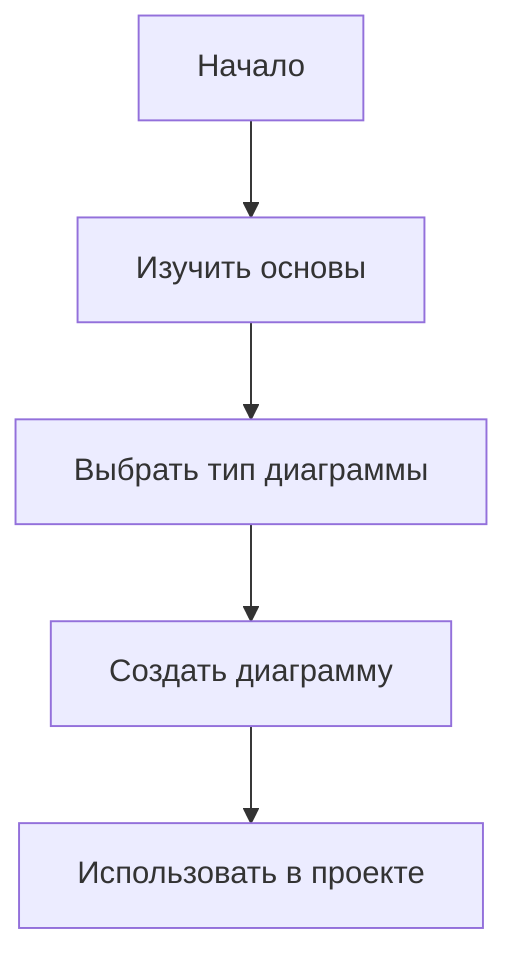

# Mermaid Guide

Полное руководство по диаграммам Mermaid для документации.

## 📚 Структура

- **Основы** — введение, установка, синтаксис
- **Типы диаграмм** — все виды поддерживаемых диаграмм
- **Продвинутые техники** — стилизация, интерактивность, интеграция
- **Примеры** — реальное применение в проектах

## 🚀 Быстрый старт



## 📖 Документация

Полная документация доступна на [GitHub Pages](https://daniilgavrin.github.io/mermaid-guide/)

## 🔧 Установка

```bash
pip install mkdocs-material mkdocs-mermaid2-plugin
```

## 👤 Автор

[DaniilGavrin](https://github.com/DaniilGavrin)
