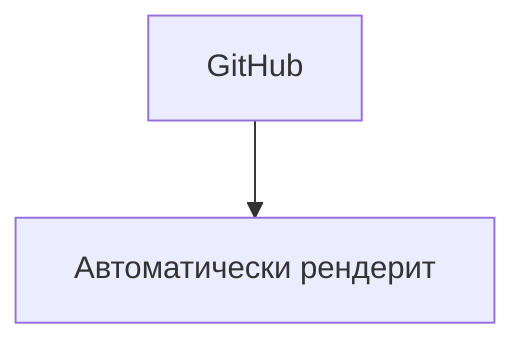

# Интеграция с другими инструментами

Mermaid работает во множестве платформ и инструментов.

## 🌐 Платформы

| Платформа | Поддержка | Примечание |
|-----------|-----------|------------|
| GitHub | ✅ Встроенная | Автоматический рендеринг |
| GitLab | ✅ Встроенная | Автоматический рендеринг |
| MkDocs | ✅ Плагин | mermaid2-plugin |
| Obsidian | ✅ Встроенная | Нативная поддержка |
| Notion | ❌ Нет | Требуется embed |
| Confluence | ⚠️ Плагин | Макрос Mermaid |

## 🔧 MkDocs интеграция

```yaml
markdown_extensions:
  - mermaid2

plugins:
  - mermaid2:
      version: 10.6.1
```

## 📝 GitHub Markdown

Просто используйте блоки кода с `mermaid`:

~~~markdown
````markdown

````

**Результат:**

~~~

## 🛠 VS Code расширения

- **Markdown Preview Mermaid Support** — предпросмотр в реальном времени
- **Mermaid Preview** — отдельный предпросмотр
- **Draw.io Integration** — альтернатива для сложных схем

---

*Перейдите к [примерам использования](../examples/documentation.md) для практических кейсов.*
