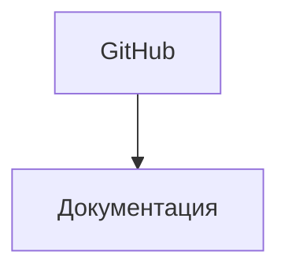
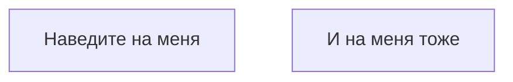
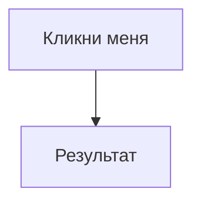

# Интерактивность

Интерактивные элементы в диаграммах Mermaid.

## 🔗 Кликабельные ссылки

````markdown

````

**Результат:**


## 📝 Tooltip (подсказки)

````markdown

````

**Результат:**


## 🎯 JavaScript колбэки

````markdown

````

**Результат:**


```javascript
window.testCallback = function(message) {
    alert(message);
};
```

## 💡 Практическое использование

- Ссылки на внешнюю документацию
- Переходы между разделами сайта
- Вызов модальных окон
- Трекинг аналитики

---

*Перейдите к [интеграции](integration.md) для изучения подключения к другим инструментам.*
