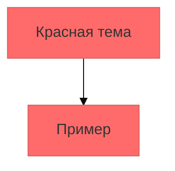
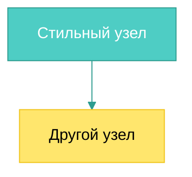
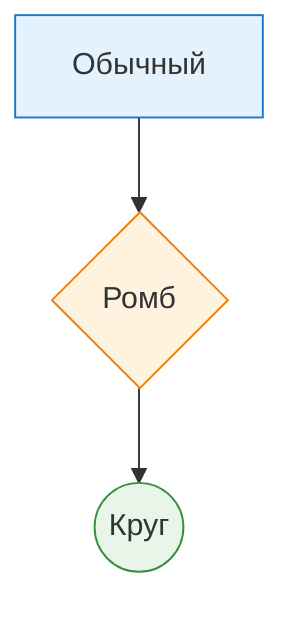

# Стилизация и темы

Продвинутые техники кастомизации диаграмм Mermaid.

## 🎨 Темы

Mermaid поддерживает встроенные темы:

## 🔧 Переменные тем

| Переменная | Описание |
|------------|----------|
| `primaryColor` | Основной цвет |
| `primaryTextColor` | Цвет текста |
| `primaryBorderColor` | Цвет границы |
| `lineColor` | Цвет линий |
| `fontSize` | Размер шрифта |

## 🏗 Кастомизация блок-схемы

## 📊 Стили для разных типов узлов

---

*Перейдите к [интерактивности](interactivity.md) для изучения продвинутых функций.*
