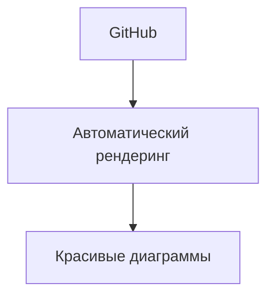

# Установка и настройка

## 📦 Установка в MkDocs

### 1. Установка зависимостей

```bash
pip install mkdocs-material mkdocs-mermaid2-plugin
```

### 2. Настройка `mkdocs.yml`

```yaml
markdown_extensions:
  - mermaid2

plugins:
  - search
  - mermaid2:
      version: 10.6.1
```

## 🔗 Интеграция с GitHub

GitHub автоматически рендерит Mermaid-диаграммы в Markdown-файлах:



## 🛠 Другие платформы

| Платформа | Поддержка |
|-----------|-----------|
| GitLab | ✅ Встроенная |
| Obsidian | ✅ Встроенная |
| Notion | ❌ Не поддерживается |
| Confluence | ⚠️ Через плагины |

---

*Перейдите к [синтаксису](syntax.md) для изучения основ.*
