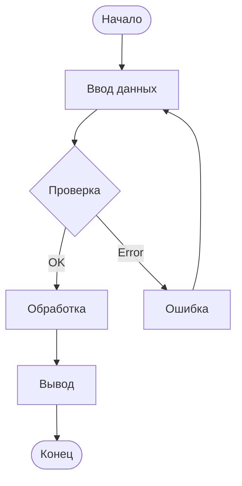

# Базовый синтаксис

## 📐 Структура диаграммы

Любая диаграмма начинается с указания типа:

## 🔤 Основные элементы

| Элемент | Синтаксис | Пример |
|---------|-----------|--------|
| Узел | `A[Текст]` | `A[Начало]` |
| Ромб (условие) | `A{Текст}` | `A{Условие?}` |
| Круг | `A((Текст))` | `A((Конец))` |
| Стрелка | `-->` | `A --> B` |
| Стрелка с текстом | `-->|Текст|` | `A -->|Да| B` |

## 🎨 Пример сложной диаграммы

## 📏 Направления

- `TD` / `TB` — сверху вниз
- `LR` — слева направо
- `RL` — справа налево
- `BT` — снизу вверх

---

*Перейдите к [блок-схемам](../diagrams/flowchart.md) для подробного изучения.*
