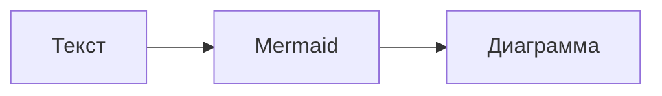

# Что такое Mermaid?

**Mermaid** — это JavaScript-библиотека для создания диаграмм и визуализаций с помощью простого текстового синтаксиса, похожего на Markdown.

## 🎯 Основные преимущества

| Преимущество | Описание |
|--------------|----------|
| Текстовый формат | Диаграммы хранятся в виде обычного текста |
| Версионность | Легко отслеживать изменения в Git |
| Интеграция | Работает в GitHub, GitLab, MkDocs, Obsidian |
| Простота | Минимум синтаксиса для быстрого старта |

## 📝 Пример использования

````markdown

````

**Результат:**


## 🔧 Где используется

- Документация проектов
- Архитектурные схемы
- Блок-схемы алгоритмов
- Диаграммы последовательностей
- Ментальные карты

---

*Перейдите к [установке и настройке](setup.md) для начала работы.*
