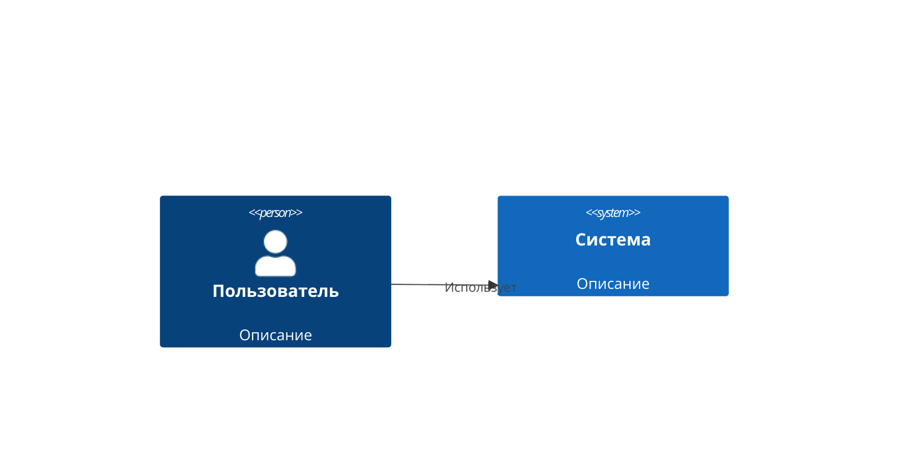
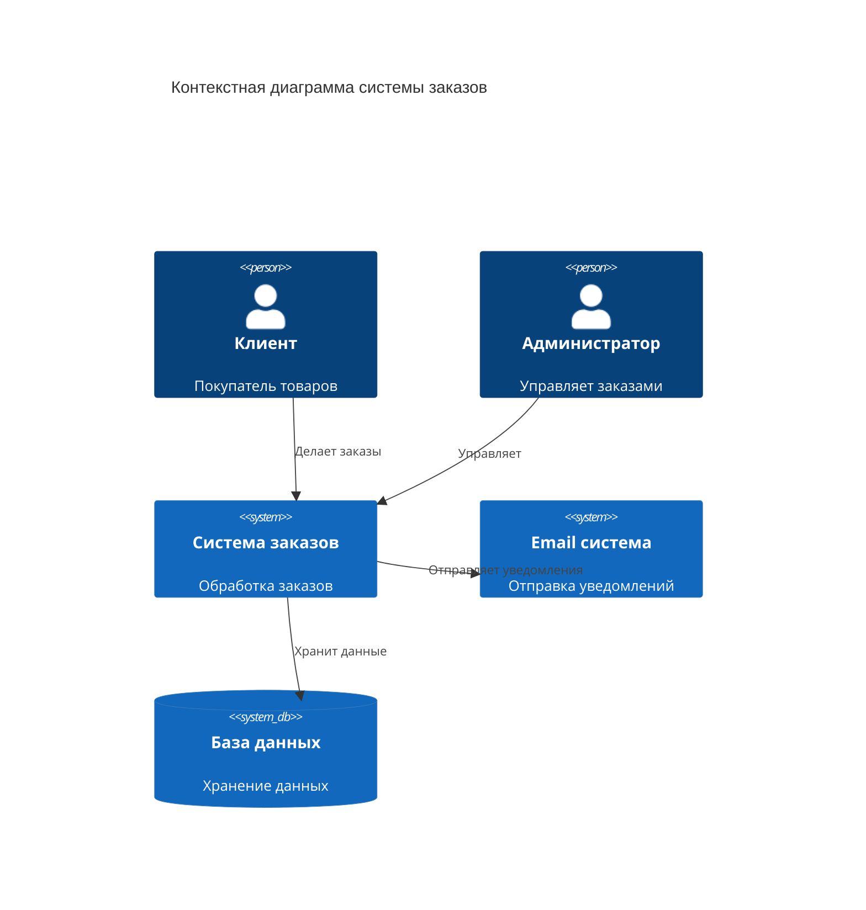

# Диаграммы C4

C4-модель для визуализации архитектуры программного обеспечения на разных уровнях абстракции.

## 📐 Базовый синтаксис

````markdown

````

**Результат:**


## 🏗 Практический пример: Веб-приложение

````markdown

````

**Результат:**


## 📊 Уровни C4

1. **Context** (Контекст) — система и внешние пользователи
2. **Container** (Контейнеры) — приложения, хранилища данных
3. **Component** (Компоненты) — модули внутри контейнеров
4. **Code** (Код) — классы и функции (редко используется)

---

*Перейдите к [продвинутым техникам](../advanced/styling.md) для изучения стилизации.*
