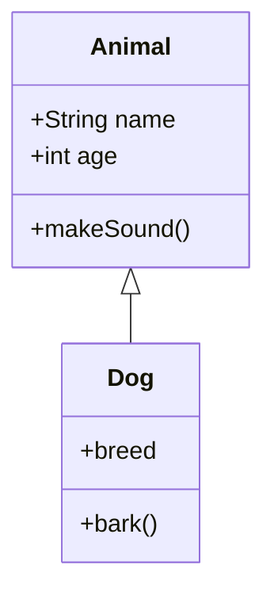
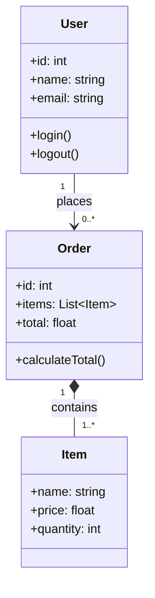

# Диаграммы классов

Диаграммы классов UML для отображения структуры системы.

## 📐 Базовый синтаксис

## 🔗 Типы отношений

| Отношение | Синтаксис | Описание |
|-----------|-----------|----------|
| Наследование | `<|--` | "Является" |
| Реализация | `<|..` | Интерфейс |
| Ассоциация | `-->` | Связь |
| Агрегация | `o--` | "Часть целого" |
| Композиция | `*--` | Сильная связь |

## 🏗 Практический пример

---

*Перейдите к [диаграммам состояний](state.md) для изучения следующего типа.*
