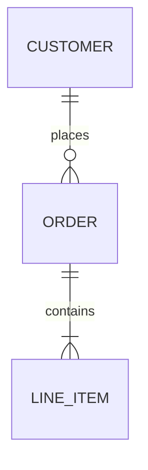
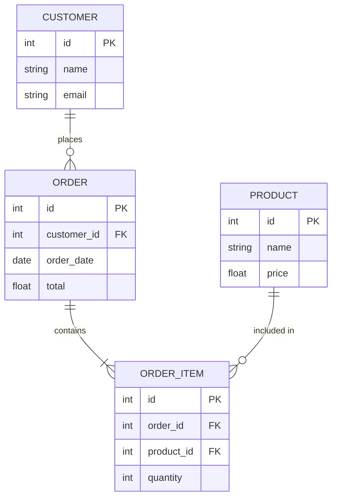

# Диаграммы сущность-связь (ER)

ER-диаграммы для моделирования данных и связей между сущностями.

## 📐 Базовый синтаксис

````markdown

````

**Результат:**


## 🔗 Типы связей

| Связь | Синтаксис | Описание |
|-------|-----------|----------|
| Один к одному | `\|\|--\|\|` | 1:1 |
| Один ко многим | `\|\|--o{` | 1:N |
| Многие ко многим | `}o--o{` | N:M |
| Необязательная | `o{` | 0..N |

## 🏗 Практический пример: Интернет-магазин

````markdown

````

**Результат:**


---

*Перейдите к [диаграммам Ганта](gantt.md) для изучения следующего типа.*
