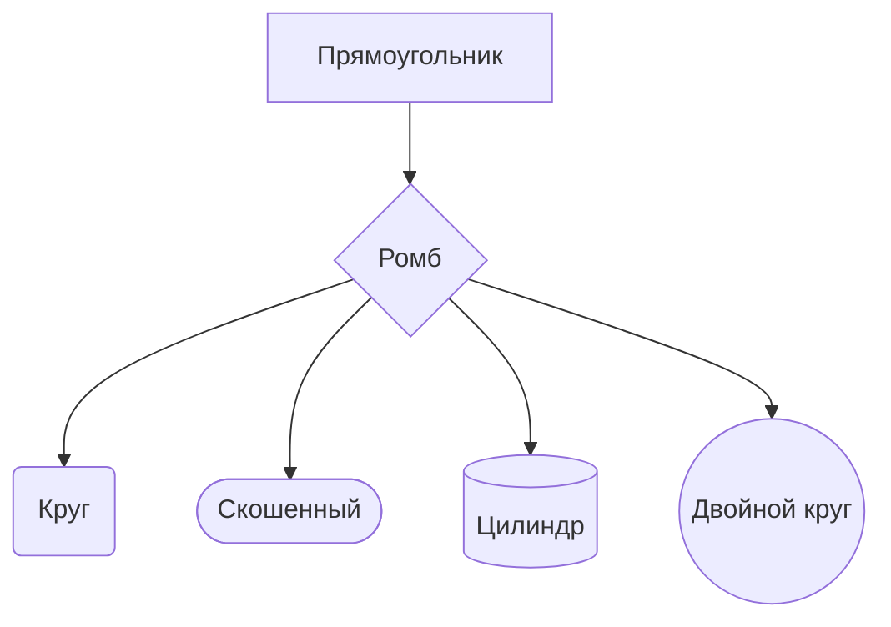
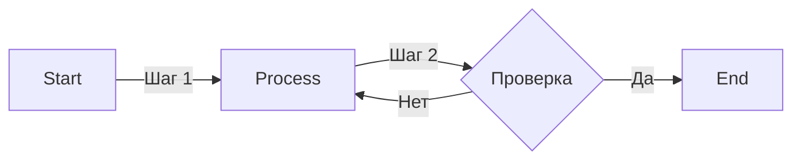
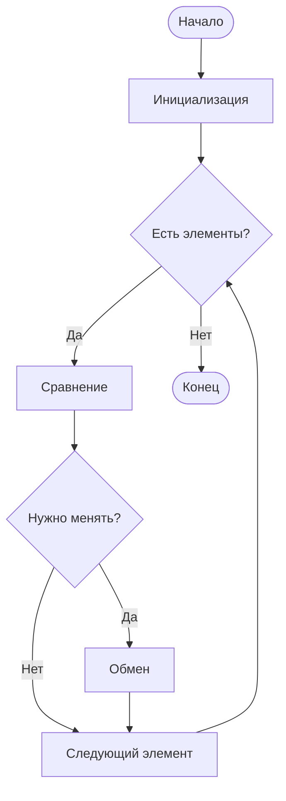

# Блок-схемы (Flowchart)

Блок-схемы — самый популярный тип диаграмм в Mermaid.

## 📊 Типы узлов

**Пример кода:**
````markdown
````markdown

````

**Результат:**

````

**Результат:**
````markdown

````

**Результат:**


## 🔗 Типы связей

| Тип | Синтаксис | Вид |
|-----|-----------|-----|
| Сплошная | `-->` | → |
| Пунктирная | `-.->` | ⇢ |
| Жирная | `==>` | ⇒ |
| Тонкая | `---` | — |

## 🏷 Подписи на связях

**Пример кода:**
````markdown
````markdown

````

**Результат:**

````

**Результат:**
````markdown

````

**Результат:**


## 🎯 Практический пример: Алгоритм сортировки

**Пример кода:**
````markdown
````markdown

````

**Результат:**

````

**Результат:**
````markdown

````

**Результат:**


---

*Перейдите к [диаграммам последовательностей](sequence.md) для изучения следующего типа.*
