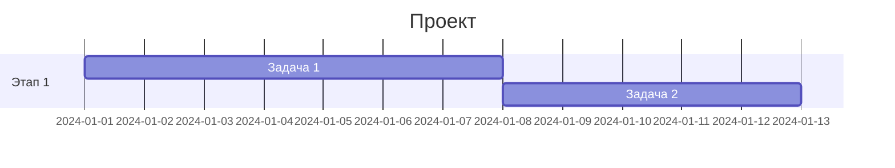
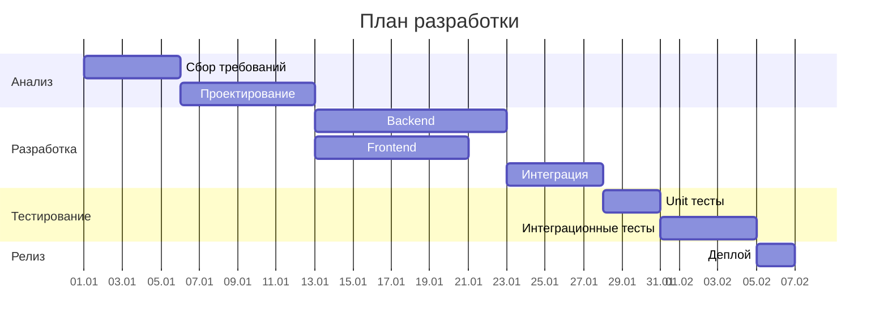

# Диаграммы Ганта

Диаграммы Ганта для визуализации планов проектов и временных шкал.

## 📐 Базовый синтаксис

````markdown

````

**Результат:**


## 🔧 Директивы

| Директива | Описание |
|-----------|----------|
| `dateFormat` | Формат даты |
| `section` | Группа задач |
| `todayMarker` | Маркер текущего дня |

## 🏗 Практический пример: Разработка ПО

````markdown

````

**Результат:**


---

*Перейдите к [ментальным картам](mindmap.md) для изучения следующего типа.*
