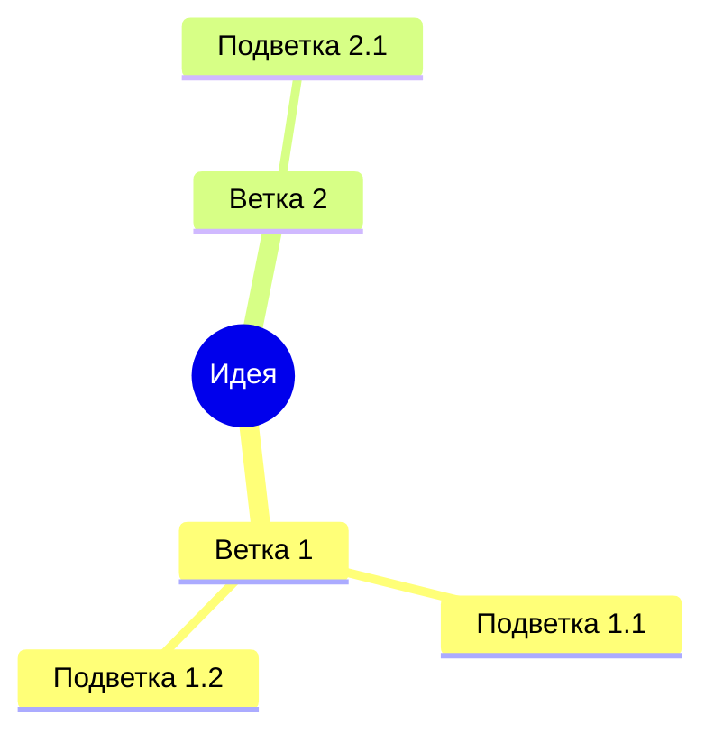
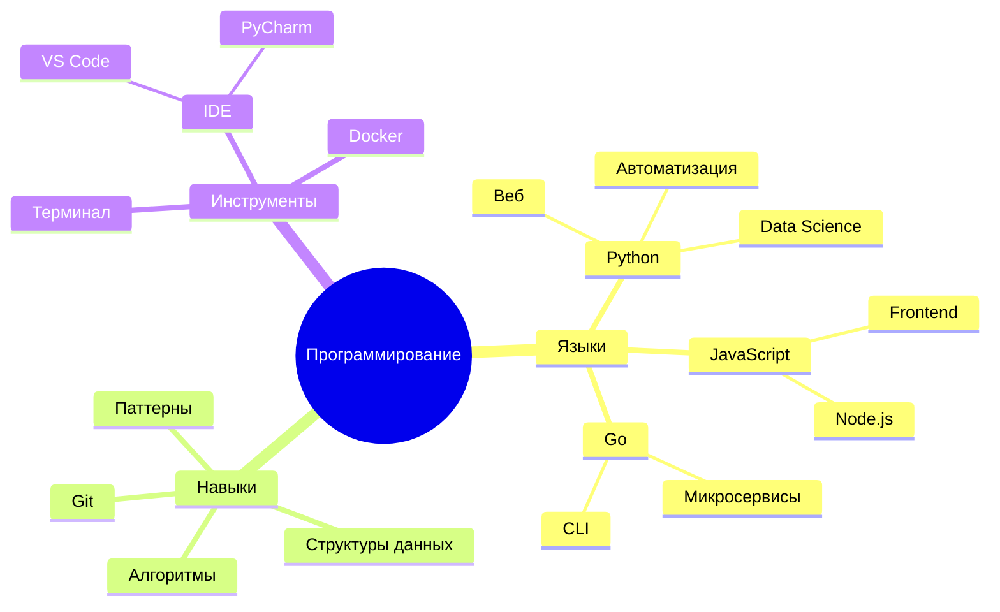

# Ментальные карты

Ментальные карты (Mind Maps) для визуализации идей и структурирования информации.

## 📐 Базовый синтаксис

## 🎯 Формы узлов

| Форма | Синтаксис | Пример |
|-------|-----------|--------|
| Круг | `((Текст))` | `root((Идея))` |
| Квадрат | `[Текст]` | `A[Узел]` |
| Ромб | `{Текст}` | `B{Вопрос}` |
| Обычный | `Текст` | `C Просто текст` |

## 🏗 Практический пример: Изучение программирования

---

*Перейдите к [диаграммам таймлайн](timeline.md) для изучения следующего типа.*
