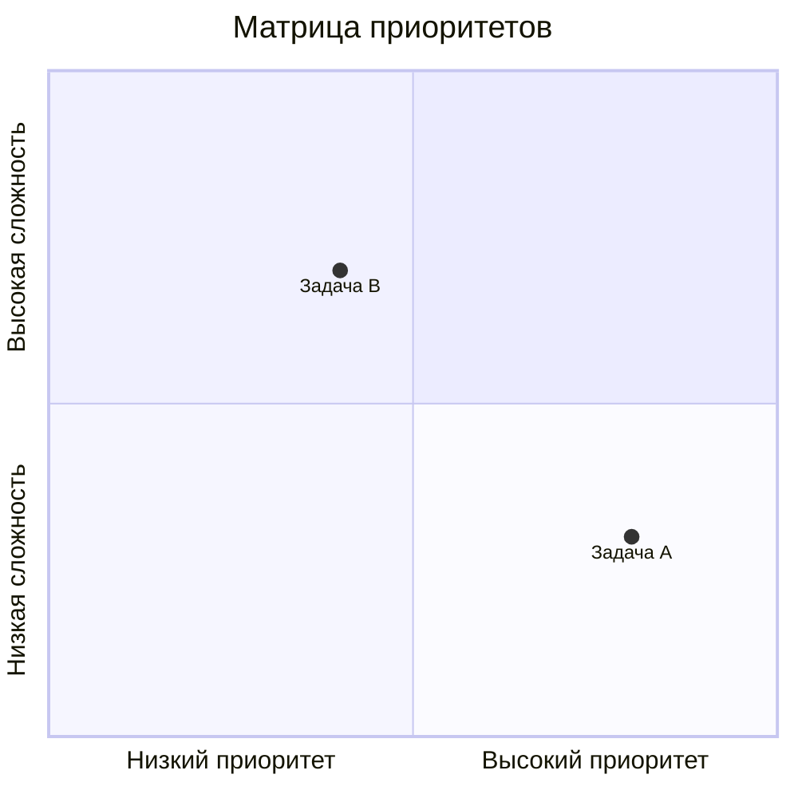
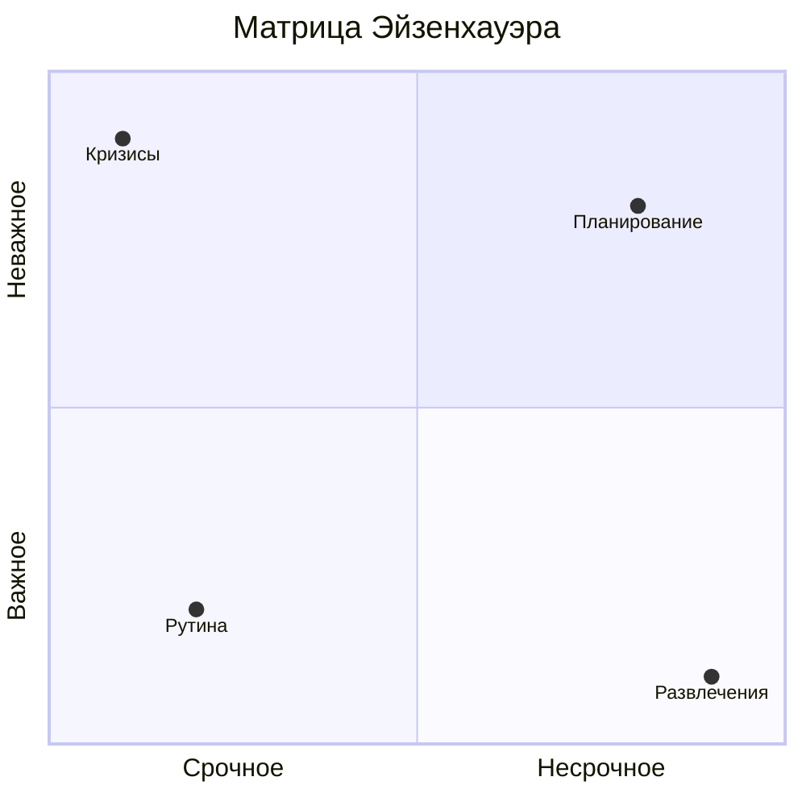

# Квадранты

Диаграммы квадрантов для сравнения объектов по двум осям.

## 📐 Базовый синтаксис

````markdown

````

**Результат:**


## 🏗 Практический пример: Приоритизация задач

````markdown

````

**Результат:**


---

*Перейдите к [продвинутым техникам](../advanced/styling.md) для изучения стилизации.*
