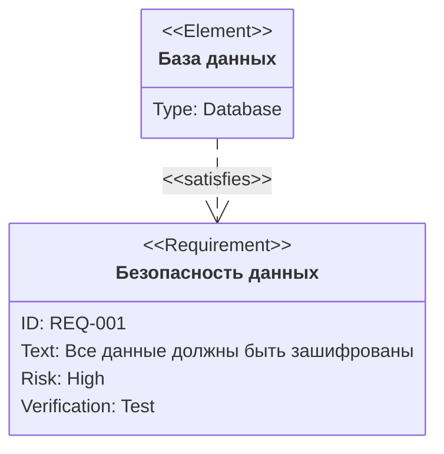
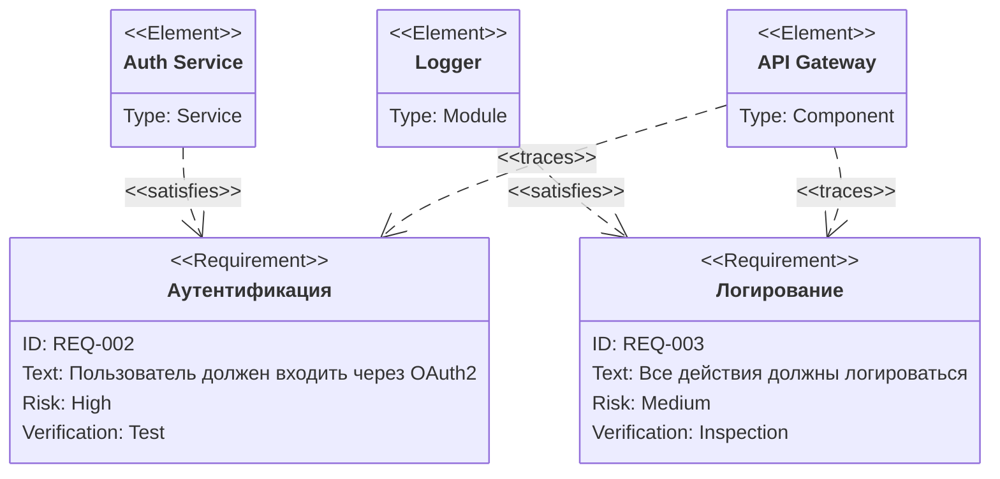

# Диаграммы требований (Requirement Diagram)

Позволяют визуализировать требования и их связи с элементами системы.

## Пример 1: Базовое требование

### Исходный код (скопируйте для использования):

````text
requirementDiagram
requirement "Безопасность данных" {
    id: "REQ-001"
    text: "Все данные должны быть зашифрованы"
    risk: High
    verifymethod: Test
}

element "База данных" {
    type: "Database"
}

"База данных" - satisfies -> "Безопасность данных"
````

### Результат (как это отобразится):



## Пример 2:Complex система требований

### Исходный код:

````text
requirementDiagram
requirement "Аутентификация" {
    id: "REQ-002"
    text: "Пользователь должен входить через OAuth2"
    risk: High
    verifymethod: Test
}

requirement "Логирование" {
    id: "REQ-003"
    text: "Все действия должны логироваться"
    risk: Medium
    verifymethod: Inspection
}

element "Auth Service" {
    type: "Service"
}

element "Logger" {
    type: "Module"
}

element "API Gateway" {
    type: "Component"
}

"Auth Service" - satisfies -> "Аутентификация"
"Logger" - satisfies -> "Логирование"
"API Gateway" - traces -> "Аутентификация"
"API Gateway" - traces -> "Логирование"
````

### Результат:


