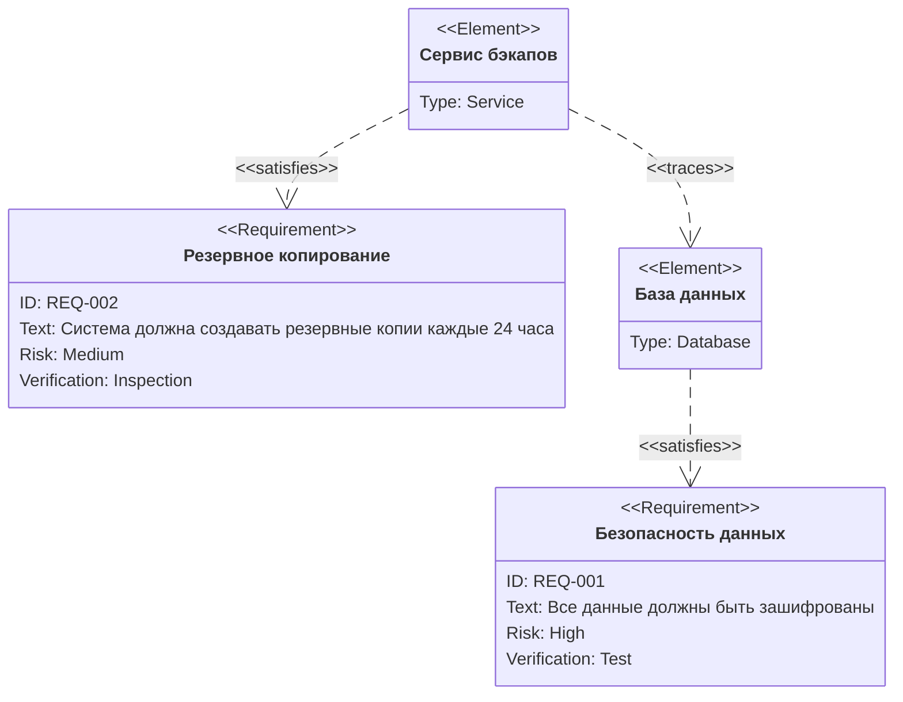

# Диаграммы требований (Requirement Diagram)

Позволяют визуализировать требования и их связи с элементами системы.

## Пример 1: Код для копирования

Чтобы использовать этот пример, скопируйте код ниже:

````text

````

## Пример 2: Результат (Живая диаграмма)

Так эта диаграмма будет выглядеть на сайте:


## Синтаксис

- `requirement`: Определяет требование. Обязательно указывать `id`, `text`, `risk` и `verifymethod`.
- `element`: Определяет элемент системы (компонент, сервис, базу данных).
- Связи:
  - `satisfies`: Элемент удовлетворяет требованию.
  - `verifies`: Элемент проверяет требование.
  - `traces`: Требование связано с другим элементом или требованием.
