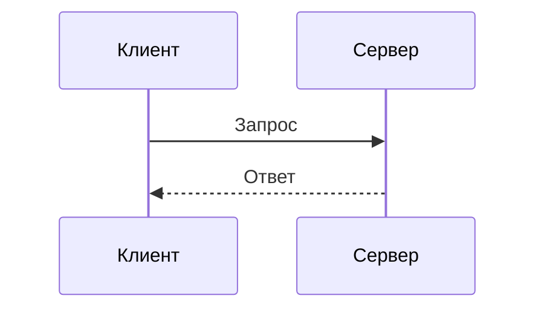
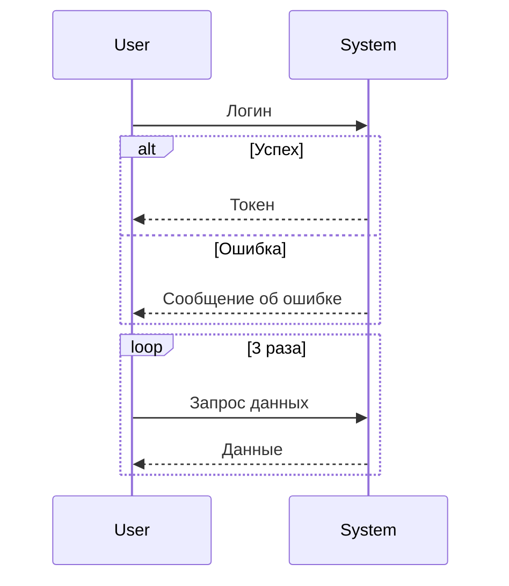
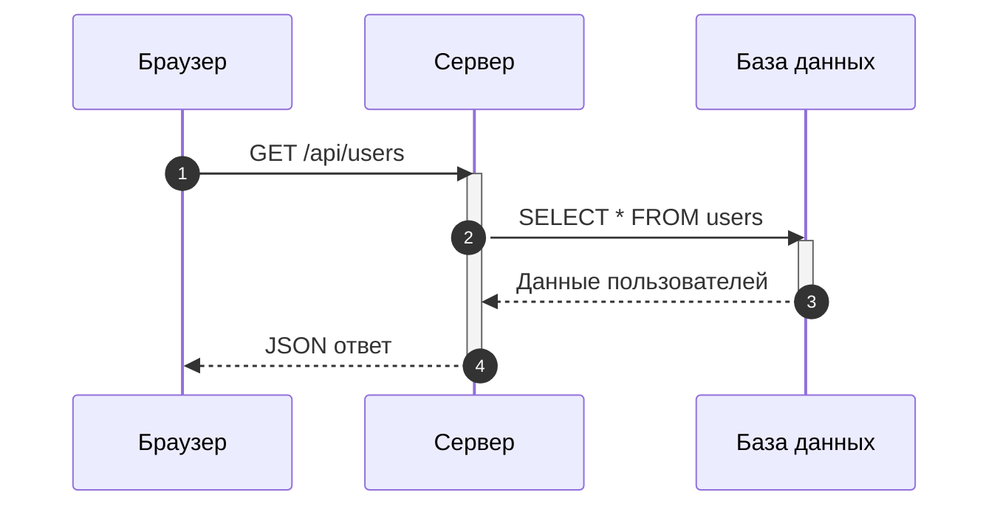

# Диаграммы последовательностей

Диаграммы последовательностей показывают взаимодействие между объектами во времени.

## 📐 Базовый синтаксис

````markdown

````

**Результат:**


## 🎯 Типы стрелок

| Тип | Синтаксис | Описание |
|-----|-----------|----------|
| Сплошная | `->>` | Вызов |
| Пунктирная | `-->>` | Возврат |
| Сплошная к себе | `->>` | Самовызов |
| Создать | `->>+` | Создание участника |
| Уничтожить | `->>-` | Уничтожение |

## 🔄 Циклы и условия

````markdown

````

**Результат:**


## 🏗 Практический пример: HTTP запрос

````markdown

````

**Результат:**


---

*Перейдите к [диаграммам классов](class.md) для изучения следующего типа.*
