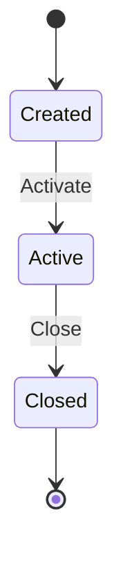
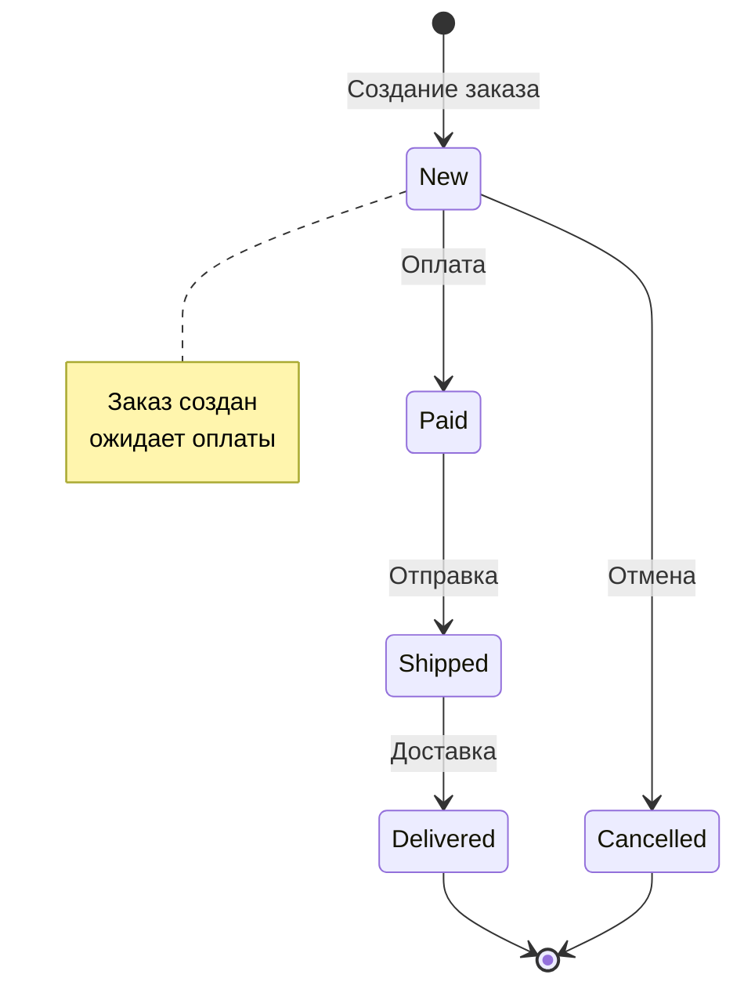

# Диаграммы состояний

Диаграммы состояний (State Diagram) показывают изменения состояния объекта.

## 📐 Базовый синтаксис

## 🔗 Типы переходов

| Элемент | Синтаксис | Описание |
|---------|-----------|----------|
| Начальное состояние | `[*]` | Точка входа |
| Конечное состояние | `--> [*]` | Точка выхода |
| Переход | `-->` | Изменение состояния |
| Событие | `: событие` | Триггер перехода |

## 🏗 Практический пример: Заказ

---

*Перейдите к [диаграммам сущность-связь](er.md) для изучения следующего типа.*
