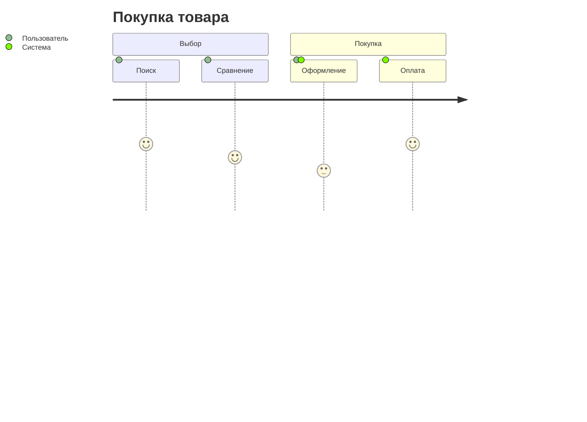
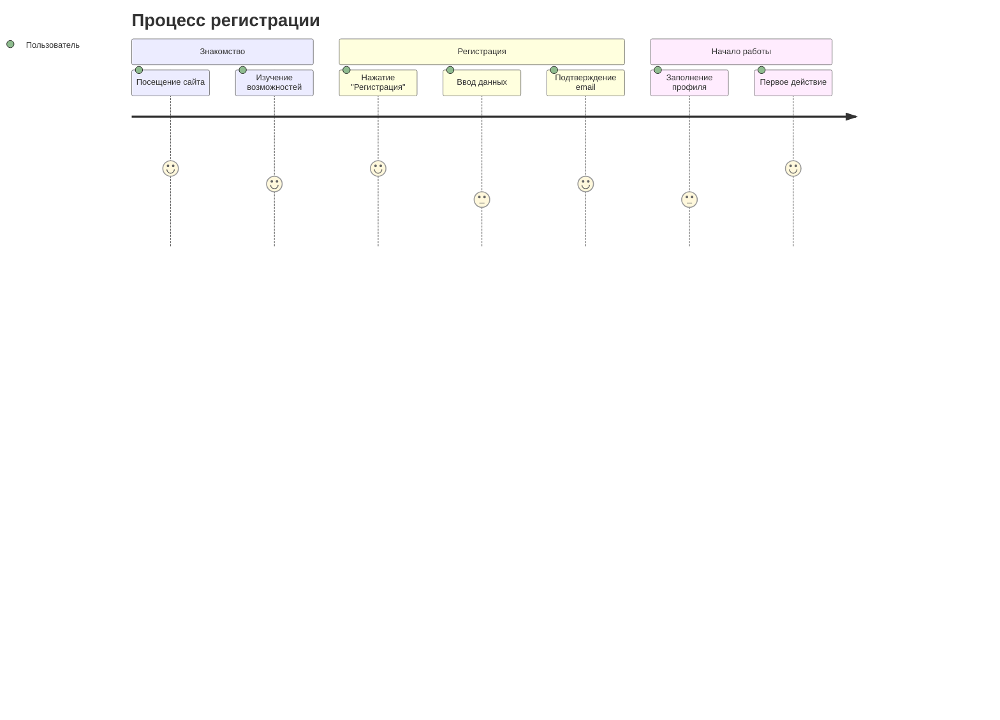

# Диаграммы пользовательского пути

Диаграммы User Journey для отображения взаимодействия пользователя с продуктом.

## 📐 Базовый синтаксис

## 🏗 Практический пример: Регистрация

---

*Перейдите к [стилизации](../advanced/styling.md) для изучения продвинутых техник.*
