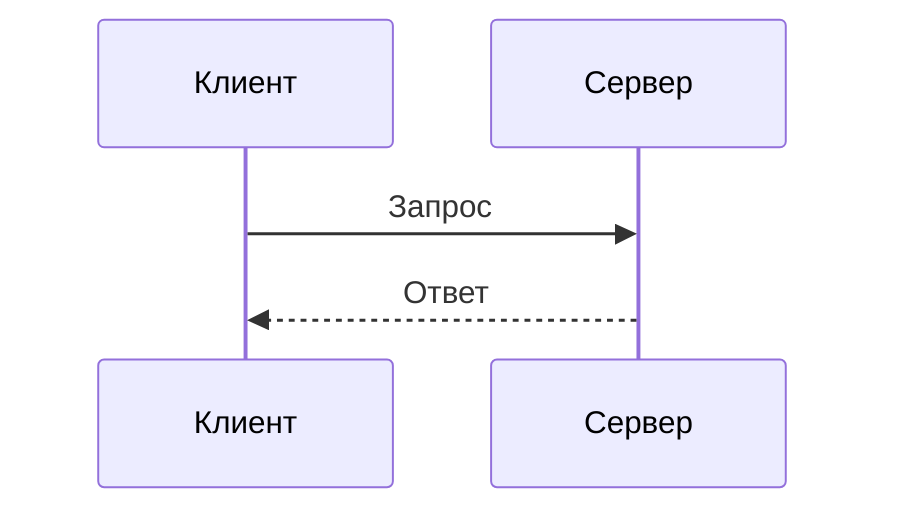
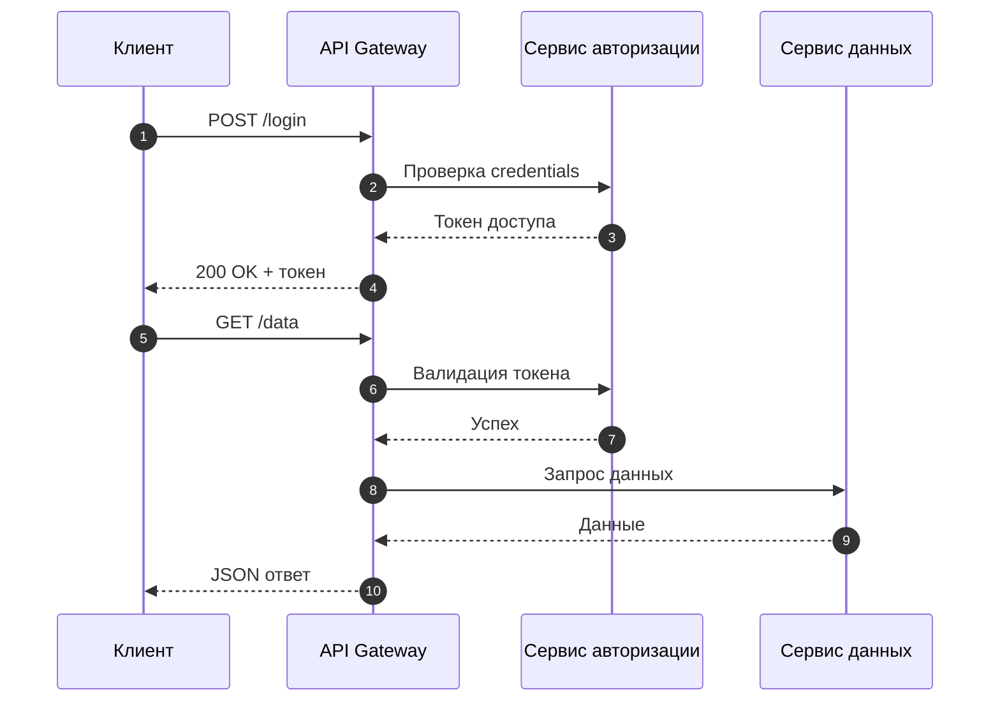

# Диаграммы Зиккерта

Диаграммы Зиккерта (ZenUML) — упрощённый синтаксис для диаграмм последовательностей.

## 📐 Базовый синтаксис

## 🏗 Практический пример: API вызов

---

*Перейдите к [продвинутым техникам](../advanced/styling.md) для изучения стилизации.*
