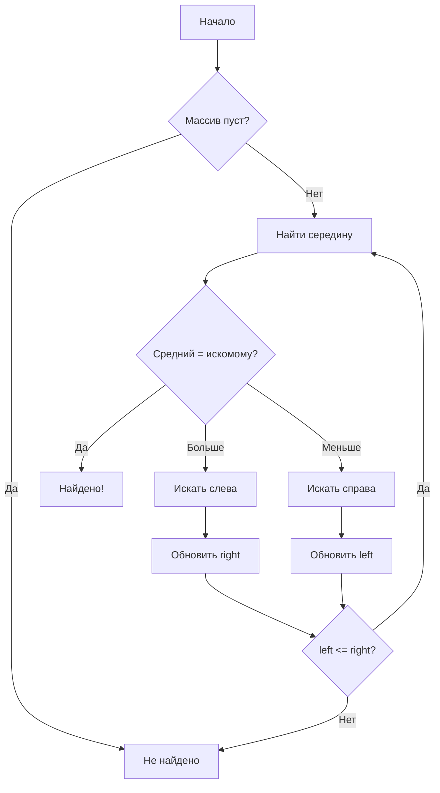
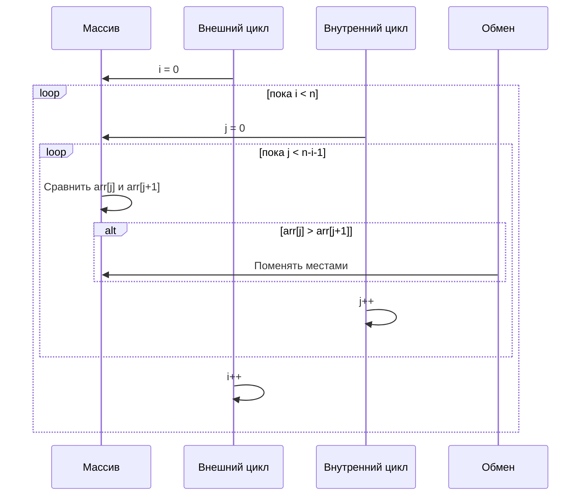
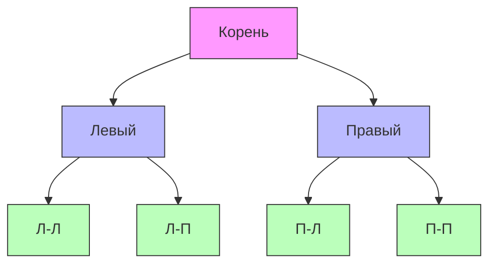

# Алгоритмы

Визуализация алгоритмов и структур данных с помощью Mermaid.

## 🔍 Бинарный поиск

## 📊 Сортировка пузырьком

## 🌳 Обход дерева (BFS)

**Порядок обхода BFS:** A → B → C → D → E → F → G

---

*Перейдите к [бизнес-процессам](business-processes.md) для примеров из бизнеса.*
