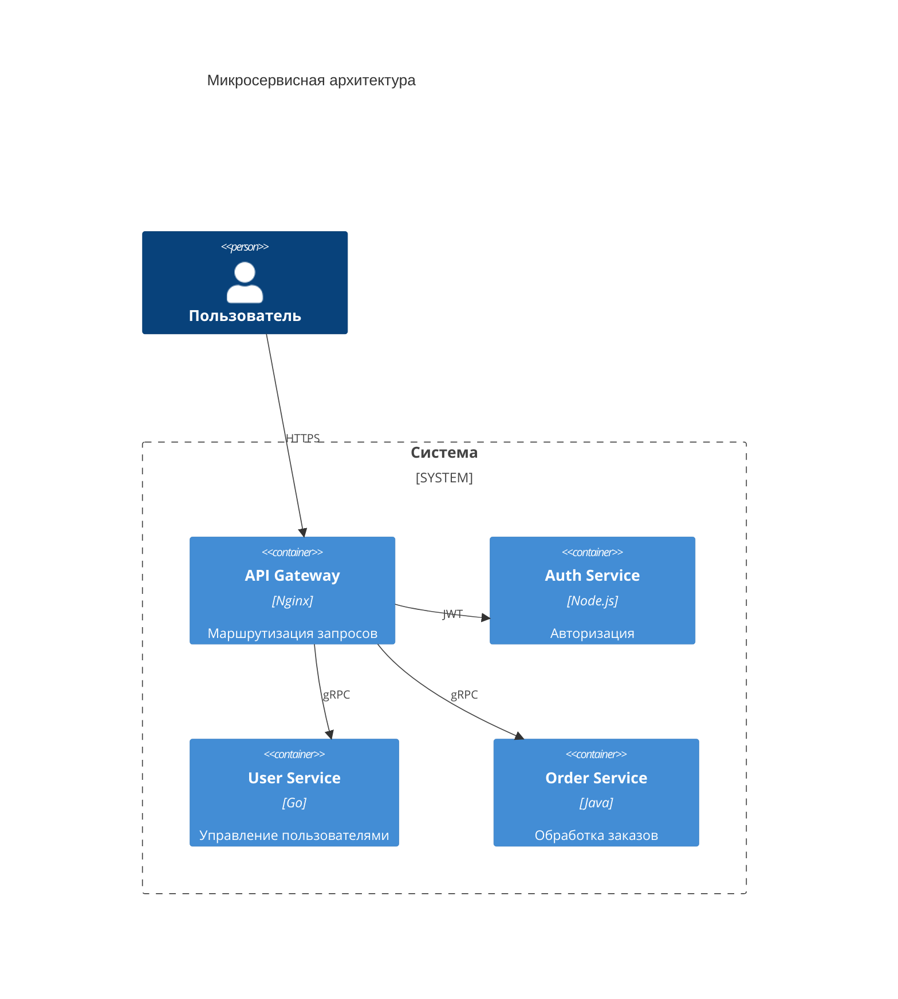
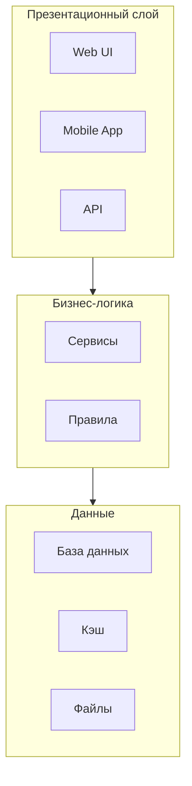

# Архитектурные схемы

Визуализация архитектуры систем с помощью Mermaid.

## 🏢 Микросервисная архитектура

````markdown

````

**Результат:**


## 🔄 Event-Driven архитектура

````markdown
```mermaid
graph LR
    subproducers[Производители]
        A[Сервис A]
        B[Сервис B]
    end
    
    subgraphkafka[Apache Kafka]
        T1[Топик 1]
        T2[Топик 2]
    end
    
    subgraphconsumers[Потребители]
        C[Сервис C]
        D[Сервис D]
    end
    
    A --> T1
    B --> T2
    T1 --> C
    T2 --> D
```
````

**Результат:**
```mermaid
graph LR
    subproducers[Производители]
        A[Сервис A]
        B[Сервис B]
    end
    
    subgraphkafka[Apache Kafka]
        T1[Топик 1]
        T2[Топик 2]
    end
    
    subgraphconsumers[Потребители]
        C[Сервис C]
        D[Сервис D]
    end
    
    A --> T1
    B --> T2
    T1 --> C
    T2 --> D
```

## 📊 Слоёная архитектура

````markdown

````

**Результат:**


---

*Перейдите к [алгоритмам](algorithms.md) для визуализации алгоритмов.*
