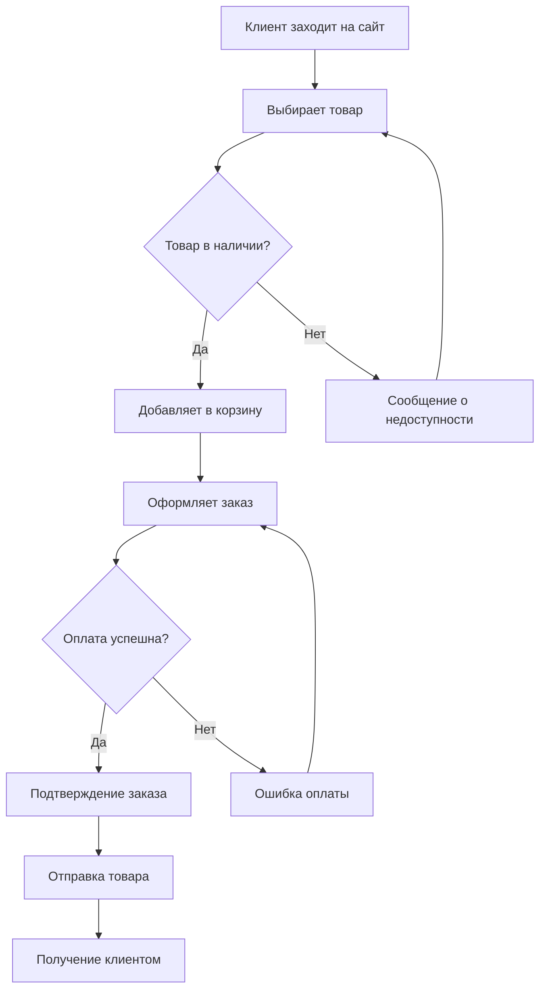
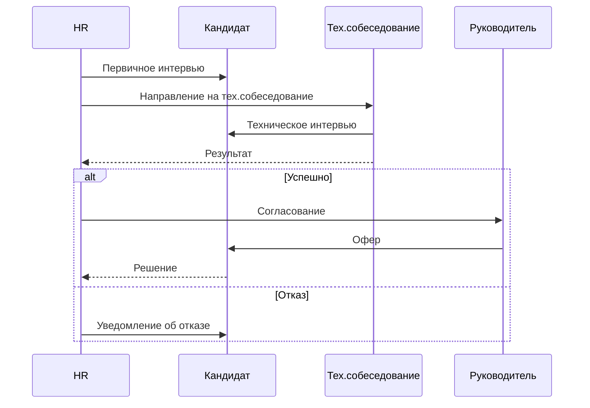
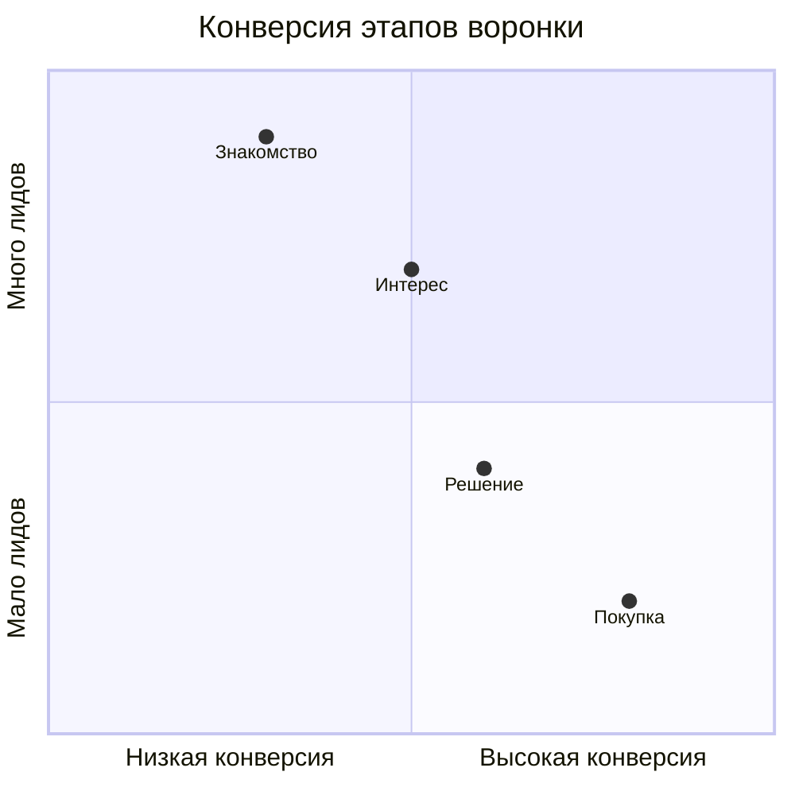

# Бизнес-процессы

Моделирование бизнес-процессов с помощью Mermaid.

## 🛒 Процесс покупки

````markdown

````

**Результат:**


## 👥 Процесс найма сотрудника

````markdown

````

**Результат:**


## 📈 Воронка продаж

````markdown

````

**Результат:**


---

*Поздравляем! Вы изучили все разделы руководства!*
