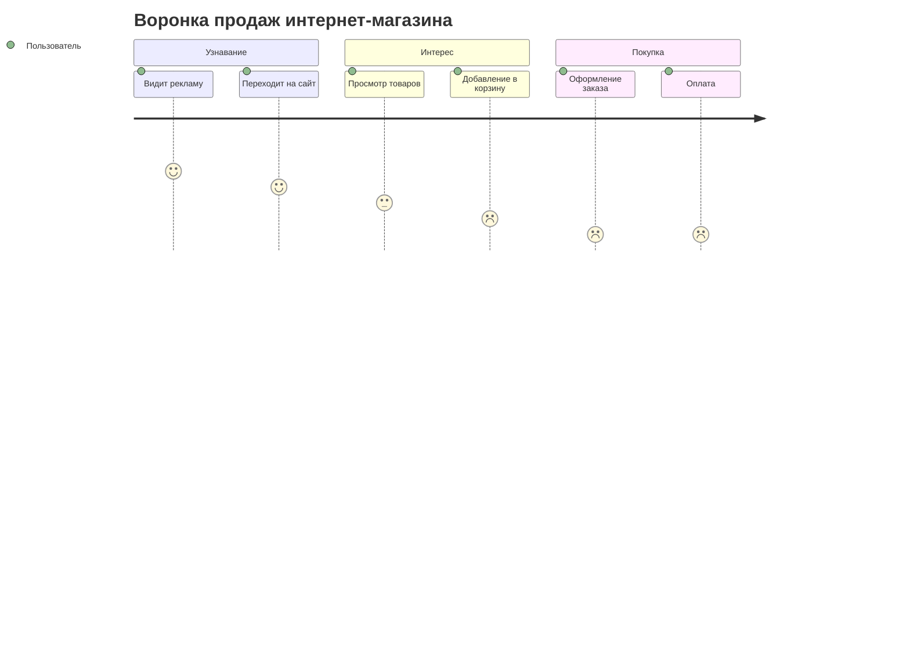
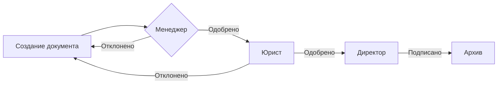

# Бизнес-процессы

Примеры визуализации бизнес-процессов с помощью Mermaid.

## Воронка продаж (User Journey)

Визуализация пути клиента от знакомства до покупки.

### Исходный код (скопируйте):

```text
journey
    title Воронка продаж интернет-магазина
    section Узнавание
      Видит рекламу: 5: Пользователь
      Переходит на сайт: 4: Пользователь
    section Интерес
      Просмотр товаров: 3: Пользователь
      Добавление в корзину: 2: Пользователь
    section Покупка
      Оформление заказа: 1: Пользователь
      Оплата: 1: Пользователь
```

### Результат:



## Процесс согласования документа

### Исходный код:

```text
flowchart LR
    A[Создание документа] --> B{Менеджер}
    B -->|Одобрено| C[Юрист]
    B -->|Отклонено| A
    C -->|Одобрено| D[Директор]
    C -->|Отклонено| A
    D -->|Подписано| E[Архив]
```

### Результат:


