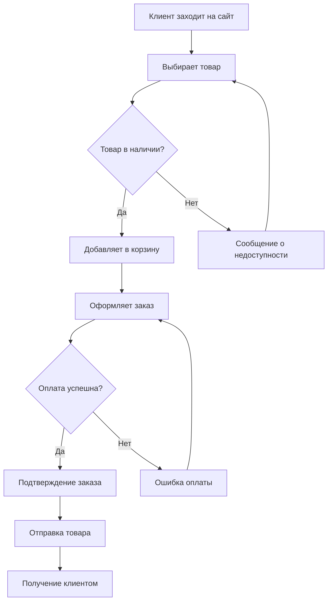
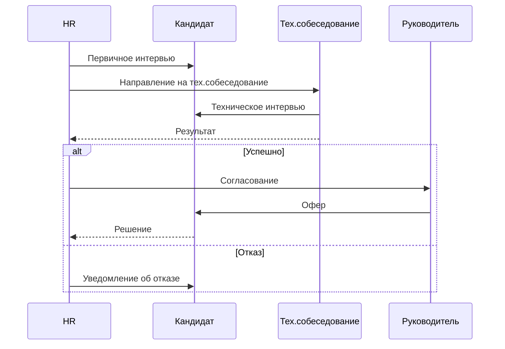
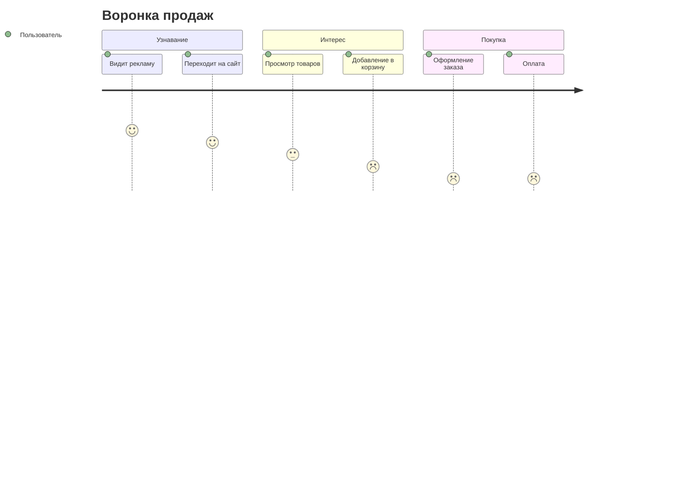

# Бизнес-процессы

Моделирование бизнес-процессов с помощью Mermaid.

## 🛒 Процесс покупки

````markdown

````

**Результат:**


## 👥 Процесс найма сотрудника

````markdown

````

**Результат:**


## 📈 Воронка продаж

Визуализация пути клиента через этапы воронки с использованием User Journey.

**Пример кода:**
```markdown

```

**Результат:**


---

*Поздравляем! Вы изучили все разделы руководства!*
