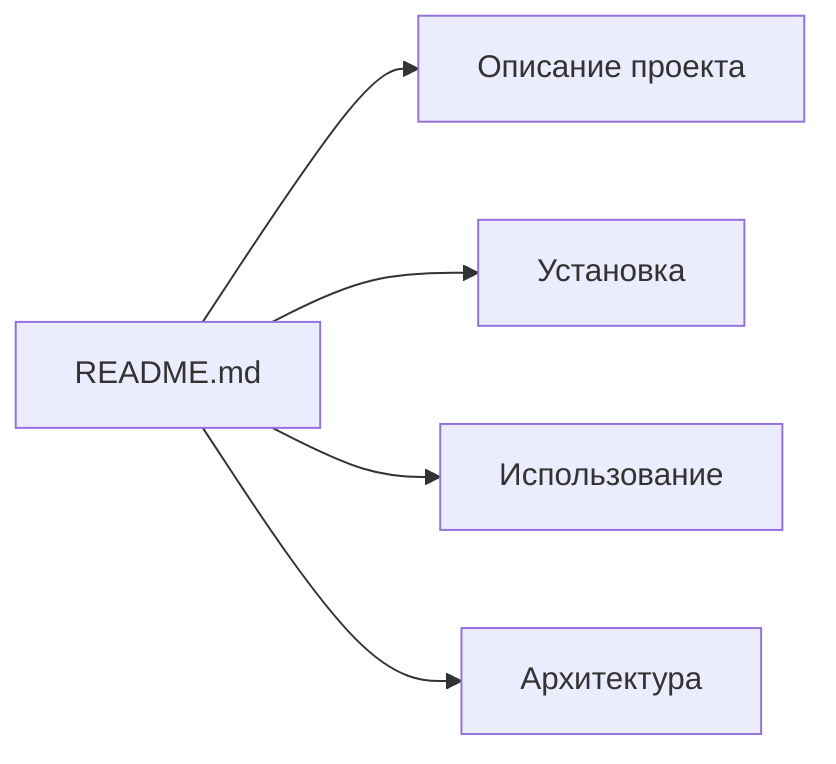
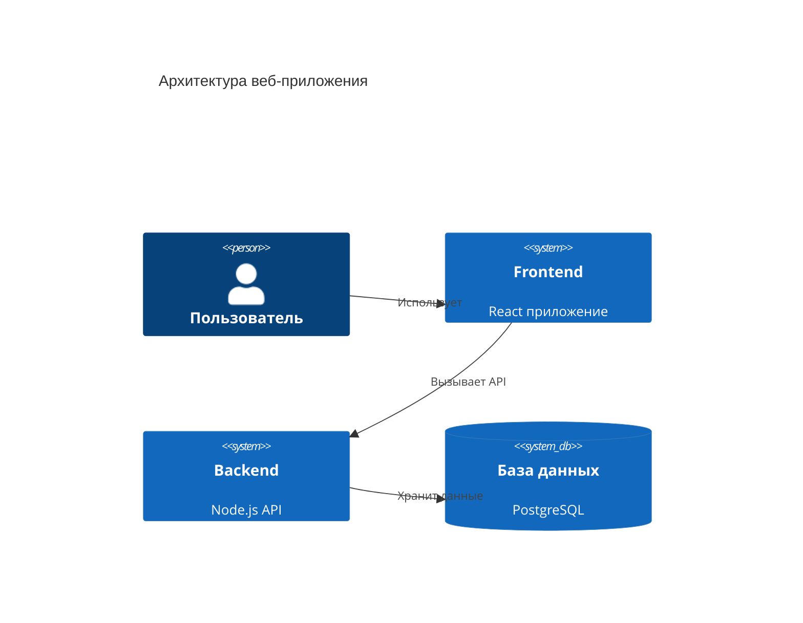
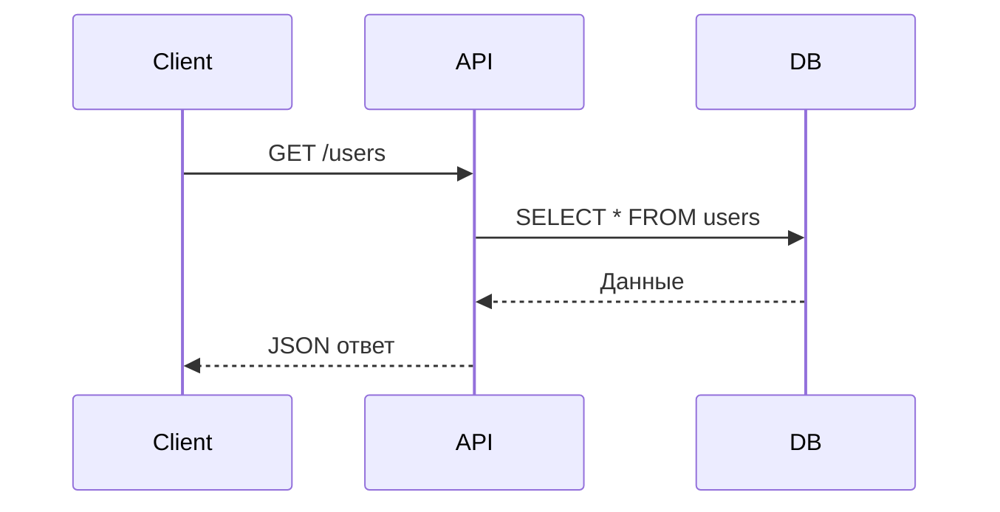

# Документация проектов

Использование Mermaid для документации программного обеспечения.

## 📚 README файлы

````markdown

````

**Результат:**


## 🏗 Архитектурная документация

````markdown

````

**Результат:**


## 📋 Техническая спецификация

````markdown

````

**Результат:**


## ✅ Best Practices

- Храните диаграммы рядом с кодом
- Используйте версионирование
- Обновляйте при изменении архитектуры
- Добавляйте описания к сложным диаграммам

---

*Перейдите к [архитектурным схемам](architecture.md) для более детального изучения.*
