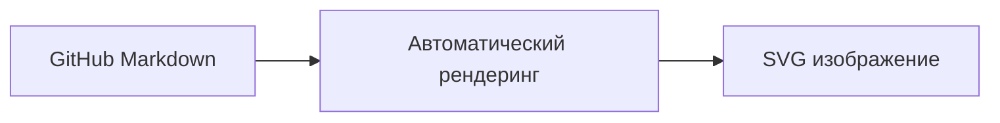
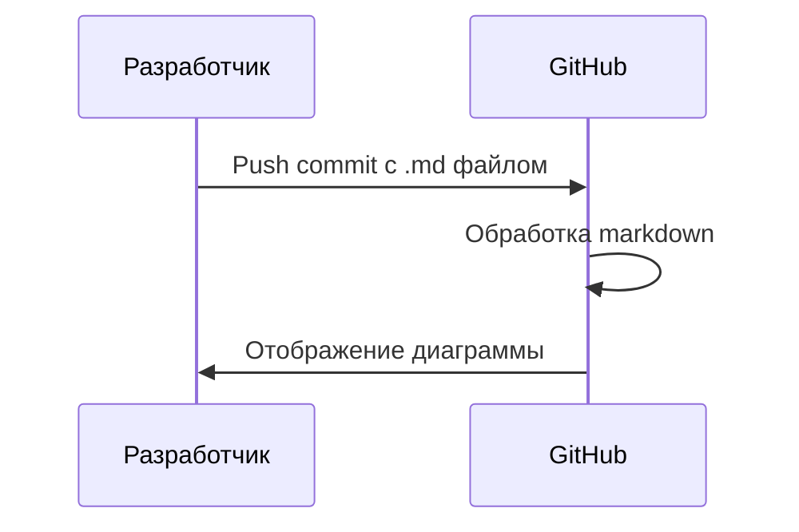
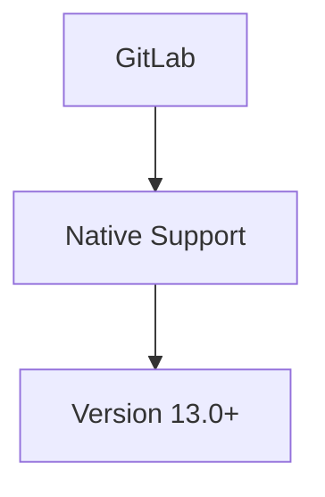
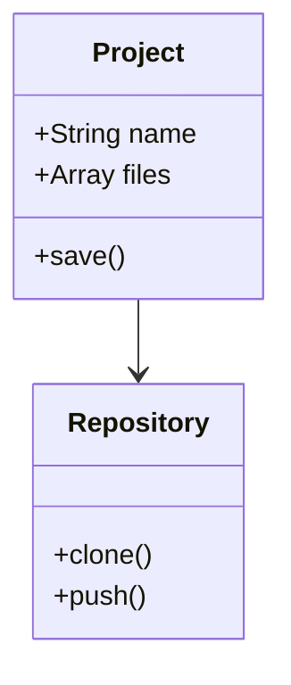
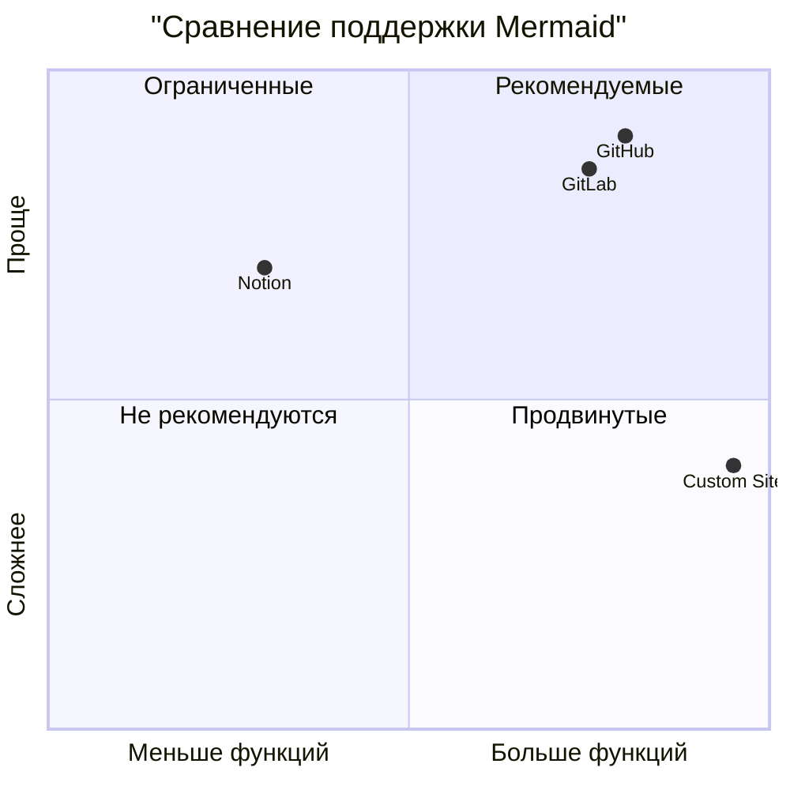
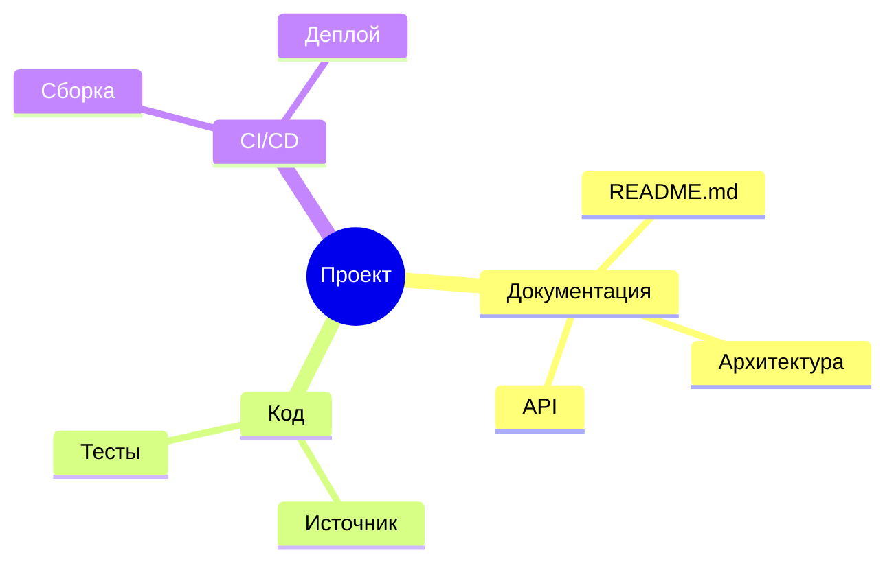
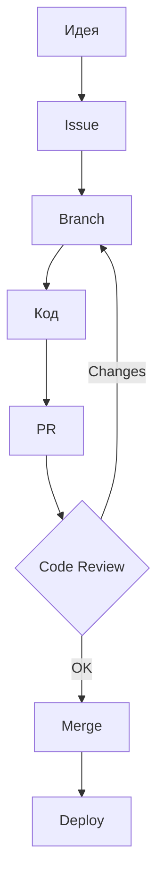

# Интеграция с GitHub и GitLab

GitHub и GitLab автоматически рендерят диаграммы Mermaid в markdown-файлах, что делает их идеальными платформами для документации.

## GitHub

### Автоматический рендеринг

GitHub поддерживает Mermaid начиная с 2022 года. Диаграммы рендерятся автоматически в:
- README.md
- Файлах документации (.md)
- Issues и Pull Requests
- Wiki

**Пример:**


### Использование в README

Просто добавьте код диаграммы в markdown:

````markdown

````

Результат:


### GitHub Actions для генерации

Для создания изображений из диаграмм:

```yaml
name: Generate Mermaid Diagrams

on: [push]

jobs:
  generate:
    runs-on: ubuntu-latest
    steps:
      - uses: actions/checkout@v3
      
      - name: Setup Node.js
        uses: actions/setup-node@v3
        with:
          node-version: '18'
      
      - name: Install mermaid-cli
        run: npm install -g @mermaid-js/mermaid-cli
      
      - name: Generate diagrams
        run: |
          mmdc -i docs/diagram.mmd -o docs/diagram.png
          
      - name: Commit generated images
        run: |
          git config user.name "GitHub Actions"
          git config user.email "actions@github.com"
          git add docs/*.png
          git commit -m "Generate diagrams" || echo "No changes"
          git push
```

### Особенности GitHub

| Функция | Поддержка |
|---------|-----------|
| Рендеринг в README | ✅ Да |
| Рендеринг в Issues | ✅ Да |
| Рендеринг в PR | ✅ Да |
| Кастомные темы | ⚠️ Ограничено |
| Интерактивность | ❌ Нет |
| Экспорт в PNG/SVG | ⚠️ Через Actions |

## GitLab

### Автоматический рендеринг

GitLab также поддерживает Mermaid в markdown:



### Использование в GitLab

````markdown

````

Результат:


### GitLab CI/CD для генерации

```yaml
generate_diagrams:
  stage: build
  image: node:18
  script:
    - npm install -g @mermaid-js/mermaid-cli
    - mkdir -p public/diagrams
    - for file in docs/*.mmd; do
        mmdc -i $file -o public/diagrams/$(basename $file .mmd).png;
      done
  artifacts:
    paths:
      - public/diagrams/
```

## Сравнение платформ



## Лучшие практики

### 1. Версионирование диаграмм

Храните исходный код диаграмм в отдельных `.mmd` файлах:

```
docs/
├── architecture.mmd
├── flowchart.mmd
└── README.md (ссылается на .mmd файлы)
```

### 2. Документирование

Добавляйте комментарии к сложным диаграммам:

````markdown
<!-- DIAGRAM: Architecture Overview -->
<!-- UPDATED: 2024-01-15 -->
```mermaid
...
```
````

### 3. Оптимизация

- Избегайте слишком больших диаграмм (>100 элементов)
- Разбивайте сложные схемы на несколько частей
- Используйте ссылки между диаграммами

## Примеры использования

### Документация проекта



### Workflow разработки



## Заключение

GitHub и GitLab предоставляют отличную поддержку Mermaid для документации. Для более сложных сценариев используйте GitHub Actions/GitLab CI для генерации изображений или создавайте собственные сайты документации.
