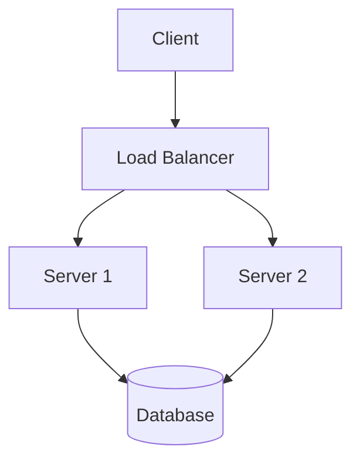
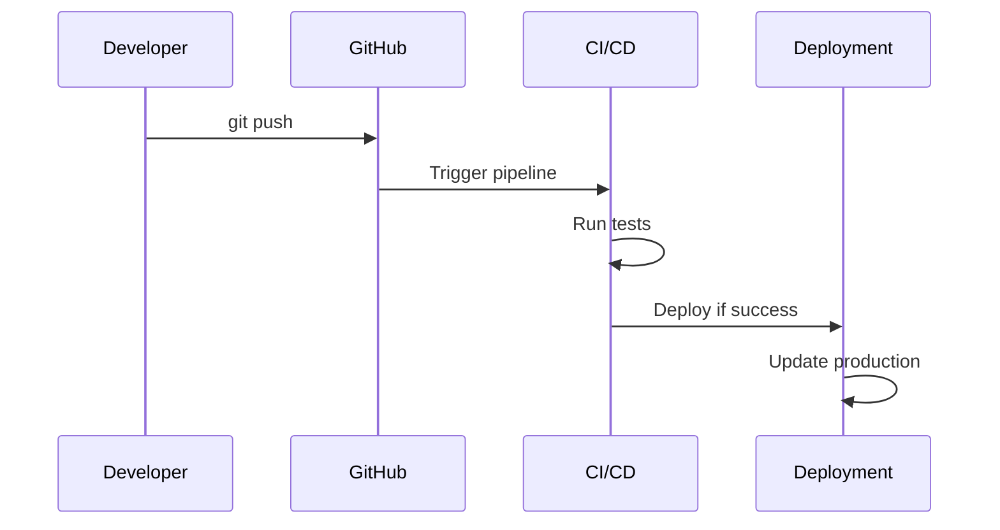
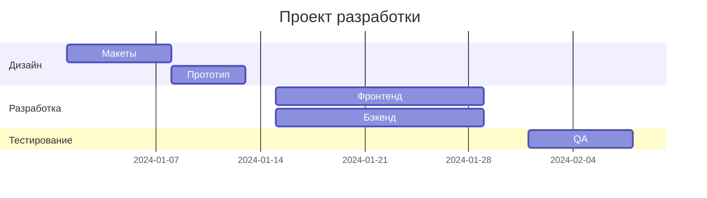
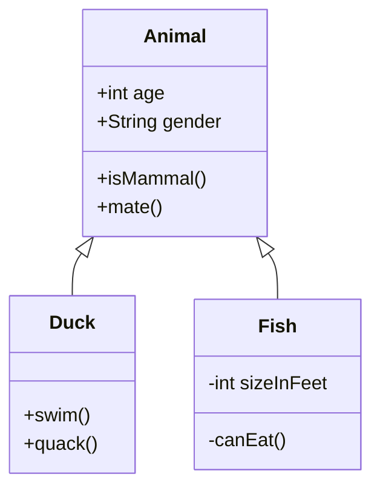
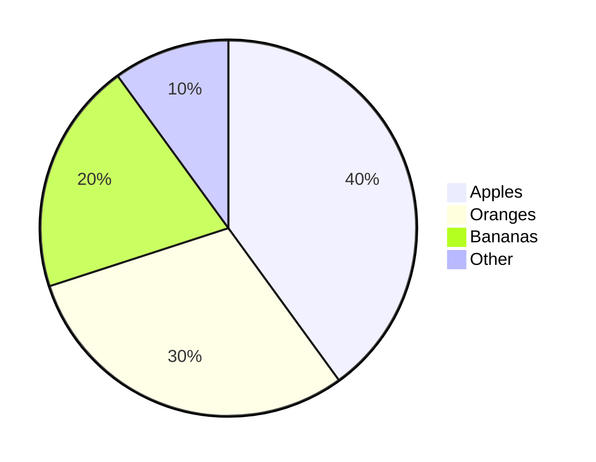
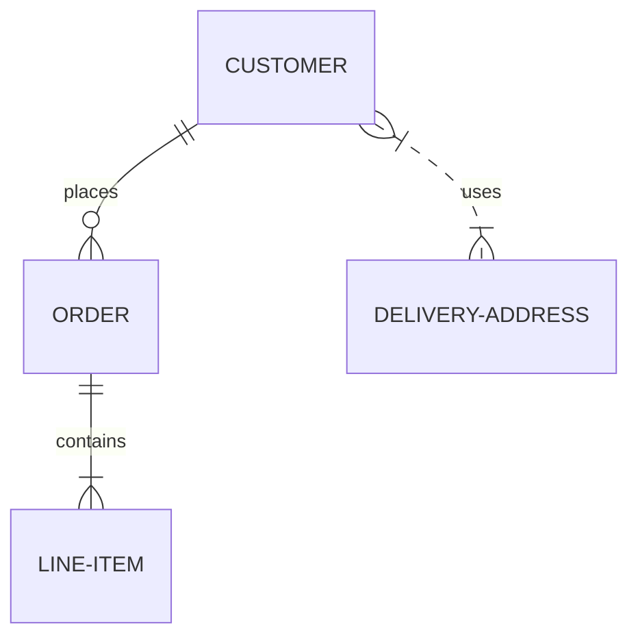
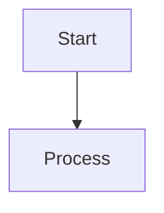

# Интеграция с Markdown

Mermaid нативно поддерживается во многих Markdown-редакторах и платформах. Рассмотрим способы использования.

## GitHub Flavored Markdown

GitHub автоматически рендерит Mermaid диаграммы в файлах `.md`.

### Пример использования

```markdown
# Архитектура проекта

## Основная схема

````markdown

````

**Результат:**


## Процесс CI/CD

````markdown

````

**Результат:**

```

**Важно:** На GitHub не требуется дополнительная настройка — просто используйте блоки кода с `mermaid`.

## GitLab

GitLab также поддерживает Mermaid из коробки.

```markdown
````markdown

````

**Результат:**

```

## Obsidian

Obsidian имеет встроенную поддержку Mermaid.

### Использование в Obsidian

1. Создайте новую заметку
2. Используйте стандартный синтаксис:

````markdown
````markdown

````

**Результат:**

````

### Настройка темы в Obsidian

В настройках Obsidian можно выбрать тему для Mermaid:
- Settings → Appearance → Mermaid theme
- Доступные темы: default, forest, dark, neutral

## Notion

Notion **не поддерживает** Mermaid нативно, но есть обходные пути:

### Способ 1: Экспорт в изображение

1. Создайте диаграмму в [Mermaid Live Editor](https://mermaid.live/)
2. Экспортируйте как PNG/SVG
3. Вставьте изображение в Notion

### Способ 2: Использование интеграций

Используйте сервисы типа [Mermaid Chart](https://www.mermaidchart.com/) для встраивания.

## VS Code

### Расширение "Markdown Preview Mermaid Support"

1. Установите расширение: `Markdown Preview Mermaid Support`
2. Откройте `.md` файл
3. Нажмите `Ctrl+Shift+V` (или `Cmd+Shift+V` на Mac)
4. Диаграммы отобразятся автоматически

### Расширение "Mermaid Preview"

Для просмотра `.mmd` файлов:
1. Установите `Mermaid Preview`
2. Откройте файл `.mmd`
3. Нажмите кнопку предпросмотра

## Hugo

### Установка плагина

```bash
# В config.toml
[markup]
  [markup.goldmark]
    [markup.goldmark.extensions]
      [markup.goldmark.extensions.passthrough]
        enable = true
      [markup.goldmark.extensions.extras]
        [markup.goldmark.extensions.extras.insert]
          enable = true
```

### Использование в статьях

```markdown
---
title: "Моя статья"
date: 2024-01-01
---

## Диаграмма


graph LR
    A[Start] --> B[Process]
    B --> C[End]

```

## Jekyll

### Плагин jekyll-mermaid

1. Добавьте в `_config.yml`:

```yaml
plugins:
  - jekyll-mermaid
```

2. Включите в layout:

```html
<!-- _layouts/default.html -->
<script type="module">
  import mermaid from 'https://cdn.jsdelivr.net/npm/mermaid@10/dist/mermaid.esm.min.mjs';
  mermaid.initialize({ startOnLoad: true });
</script>
```

3. Используйте в постах:

```markdown
````markdown

````

**Результат:**

```

## Docusaurus

### Настройка

1. Установите плагин:

```bash
npm install @docusaurus/theme-mermaid
```

2. Добавьте в `docusaurus.config.js`:

```javascript
module.exports = {
  themes: ['@docusaurus/theme-mermaid'],
  markdown: {
    mermaid: true,
  },
};
```

3. Используйте в документах:

```markdown
````markdown

````

**Результат:**

```

## MkDocs Material

Как в нашем проекте:

```yaml
# mkdocs.yml
markdown_extensions:
  - pymdownx.superfences:
      custom_fences:
        - name: mermaid
          class: mermaid
          format: !!python/name:mermaid2.fence_mermaid

plugins:
  - mermaid2
```

## Pandoc

Конвертация Markdown с Mermaid в PDF/HTML:

```bash
# Установка фильтра
npm install -g mermaid-filter

# Конвертация
pandoc input.md --filter mermaid-filter -o output.pdf
```

## Сравнение платформ

| Платформа | Поддержка | Настройка | Примечания |
|-----------|-----------|-----------|------------|
| GitHub | ✅ Нативная | Не требуется | Автоматический рендеринг |
| GitLab | ✅ Нативная | Не требуется | Полная поддержка |
| Obsidian | ✅ Нативная | Минимальная | Выбор темы в настройках |
| Notion | ❌ Нет | Требуется экспорт | Через изображения |
| VS Code | ✅ Через расширения | Установка плагина | Несколько вариантов |
| Hugo | ⚠️ Частичная | Конфигурация | Требует настройки |
| Jekyll | ⚠️ Через плагины | Установка плагина | Дополнительный шаг |
| Docusaurus | ✅ Через тему | Установка темы | Официальная поддержка |
| MkDocs | ✅ Через плагин | Настройка YAML | Как в этом проекте |

## Советы по использованию

1. **Всегда проверяйте рендеринг** на целевой платформе
2. **Используйте простые конструкции** для лучшей совместимости
3. **Тестируйте на мобильных устройствах** — некоторые платформы могут иметь ограничения
4. **Сохраняйте исходный код диаграмм** в репозитории для версионирования
5. **Используйте комментарии** в сложных диаграммах:

````markdown

````

**Результат:**


## Полезные ссылки

- [Mermaid Live Editor](https://mermaid.live/)
- [Документация GitHub](https://docs.github.com/en/get-started/writing-on-github/working-with-advanced-formatting/creating-diagrams)
- [Obsidian Help](https://help.obsidian.md/How+to/Create+diagrams+with+Mermaid)
- [Docusaurus Mermaid](https://docusaurus.io/docs/markdown-features/diagrams)
