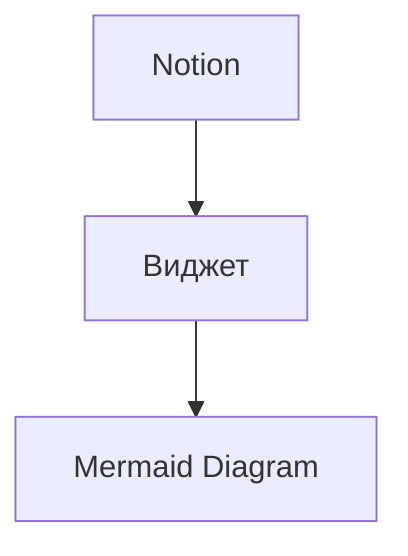
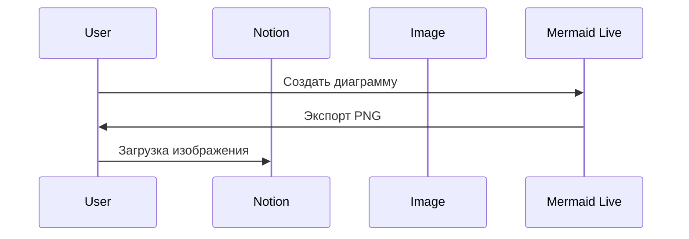
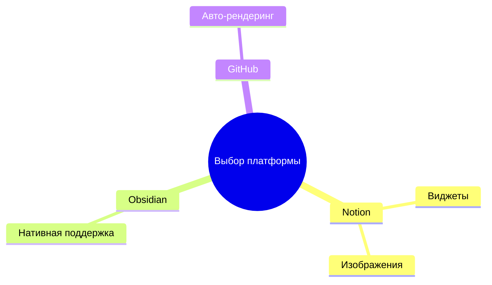

# Интеграция с Notion

Notion — популярная платформа для заметок и управления проектами. Хотя прямая поддержка Mermaid в Notion ограничена, существуют способы использования диаграмм.

## Способы интеграции

### 1. Использование сторонних виджетов

Самый простой способ — использовать сервисы-посредники:

1. Создайте диаграмму в [Mermaid Live Editor](https://mermaid.live/)
2. Скопируйте ссылку на диаграмму
3. Используйте сервисы вроде [Indify](https://indify.co/) или [Super.so](https://super.so/) для вставки

**Пример:**


### 2. Экспорт в изображение

Для статических диаграмм:

1. Создайте диаграмму в Mermaid Live Editor
2. Экспортируйте как PNG/SVG
3. Загрузите изображение в Notion



### 3. Использование API (для разработчиков)

Для автоматизации можно использовать Notion API:

```javascript
// Пример скрипта для генерации и загрузки диаграмм
const { Client } = require('@notionhq/client');
const mermaid = require('mermaid');
const fs = require('fs');

async function addDiagramToNotion(pageId, mermaidCode) {
  // Генерация SVG
  const { svg } = await mermaid.render('diagram', mermaidCode);
  
  // Сохранение и загрузка в Notion
  fs.writeFileSync('diagram.svg', svg);
  // ... код загрузки через API
}
```

## Ограничения

| Возможность | Статус |
|------------|--------|
| Рендеринг Mermaid | ❌ Не поддерживается нативно |
| Изображения | ✅ Полная поддержка |
| Сторонние виджеты | ✅ Работают через embed |
| Интерактивность | ⚠️ Только через виджеты |

## Рекомендации

1. **Для документации**: используйте экспорт в PNG/SVG
2. **Для презентаций**: применяйте сторонние виджеты
3. **Для автоматизации**: пишите скрипты с использованием API

## Альтернативы

Если нужна полноценная поддержка Mermaid:
- **Obsidian** — полная поддержка из коробки
- **GitHub/GitLab** — рендеринг в markdown
- **Собственный сайт** — через MkDocs + плагин mermaid2


