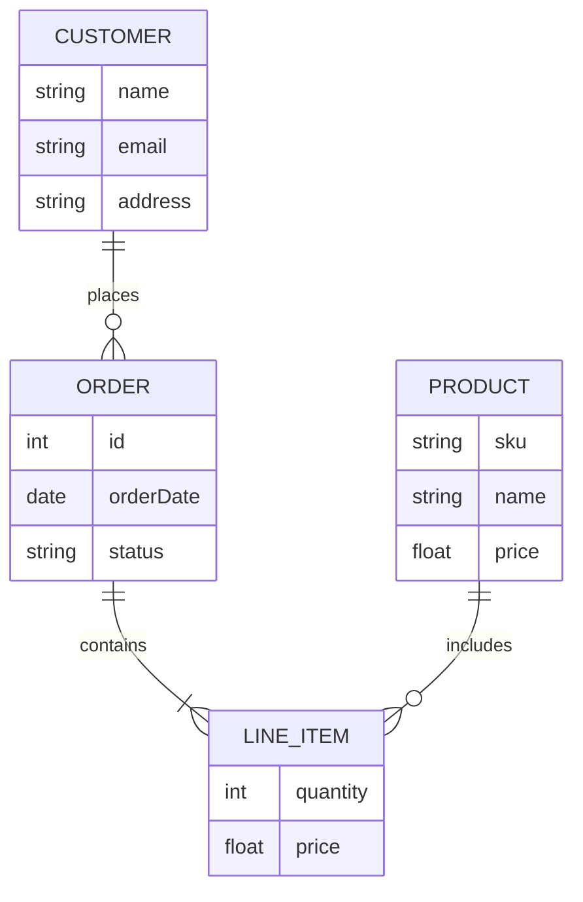

# Интеграция с Obsidian

Obsidian имеет встроенную поддержку Mermaid. Вам не нужно устанавливать плагины, просто используйте блоки кода.

## Как использовать

1. Создайте новую заметку.
2. Вставьте блок кода с языком `mermaid`.
3. Переключитесь в режим просмотра (Preview), чтобы увидеть диаграмму.

## Пример: ER Диаграмма (Сущность-Связь)

### Исходный код (для копирования):

```text
erDiagram
    CUSTOMER ||--o{ ORDER : places
    ORDER ||--|{ LINE_ITEM : contains
    PRODUCT ||--o{ LINE_ITEM : includes
    
    CUSTOMER {
        string name
        string email
        string address
    }
    ORDER {
        int id
        date orderDate
        string status
    }
    PRODUCT {
        string sku
        string name
        float price
    }
    LINE_ITEM {
        int quantity
        float price
    }
```

### Результат (как это выглядит в Obsidian):



## Советы для Obsidian

- Используйте режим "Live Preview" для мгновенного отображения изменений.
- Диаграммы сохраняются как обычный текст в заметке.
- Можно экспортировать заметку в PDF, диаграммы сохранятся как изображения.
