# Работа с Obsidian

Obsidian — мощный инструмент для работы с заметками, который имеет отличную встроенную поддержку Mermaid.

## Базовое использование

### Создание диаграммы

1. Откройте или создайте заметку в Obsidian
2. Используйте стандартный синтаксис Mermaid:

````markdown
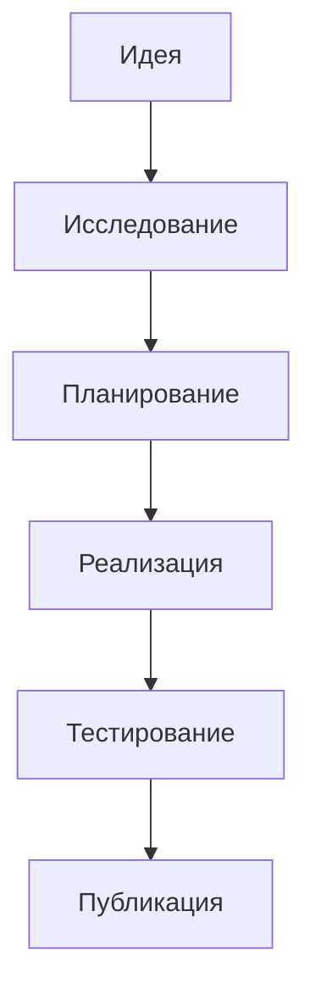
````

## Типы диаграмм в Obsidian

### Flowchart (Блок-схемы)

````markdown
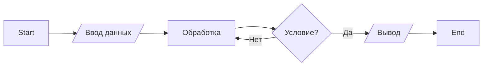
````

### Sequence Diagram (Диаграммы последовательностей)

````markdown
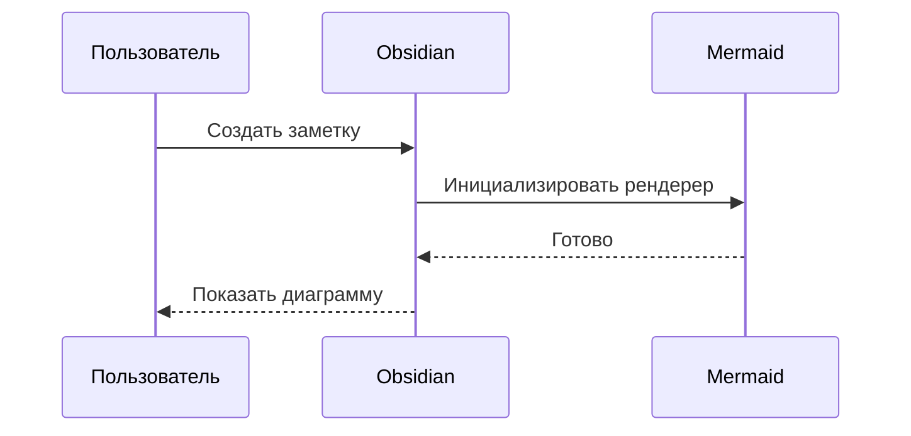
````

### Class Diagram (Диаграммы классов)

````markdown
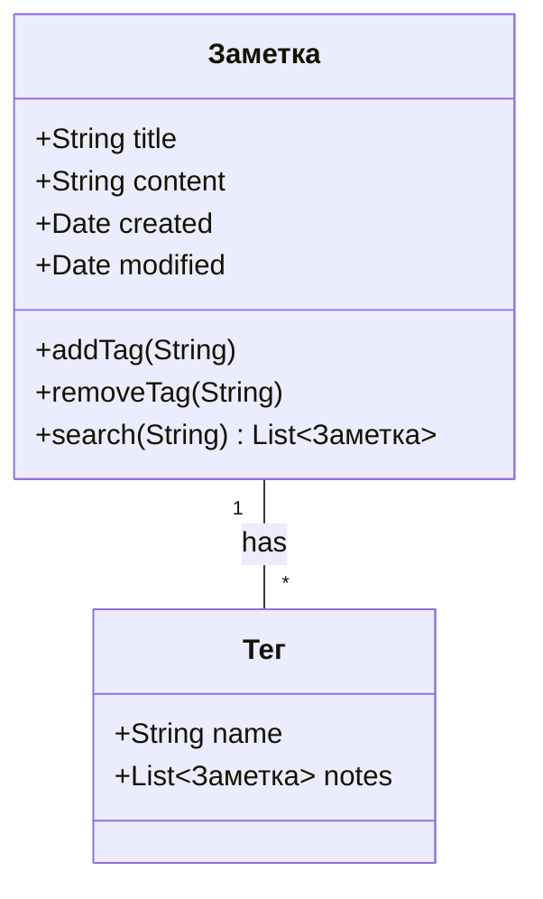
````

### Gantt Chart (Диаграммы Ганта)

````markdown
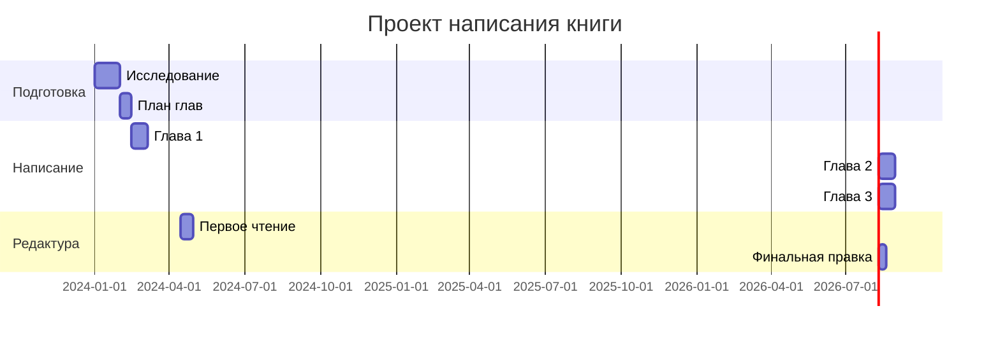
````

### Mindmap (Ментальные карты)

````markdown
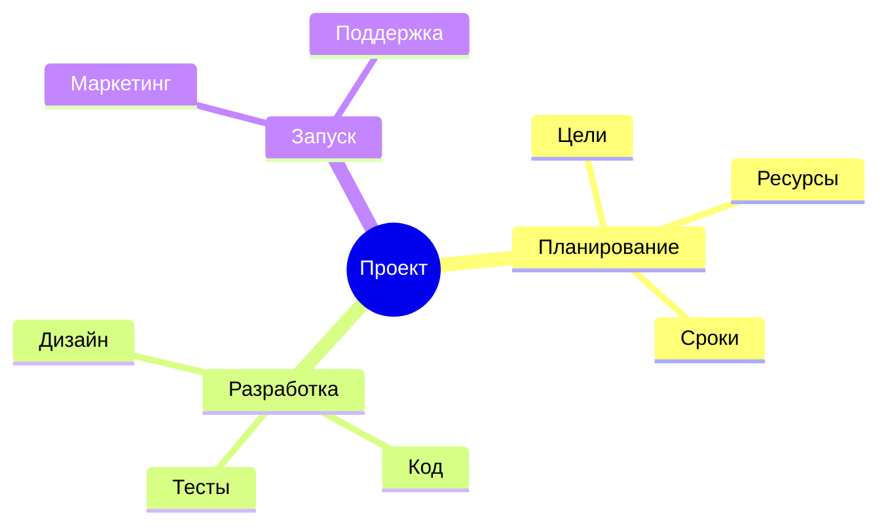
````

### ER Diagram (Диаграммы сущность-связь)

````markdown
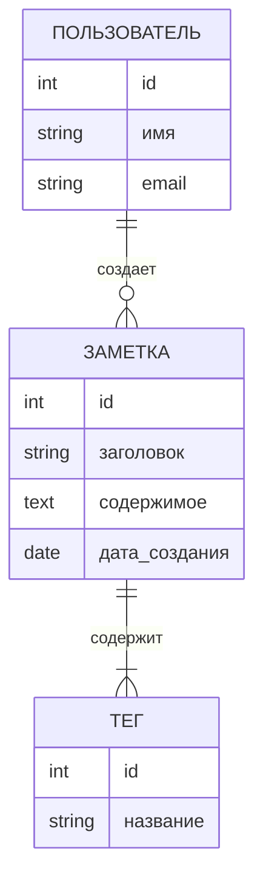
````

## Настройка тем

### Выбор темы

1. Откройте **Settings** (Настройки)
2. Перейдите в **Appearance** (Внешний вид)
3. Найдите секцию **Mermaid theme**
4. Выберите одну из тем:
   - `default` — светлая тема по умолчанию
   - `forest` — зеленая тема
   - `dark` — темная тема
   - `neutral` — нейтральная серая тема

### Автоматическое переключение тем

Obsidian может автоматически переключать тему Mermaid вместе с темой приложения:

```javascript
// В сниппете или плагине
app.on('css-change', () => {
  const isDark = document.body.classList.contains('theme-dark');
  // Логика переключения темы Mermaid
});
```

## Продвинутые техники

### Связь между заметками

Используйте Mermaid для визуализации связей между заметками:

````markdown
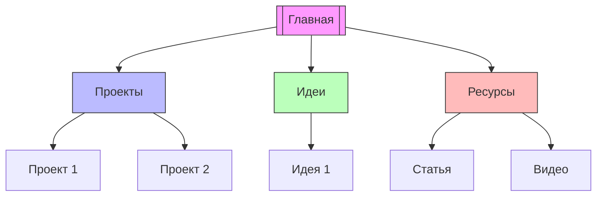
````

### Интерактивные элементы

Хотя Obsidian не поддерживает полную интерактивность, можно использовать кликабельные ссылки:

````markdown
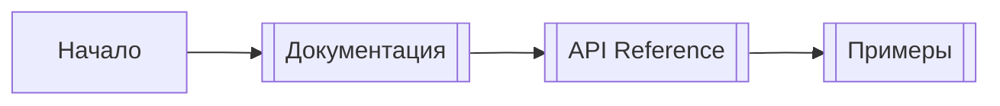
````

### Использование с плагинами

#### Excalidraw + Mermaid

Плагин Excalidraw позволяет комбинировать Mermaid с ручными рисунками:

1. Установите плагин **Excalidraw**
2. Создайте новый Excalidraw файл
3. Вставьте Mermaid код через меню

#### Dataview + Mermaid

Автоматическая генерация диаграмм из данных:

````markdown
```dataview
TABLE without id file.link as "Заметка", tags as "Теги"
FROM #проект
SORT file.name
```

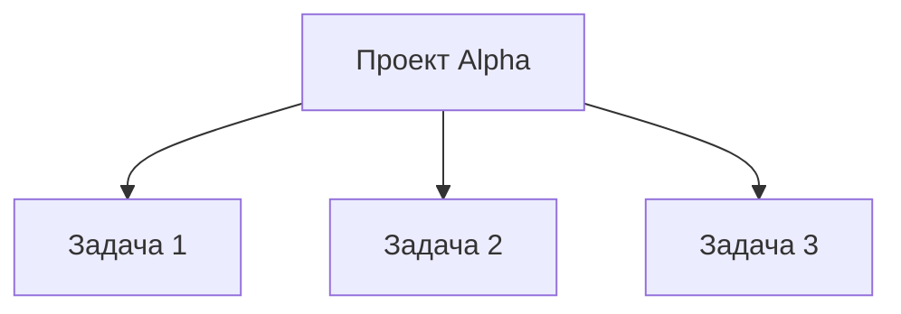
````

## Шаблоны для частого использования

### Шаблон: Процесс разработки

Создайте файл `Templates/Development Process.md`:

````markdown
## Процесс разработки

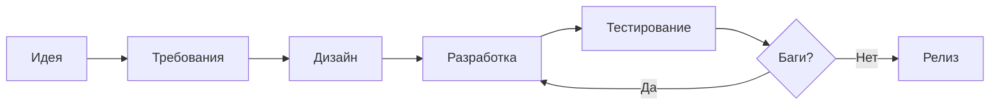

**Статус:** %% Не начато %%
**Дата начала:** %% {{date}} %%
````

### Шаблон: Архитектура системы

````markdown
## Архитектура

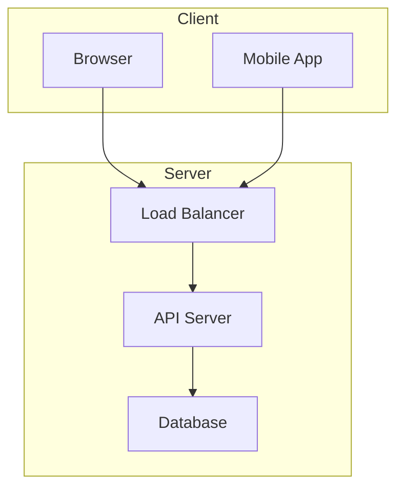

**Версия:** 1.0
**Последнее обновление:** {{date}}
````

## Советы и лучшие практики

1. **Используйте комментарии** для документации сложных диаграмм:
   ```mermaid
   graph TD
       %% Основной поток
       A --> B
       %% Обработка ошибок
       B --> C
   ```

2. **Группируйте связанные элементы** с помощью `subgraph`:
   ```mermaid
   graph TB
       subgraph Frontend
           A[React]
           B[Vue]
       end
       
       subgraph Backend
           C[Node.js]
           D[Python]
       end
   ```

3. **Сохраняйте простоту** — сложные диаграммы трудно читать

4. **Используйте цвета осмысленно**:
   ```mermaid
   graph LR
       A[Критично] --> B[Важно]
       B --> C[Нормально]
       
       style A fill:#ff6b6b
       style B fill:#ffd93d
       style C fill:#6bcb77
   ```

5. **Версионируйте диаграммы** вместе с заметками через Git

## Экспорт и публикация

### Экспорт в PNG/SVG

1. Откройте заметку с диаграммой
2. Нажмите правой кнопкой на диаграмму
3. Выберите **Save as image**
4. Выберите формат (PNG или SVG)

### Публикация через Obsidian Publish

Диаграммы Mermaid автоматически рендерятся в опубликованных заметках.

### Экспорт в PDF

1. Установите плагин **Export to PDF**
2. Экспортируйте заметку
3. Диаграммы будут включены как изображения

## Решение проблем

### Диаграмма не отображается

1. Проверьте синтаксис в [Mermaid Live Editor](https://mermaid.live/)
2. Убедитесь, что отступы правильные (пробелы, не табы)
3. Перезагрузите Obsidian

### Медленный рендеринг

1. Упростите диаграмму
2. Разбейте на несколько меньших диаграмм
3. Отключите предпросмотр для больших заметок

### Конфликты с плагинами

Если диаграммы не работают после установки плагина:
1. Отключите недавно установленные плагины
2. Проверьте консоль разработчика (`Ctrl+Shift+I`)
3. Обновите Obsidian до последней версии

## Полезные ресурсы

- [Официальная документация Obsidian](https://help.obsidian.md/How+to/Create+diagrams+with+Mermaid)
- [Mermaid JS Documentation](https://mermaid.js.org/)
- [Obsidian Forum - Mermaid Tag](https://forum.obsidian.md/tag/mermaid)
- [Awesome Obsidian](https://github.com/kmaasrud/awesome-obsidian)
