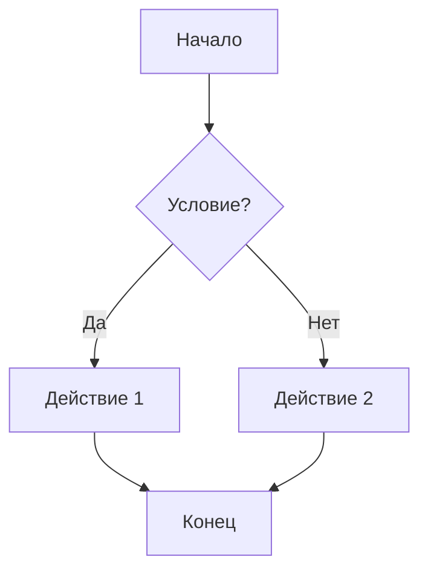

# Mermaid Guide

Добро пожаловать в полное руководство по **Mermaid** — инструменту для создания диаграмм и визуализаций с помощью простого текстового синтаксиса.

## 🚀 Быстрый старт

Создайте свою первую диаграмму за 30 секунд:

````markdown

````

**Результат:**


## 📚 Что вы найдете здесь

- **Основы**: Изучите синтаксис и настройте окружение
- **Типы диаграмм**: От блок-схем до диаграмм Ганта и ментальных карт
- **Продвинутые техники**: Стилизация, интерактивность и интеграция
- **Примеры**: Реальные кейсы использования в документации и архитектуре

## 🎯 Почему Mermaid?

- ✅ **Текстовый формат**: Диаграммы хранятся вместе с кодом
- ✅ **Версионность**: Легко отслеживать изменения в Git
- ✅ **Интеграция**: Работает в GitHub, GitLab, MkDocs, Obsidian и других
- ✅ **Простота**: Минимум синтаксиса для максимального результата

## 📖 Навигация

| Раздел | Описание |
|--------|----------|
| [Основы](basics/what-is-mermaid.md) | Введение, установка, базовый синтаксис |
| [Типы диаграмм](diagrams/flowchart.md) | Все виды поддерживаемых диаграмм |
| [Продвинутые техники](advanced/styling.md) | Кастомизация и сложные сценарии |
| [Примеры](examples/documentation.md) | Практическое применение |

---

*Руководство создано [DaniilGavrin](https://github.com/DaniilGavrin)*
