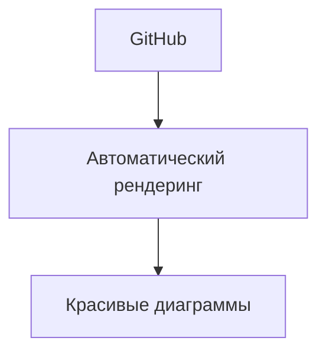
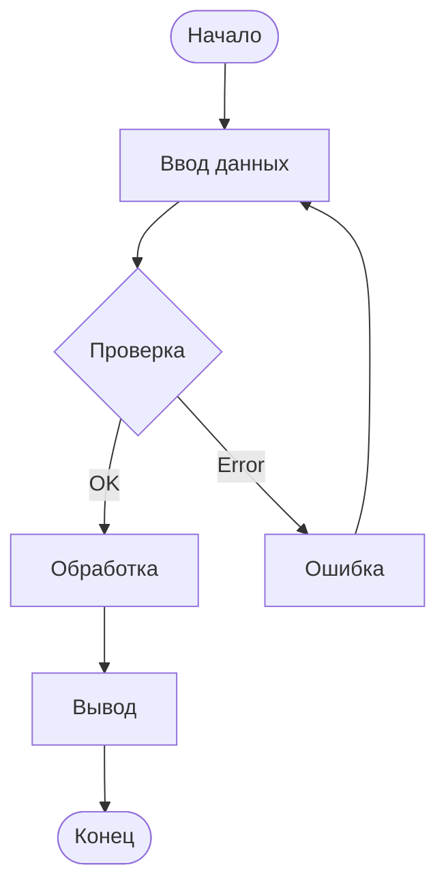
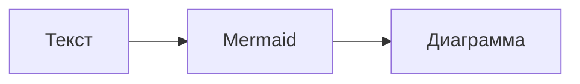
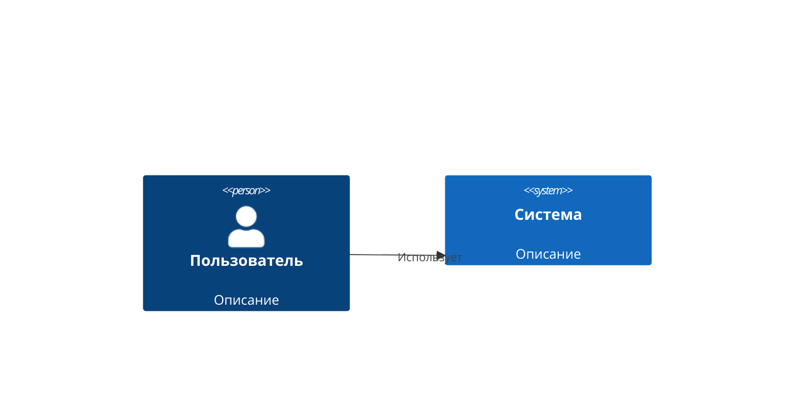
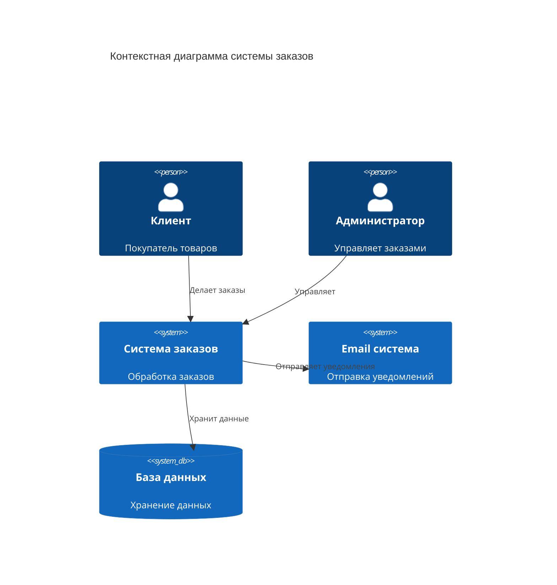
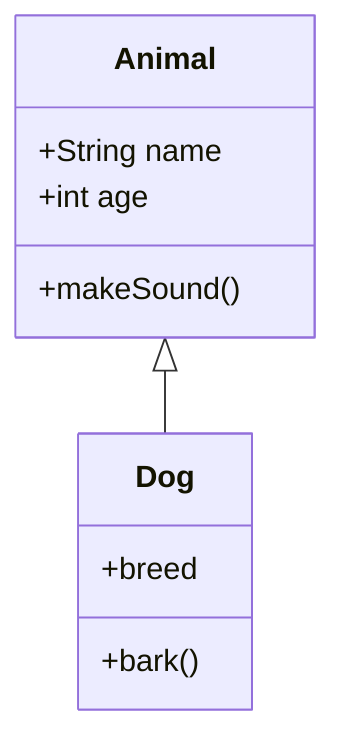
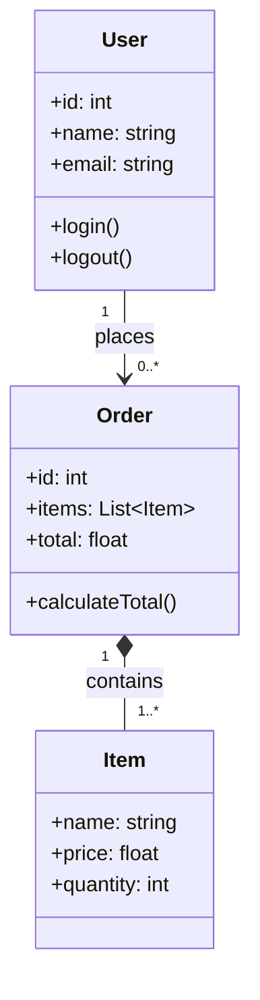
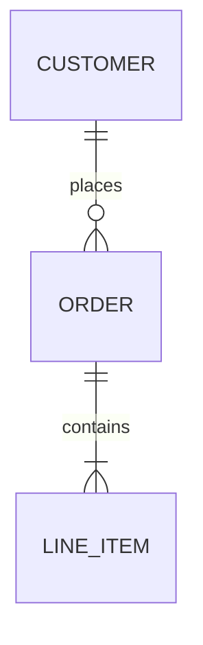
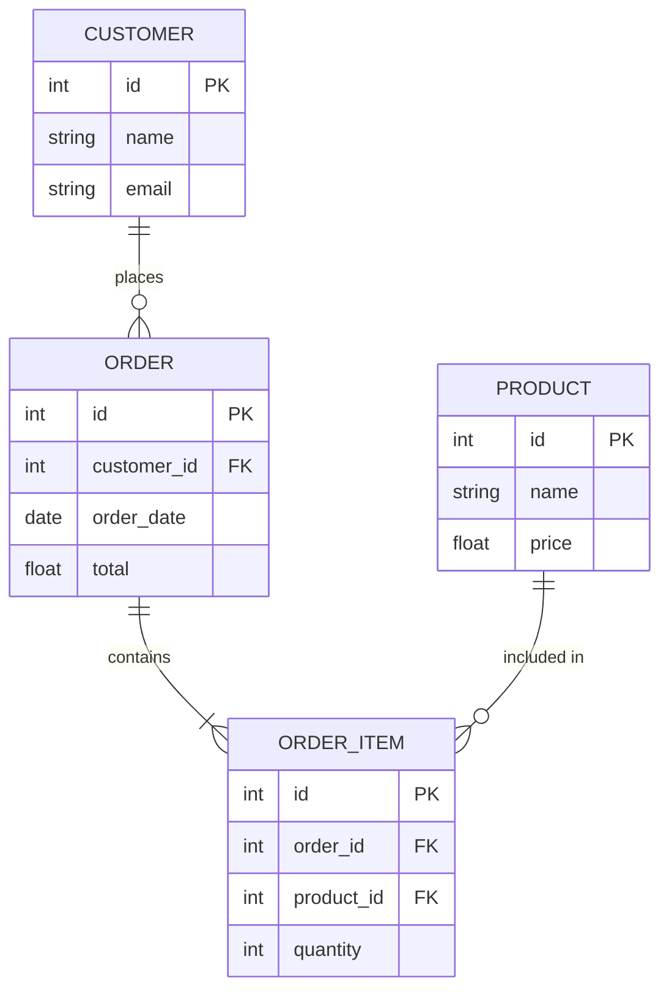

# Полное руководство по Mermaid.js

*Автоматически сгенерированная документация*

---

# Установка и настройка

## 📦 Установка в MkDocs

### 1. Установка зависимостей

```bash
pip install mkdocs-material mkdocs-mermaid2-plugin
```

### 2. Настройка `mkdocs.yml`

```yaml
markdown_extensions:
  - mermaid2

plugins:
  - search
  - mermaid2:
      version: 10.6.1
```

## 🔗 Интеграция с GitHub

GitHub автоматически рендерит Mermaid-диаграммы в Markdown-файлах:

````markdown

````

**Результат:**


## 🛠 Другие платформы

| Платформа | Поддержка |
|-----------|-----------|
| GitLab | ✅ Встроенная |
| Obsidian | ✅ Встроенная |
| Notion | ❌ Не поддерживается |
| Confluence | ⚠️ Через плагины |

---

*Перейдите к [синтаксису](syntax.md) для изучения основ.*

---
# Базовый синтаксис

## 📐 Структура диаграммы

Любая диаграмма начинается с указания типа:

````markdown

````

**Результат:**


## 🔤 Основные элементы

| Элемент | Синтаксис | Пример |
|---------|-----------|--------|
| Узел | `A[Текст]` | `A[Начало]` |
| Ромб (условие) | `A{Текст}` | `A{Условие?}` |
| Круг | `A((Текст))` | `A((Конец))` |
| Стрелка | `-->` | `A --> B` |
| Стрелка с текстом | `-->|Текст|` | `A -->|Да| B` |

## 🎨 Пример сложной диаграммы

````markdown

````

**Результат:**


## 📏 Направления

- `TD` / `TB` — сверху вниз
- `LR` — слева направо
- `RL` — справа налево
- `BT` — снизу вверх

---

*Перейдите к [блок-схемам](../diagrams/flowchart.md) для подробного изучения.*

---
# Что такое Mermaid?

**Mermaid** — это JavaScript-библиотека для создания диаграмм и визуализаций с помощью простого текстового синтаксиса, похожего на Markdown.

## 🎯 Основные преимущества

| Преимущество | Описание |
|--------------|----------|
| Текстовый формат | Диаграммы хранятся в виде обычного текста |
| Версионность | Легко отслеживать изменения в Git |
| Интеграция | Работает в GitHub, GitLab, MkDocs, Obsidian |
| Простота | Минимум синтаксиса для быстрого старта |

## 📝 Пример использования

````markdown

````

**Результат:**


## 🔧 Где используется

- Документация проектов
- Архитектурные схемы
- Блок-схемы алгоритмов
- Диаграммы последовательностей
- Ментальные карты

---

*Перейдите к [установке и настройке](setup.md) для начала работы.*

---

# Типы диаграмм

# Диаграммы C4

C4-модель для визуализации архитектуры программного обеспечения на разных уровнях абстракции.

## 📐 Базовый синтаксис

````markdown

````

**Результат:**


## 🏗 Практический пример: Веб-приложение

````markdown

````

**Результат:**


## 📊 Уровни C4

1. **Context** (Контекст) — система и внешние пользователи
2. **Container** (Контейнеры) — приложения, хранилища данных
3. **Component** (Компоненты) — модули внутри контейнеров
4. **Code** (Код) — классы и функции (редко используется)

---

*Перейдите к [продвинутым техникам](../advanced/styling.md) для изучения стилизации.*

---
# Диаграммы классов

Диаграммы классов UML для отображения структуры системы.

## 📐 Базовый синтаксис

````markdown

````

**Результат:**


## 🔗 Типы отношений

| Отношение | Синтаксис | Описание |
|-----------|-----------|----------|
| Наследование | `<|--` | "Является" |
| Реализация | `<|..` | Интерфейс |
| Ассоциация | `-->` | Связь |
| Агрегация | `o--` | "Часть целого" |
| Композиция | `*--` | Сильная связь |

## 🏗 Практический пример

````markdown

````

**Результат:**


---

*Перейдите к [диаграммам состояний](state.md) для изучения следующего типа.*

---
# Диаграммы сущность-связь (ER)

ER-диаграммы для моделирования данных и связей между сущностями.

## 📐 Базовый синтаксис

````markdown

````

**Результат:**


## 🔗 Типы связей

| Связь | Синтаксис | Описание |
|-------|-----------|----------|
| Один к одному | `\|\|--\|\|` | 1:1 |
| Один ко многим | `\|\|--o{` | 1:N |
| Многие ко многим | `}o--o{` | N:M |
| Необязательная | `o{` | 0..N |

## 🏗 Практический пример: Интернет-магазин

````markdown

````

**Результат:**


---

*Перейдите к [диаграммам Ганта](gantt.md) для изучения следующего типа.*

---
# Блок-схемы (Flowchart)

Блок-схемы — самый популярный тип диаграмм в Mermaid.

## 📊 Типы узлов

**Пример кода:**
````markdown
````markdown
```mermaid
graph TD
    A[Прямоугольник] --> B{Ромб}
    B --> C(Круг)
    B --> D([Скошенный])
    B --> E[(Цилиндр)]
    B --> F((Двойной круг))
```
````

**Результат:**
```mermaid
graph TD
    A[Прямоугольник] --> B{Ромб}
    B --> C(Круг)
    B --> D([Скошенный])
    B --> E[(Цилиндр)]
    B --> F((Двойной круг))
```
````

**Результат:**
````markdown
```mermaid
graph TD
    A[Прямоугольник] --> B{Ромб}
    B --> C(Круг)
    B --> D([Скошенный])
    B --> E[(Цилиндр)]
    B --> F((Двойной круг))
```
````

**Результат:**
```mermaid
graph TD
    A[Прямоугольник] --> B{Ромб}
    B --> C(Круг)
    B --> D([Скошенный])
    B --> E[(Цилиндр)]
    B --> F((Двойной круг))
```

## 🔗 Типы связей

| Тип | Синтаксис | Вид |
|-----|-----------|-----|
| Сплошная | `-->` | → |
| Пунктирная | `-.->` | ⇢ |
| Жирная | `==>` | ⇒ |
| Тонкая | `---` | — |

## 🏷 Подписи на связях

**Пример кода:**
````markdown
````markdown
```mermaid
graph LR
    Start -->|Шаг 1| Process
    Process -->|Шаг 2| Check{Проверка}
    Check -->|Да| End
    Check -->|Нет| Process
```
````

**Результат:**
```mermaid
graph LR
    Start -->|Шаг 1| Process
    Process -->|Шаг 2| Check{Проверка}
    Check -->|Да| End
    Check -->|Нет| Process
```
````

**Результат:**
````markdown
```mermaid
graph LR
    Start -->|Шаг 1| Process
    Process -->|Шаг 2| Check{Проверка}
    Check -->|Да| End
    Check -->|Нет| Process
```
````

**Результат:**
```mermaid
graph LR
    Start -->|Шаг 1| Process
    Process -->|Шаг 2| Check{Проверка}
    Check -->|Да| End
    Check -->|Нет| Process
```

## 🎯 Практический пример: Алгоритм сортировки

**Пример кода:**
````markdown
````markdown
```mermaid
graph TD
    Start([Начало]) --> Init[Инициализация]
    Init --> Loop{Есть элементы?}
    Loop -->|Да| Compare[Сравнение]
    Compare --> Swap{Нужно менять?}
    Swap -->|Да| Exchange[Обмен]
    Swap -->|Нет| Next[Следующий элемент]
    Exchange --> Next
    Next --> Loop
    Loop -->|Нет| Finish([Конец])
```
````

**Результат:**
```mermaid
graph TD
    Start([Начало]) --> Init[Инициализация]
    Init --> Loop{Есть элементы?}
    Loop -->|Да| Compare[Сравнение]
    Compare --> Swap{Нужно менять?}
    Swap -->|Да| Exchange[Обмен]
    Swap -->|Нет| Next[Следующий элемент]
    Exchange --> Next
    Next --> Loop
    Loop -->|Нет| Finish([Конец])
```
````

**Результат:**
````markdown
```mermaid
graph TD
    Start([Начало]) --> Init[Инициализация]
    Init --> Loop{Есть элементы?}
    Loop -->|Да| Compare[Сравнение]
    Compare --> Swap{Нужно менять?}
    Swap -->|Да| Exchange[Обмен]
    Swap -->|Нет| Next[Следующий элемент]
    Exchange --> Next
    Next --> Loop
    Loop -->|Нет| Finish([Конец])
```
````

**Результат:**
```mermaid
graph TD
    Start([Начало]) --> Init[Инициализация]
    Init --> Loop{Есть элементы?}
    Loop -->|Да| Compare[Сравнение]
    Compare --> Swap{Нужно менять?}
    Swap -->|Да| Exchange[Обмен]
    Swap -->|Нет| Next[Следующий элемент]
    Exchange --> Next
    Next --> Loop
    Loop -->|Нет| Finish([Конец])
```

---

*Перейдите к [диаграммам последовательностей](sequence.md) для изучения следующего типа.*

---
# Диаграммы Ганта

Диаграммы Ганта для визуализации планов проектов и временных шкал.

## 📐 Базовый синтаксис

````markdown
```mermaid
gantt
    title Проект
    dateFormat  YYYY-MM-DD
    section Этап 1
    Задача 1 :a1, 2024-01-01, 7d
    Задача 2 :after a1, 5d
```
````

**Результат:**
```mermaid
gantt
    title Проект
    dateFormat  YYYY-MM-DD
    section Этап 1
    Задача 1 :a1, 2024-01-01, 7d
    Задача 2 :after a1, 5d
```

## 🔧 Директивы

| Директива | Описание |
|-----------|----------|
| `dateFormat` | Формат даты |
| `section` | Группа задач |
| `todayMarker` | Маркер текущего дня |

## 🏗 Практический пример: Разработка ПО

````markdown
```mermaid
gantt
    title План разработки
    dateFormat  YYYY-MM-DD
    axisFormat  %d.%m
    
    section Анализ
    Сбор требований       :a1, 2024-01-01, 5d
    Проектирование        :a2, after a1, 7d
    
    section Разработка
    Backend              :b1, after a2, 10d
    Frontend             :b2, after a2, 8d
    Интеграция           :b3, after b1 b2, 5d
    
    section Тестирование
    Unit тесты           :c1, after b3, 3d
    Интеграционные тесты  :c2, after c1, 5d
    
    section Релиз
    Деплой               :d1, after c2, 2d
```
````

**Результат:**
```mermaid
gantt
    title План разработки
    dateFormat  YYYY-MM-DD
    axisFormat  %d.%m
    
    section Анализ
    Сбор требований       :a1, 2024-01-01, 5d
    Проектирование        :a2, after a1, 7d
    
    section Разработка
    Backend              :b1, after a2, 10d
    Frontend             :b2, after a2, 8d
    Интеграция           :b3, after b1 b2, 5d
    
    section Тестирование
    Unit тесты           :c1, after b3, 3d
    Интеграционные тесты  :c2, after c1, 5d
    
    section Релиз
    Деплой               :d1, after c2, 2d
```

---

*Перейдите к [ментальным картам](mindmap.md) для изучения следующего типа.*

---
# Ментальные карты

Ментальные карты (Mind Maps) для визуализации идей и структурирования информации.

## 📐 Базовый синтаксис

````markdown
```mermaid
mindmap
  root((Идея))
    Ветка 1
      Подветка 1.1
      Подветка 1.2
    Ветка 2
      Подветка 2.1
```
````

**Результат:**
```mermaid
mindmap
  root((Идея))
    Ветка 1
      Подветка 1.1
      Подветка 1.2
    Ветка 2
      Подветка 2.1
```

## 🎯 Формы узлов

| Форма | Синтаксис | Пример |
|-------|-----------|--------|
| Круг | `((Текст))` | `root((Идея))` |
| Квадрат | `[Текст]` | `A[Узел]` |
| Ромб | `{Текст}` | `B{Вопрос}` |
| Обычный | `Текст` | `C Просто текст` |

## 🏗 Практический пример: Изучение программирования

````markdown
```mermaid
mindmap
  root((Программирование))
    Языки
      Python
        Веб
        Data Science
        Автоматизация
      JavaScript
        Frontend
        Node.js
      Go
        Микросервисы
        CLI
    Навыки
      Алгоритмы
      Структуры данных
      Паттерны
      Git
    Инструменты
      IDE
        VS Code
        PyCharm
      Терминал
      Docker
```
````

**Результат:**
```mermaid
mindmap
  root((Программирование))
    Языки
      Python
        Веб
        Data Science
        Автоматизация
      JavaScript
        Frontend
        Node.js
      Go
        Микросервисы
        CLI
    Навыки
      Алгоритмы
      Структуры данных
      Паттерны
      Git
    Инструменты
      IDE
        VS Code
        PyCharm
      Терминал
      Docker
```

---

*Перейдите к [диаграммам таймлайн](timeline.md) для изучения следующего типа.*

---
# Квадранты

Диаграммы квадрантов для сравнения объектов по двум осям.

## 📐 Базовый синтаксис

````markdown
```mermaid
quadrantChart
    title Матрица приоритетов
    x-axis Низкий приоритет --> Высокий приоритет
    y-axis Низкая сложность --> Высокая сложность
    "Задача A": [0.8, 0.3]
    "Задача B": [0.4, 0.7]
```
````

**Результат:**
```mermaid
quadrantChart
    title Матрица приоритетов
    x-axis Низкий приоритет --> Высокий приоритет
    y-axis Низкая сложность --> Высокая сложность
    "Задача A": [0.8, 0.3]
    "Задача B": [0.4, 0.7]
```

## 🏗 Практический пример: Приоритизация задач

````markdown
```mermaid
quadrantChart
    title Матрица Эйзенхауэра
    x-axis Срочное --> Несрочное
    y-axis Важное --> Неважное
    "Кризисы": [0.1, 0.9]
    "Планирование": [0.8, 0.8]
    "Рутина": [0.2, 0.2]
    "Развлечения": [0.9, 0.1]
```
````

**Результат:**
```mermaid
quadrantChart
    title Матрица Эйзенхауэра
    x-axis Срочное --> Несрочное
    y-axis Важное --> Неважное
    "Кризисы": [0.1, 0.9]
    "Планирование": [0.8, 0.8]
    "Рутина": [0.2, 0.2]
    "Развлечения": [0.9, 0.1]
```

---

*Перейдите к [продвинутым техникам](../advanced/styling.md) для изучения стилизации.*

---
# Диаграммы требований (Requirement Diagram)

Позволяют визуализировать требования и их связи с элементами системы.

## Пример 1: Базовое требование

### Исходный код (скопируйте для использования):

````text
requirementDiagram
requirement "Безопасность данных" {
    id: "REQ-001"
    text: "Все данные должны быть зашифрованы"
    risk: High
    verifymethod: Test
}

element "База данных" {
    type: "Database"
}

"База данных" - satisfies -> "Безопасность данных"
````

### Результат (как это отобразится):

```mermaid
requirementDiagram
requirement "Безопасность данных" {
    id: "REQ-001"
    text: "Все данные должны быть зашифрованы"
    risk: High
    verifymethod: Test
}

element "База данных" {
    type: "Database"
}

"База данных" - satisfies -> "Безопасность данных"
```

## Пример 2:Complex система требований

### Исходный код:

````text
requirementDiagram
requirement "Аутентификация" {
    id: "REQ-002"
    text: "Пользователь должен входить через OAuth2"
    risk: High
    verifymethod: Test
}

requirement "Логирование" {
    id: "REQ-003"
    text: "Все действия должны логироваться"
    risk: Medium
    verifymethod: Inspection
}

element "Auth Service" {
    type: "Service"
}

element "Logger" {
    type: "Module"
}

element "API Gateway" {
    type: "Component"
}

"Auth Service" - satisfies -> "Аутентификация"
"Logger" - satisfies -> "Логирование"
"API Gateway" - traces -> "Аутентификация"
"API Gateway" - traces -> "Логирование"
````

### Результат:

```mermaid
requirementDiagram
requirement "Аутентификация" {
    id: "REQ-002"
    text: "Пользователь должен входить через OAuth2"
    risk: High
    verifymethod: Test
}

requirement "Логирование" {
    id: "REQ-003"
    text: "Все действия должны логироваться"
    risk: Medium
    verifymethod: Inspection
}

element "Auth Service" {
    type: "Service"
}

element "Logger" {
    type: "Module"
}

element "API Gateway" {
    type: "Component"
}

"Auth Service" - satisfies -> "Аутентификация"
"Logger" - satisfies -> "Логирование"
"API Gateway" - traces -> "Аутентификация"
"API Gateway" - traces -> "Логирование"
```

---
# Диаграммы последовательностей

Диаграммы последовательностей показывают взаимодействие между объектами во времени.

## 📐 Базовый синтаксис

````markdown
```mermaid
sequenceDiagram
    participant A as Клиент
    participant B as Сервер
    A->>B: Запрос
    B-->>A: Ответ
```
````

**Результат:**
```mermaid
sequenceDiagram
    participant A as Клиент
    participant B as Сервер
    A->>B: Запрос
    B-->>A: Ответ
```

## 🎯 Типы стрелок

| Тип | Синтаксис | Описание |
|-----|-----------|----------|
| Сплошная | `->>` | Вызов |
| Пунктирная | `-->>` | Возврат |
| Сплошная к себе | `->>` | Самовызов |
| Создать | `->>+` | Создание участника |
| Уничтожить | `->>-` | Уничтожение |

## 🔄 Циклы и условия

````markdown
```mermaid
sequenceDiagram
    participant User
    participant System
    
    User->>System: Логин
    alt Успех
        System-->>User: Токен
    else Ошибка
        System-->>User: Сообщение об ошибке
    end
    
    loop 3 раза
        User->>System: Запрос данных
        System-->>User: Данные
    end
```
````

**Результат:**
```mermaid
sequenceDiagram
    participant User
    participant System
    
    User->>System: Логин
    alt Успех
        System-->>User: Токен
    else Ошибка
        System-->>User: Сообщение об ошибке
    end
    
    loop 3 раза
        User->>System: Запрос данных
        System-->>User: Данные
    end
```

## 🏗 Практический пример: HTTP запрос

````markdown
```mermaid
sequenceDiagram
    autonumber
    participant Browser as Браузер
    participant Server as Сервер
    participant DB as База данных
    
    Browser->>Server: GET /api/users
    activate Server
    Server->>DB: SELECT * FROM users
    activate DB
    DB-->>Server: Данные пользователей
    deactivate DB
    Server-->>Browser: JSON ответ
    deactivate Server
```
````

**Результат:**
```mermaid
sequenceDiagram
    autonumber
    participant Browser as Браузер
    participant Server as Сервер
    participant DB as База данных
    
    Browser->>Server: GET /api/users
    activate Server
    Server->>DB: SELECT * FROM users
    activate DB
    DB-->>Server: Данные пользователей
    deactivate DB
    Server-->>Browser: JSON ответ
    deactivate Server
```

---

*Перейдите к [диаграммам классов](class.md) для изучения следующего типа.*

---
# Диаграммы состояний

Диаграммы состояний (State Diagram) показывают изменения состояния объекта.

## 📐 Базовый синтаксис

````markdown
```mermaid
stateDiagram-v2
    [*] --> Created
    Created --> Active: Activate
    Active --> Closed: Close
    Closed --> [*]
```
````

**Результат:**
```mermaid
stateDiagram-v2
    [*] --> Created
    Created --> Active: Activate
    Active --> Closed: Close
    Closed --> [*]
```

## 🔗 Типы переходов

| Элемент | Синтаксис | Описание |
|---------|-----------|----------|
| Начальное состояние | `[*]` | Точка входа |
| Конечное состояние | `--> [*]` | Точка выхода |
| Переход | `-->` | Изменение состояния |
| Событие | `: событие` | Триггер перехода |

## 🏗 Практический пример: Заказ

````markdown
```mermaid
stateDiagram-v2
    [*] --> New: Создание заказа
    New --> Paid: Оплата
    New --> Cancelled: Отмена
    Paid --> Shipped: Отправка
    Shipped --> Delivered: Доставка
    Delivered --> [*]
    Cancelled --> [*]
    
    note right of New
        Заказ создан
        ожидает оплаты
    end note
```
````

**Результат:**
```mermaid
stateDiagram-v2
    [*] --> New: Создание заказа
    New --> Paid: Оплата
    New --> Cancelled: Отмена
    Paid --> Shipped: Отправка
    Shipped --> Delivered: Доставка
    Delivered --> [*]
    Cancelled --> [*]
    
    note right of New
        Заказ создан
        ожидает оплаты
    end note
```

---

*Перейдите к [диаграммам сущность-связь](er.md) для изучения следующего типа.*

---
# Диаграммы таймлайн

Диаграммы таймлайн для отображения событий во времени.

## 📐 Базовый синтаксис

````markdown
```mermaid
timeline
    title История проекта
    2020 : Начало
    2021 : Развитие
    2022 : Релиз
```
````

**Результат:**
```mermaid
timeline
    title История проекта
    2020 : Начало
    2021 : Развитие
    2022 : Релиз
```

## 🏗 Практический пример: История IT

````markdown
```mermaid
timeline
    title История вычислительной техники
    1940-е : ENIAC
           : Первый компьютер
    1950-е : Транзисторы
           : Миниатюризация
    1960-е : Интегральные схемы
    1970-е : Персональные компьютеры
           : Apple II, IBM PC
    1980-е : Графические интерфейсы
    1990-е : Интернет
           : Всемирная паутина
    2000-е : Мобильные устройства
           : iPhone, Android
    2010-е : Облачные технологии
    2020-е : ИИ и машинное обучение
```
````

**Результат:**
```mermaid
timeline
    title История вычислительной техники
    1940-е : ENIAC
           : Первый компьютер
    1950-е : Транзисторы
           : Миниатюризация
    1960-е : Интегральные схемы
    1970-е : Персональные компьютеры
           : Apple II, IBM PC
    1980-е : Графические интерфейсы
    1990-е : Интернет
           : Всемирная паутина
    2000-е : Мобильные устройства
           : iPhone, Android
    2010-е : Облачные технологии
    2020-е : ИИ и машинное обучение
```

---

*Перейдите к [продвинутым техникам](../advanced/styling.md) для изучения стилизации.*

---
# Диаграммы пользовательского пути

Диаграммы User Journey для отображения взаимодействия пользователя с продуктом.

## 📐 Базовый синтаксис

````markdown
```mermaid
journey
    title Покупка товара
    section Выбор
      Поиск: 5: Пользователь
      Сравнение: 4: Пользователь
    section Покупка
      Оформление: 3: Пользователь, Система
      Оплата: 5: Система
```
````

**Результат:**
```mermaid
journey
    title Покупка товара
    section Выбор
      Поиск: 5: Пользователь
      Сравнение: 4: Пользователь
    section Покупка
      Оформление: 3: Пользователь, Система
      Оплата: 5: Система
```

## 🏗 Практический пример: Регистрация

````markdown
```mermaid
journey
    title Процесс регистрации
    section Знакомство
      Посещение сайта: 5: Пользователь
      Изучение возможностей: 4: Пользователь
    section Регистрация
      Нажатие "Регистрация": 5: Пользователь
      Ввод данных: 3: Пользователь
      Подтверждение email: 4: Пользователь
    section Начало работы
      Заполнение профиля: 3: Пользователь
      Первое действие: 5: Пользователь
```
````

**Результат:**
```mermaid
journey
    title Процесс регистрации
    section Знакомство
      Посещение сайта: 5: Пользователь
      Изучение возможностей: 4: Пользователь
    section Регистрация
      Нажатие "Регистрация": 5: Пользователь
      Ввод данных: 3: Пользователь
      Подтверждение email: 4: Пользователь
    section Начало работы
      Заполнение профиля: 3: Пользователь
      Первое действие: 5: Пользователь
```

---

*Перейдите к [стилизации](../advanced/styling.md) для изучения продвинутых техник.*

---
# Диаграммы Зиккерта

Диаграммы Зиккерта (ZenUML) — упрощённый синтаксис для диаграмм последовательностей.

## 📐 Базовый синтаксис

````markdown
```mermaid
sequenceDiagram
    participant A as Клиент
    participant B as Сервер
    
    A->>B: Запрос
    B-->>A: Ответ
```
````

**Результат:**
```mermaid
sequenceDiagram
    participant A as Клиент
    participant B as Сервер
    
    A->>B: Запрос
    B-->>A: Ответ
```

## 🏗 Практический пример: API вызов

````markdown
```mermaid
sequenceDiagram
    autonumber
    participant Client as Клиент
    participant API as API Gateway
    participant Auth as Сервис авторизации
    participant Data as Сервис данных
    
    Client->>API: POST /login
    API->>Auth: Проверка credentials
    Auth-->>API: Токен доступа
    API-->>Client: 200 OK + токен
    
    Client->>API: GET /data
    API->>Auth: Валидация токена
    Auth-->>API: Успех
    API->>Data: Запрос данных
    Data-->>API: Данные
    API-->>Client: JSON ответ
```
````

**Результат:**
```mermaid
sequenceDiagram
    autonumber
    participant Client as Клиент
    participant API as API Gateway
    participant Auth as Сервис авторизации
    participant Data as Сервис данных
    
    Client->>API: POST /login
    API->>Auth: Проверка credentials
    Auth-->>API: Токен доступа
    API-->>Client: 200 OK + токен
    
    Client->>API: GET /data
    API->>Auth: Валидация токена
    Auth-->>API: Успех
    API->>Data: Запрос данных
    Data-->>API: Данные
    API-->>Client: JSON ответ
```

---

*Перейдите к [продвинутым техникам](../advanced/styling.md) для изучения стилизации.*

---

# Продвинутые техники

# Интеграция с другими инструментами

Mermaid работает во множестве платформ и инструментов.

## 🌐 Платформы

| Платформа | Поддержка | Примечание |
|-----------|-----------|------------|
| GitHub | ✅ Встроенная | Автоматический рендеринг |
| GitLab | ✅ Встроенная | Автоматический рендеринг |
| MkDocs | ✅ Плагин | mermaid2-plugin |
| Obsidian | ✅ Встроенная | Нативная поддержка |
| Notion | ❌ Нет | Требуется embed |
| Confluence | ⚠️ Плагин | Макрос Mermaid |

## 🔧 MkDocs интеграция

```yaml
markdown_extensions:
  - mermaid2

plugins:
  - mermaid2:
      version: 10.6.1
```

## 📝 GitHub Markdown

Просто используйте блоки кода с `mermaid`:

~~~markdown
````markdown
```mermaid
graph TD
    A[GitHub] --> B[Автоматически рендерит]
```
````

**Результат:**
```mermaid
graph TD
    A[GitHub] --> B[Автоматически рендерит]
```
~~~

## 🛠 VS Code расширения

- **Markdown Preview Mermaid Support** — предпросмотр в реальном времени
- **Mermaid Preview** — отдельный предпросмотр
- **Draw.io Integration** — альтернатива для сложных схем

---

*Перейдите к [примерам использования](../examples/documentation.md) для практических кейсов.*

---
# Интерактивность

Интерактивные элементы в диаграммах Mermaid.

## 🔗 Кликабельные ссылки

````markdown
```mermaid
graph TD
    A[GitHub] --> B[Документация]
    click A "https://github.com" "Открыть GitHub"
    click B "https://mermaid.js.org" "Открыть документацию"
```
````

**Результат:**
```mermaid
graph TD
    A[GitHub] --> B[Документация]
    click A "https://github.com" "Открыть GitHub"
    click B "https://mermaid.js.org" "Открыть документацию"
```

## 📝 Tooltip (подсказки)

````markdown
```mermaid
graph TD
    A[Наведите на меня] 
    B[И на меня тоже]
    
    click A callback "Это всплывающая подсказка"
    click B href "https://example.com" "Перейти на сайт"
```
````

**Результат:**
```mermaid
graph TD
    A[Наведите на меня] 
    B[И на меня тоже]
    
    click A callback "Это всплывающая подсказка"
    click B href "https://example.com" "Перейти на сайт"
```

## 🎯 JavaScript колбэки

````markdown
```mermaid
graph TD
    A[Кликни меня] --> B[Результат]
    
    click A call testCallback("Привет!")
```
````

**Результат:**
```mermaid
graph TD
    A[Кликни меня] --> B[Результат]
    
    click A call testCallback("Привет!")
```

```javascript
window.testCallback = function(message) {
    alert(message);
};
```

## 💡 Практическое использование

- Ссылки на внешнюю документацию
- Переходы между разделами сайта
- Вызов модальных окон
- Трекинг аналитики

---

*Перейдите к [интеграции](integration.md) для изучения подключения к другим инструментам.*

---
# Стилизация и темы

Продвинутые техники кастомизации диаграмм Mermaid.

## 🎨 Темы

Mermaid поддерживает встроенные темы:

````markdown
```mermaid
%%{init: {'theme': 'base', 'themeVariables': { 'primaryColor': '#ff6b6b'}}}%%
graph TD
    A[Красная тема] --> B[Пример]
```
````

**Результат:**
```mermaid
%%{init: {'theme': 'base', 'themeVariables': { 'primaryColor': '#ff6b6b'}}}%%
graph TD
    A[Красная тема] --> B[Пример]
```

## 🔧 Переменные тем

| Переменная | Описание |
|------------|----------|
| `primaryColor` | Основной цвет |
| `primaryTextColor` | Цвет текста |
| `primaryBorderColor` | Цвет границы |
| `lineColor` | Цвет линий |
| `fontSize` | Размер шрифта |

## 🏗 Кастомизация блок-схемы

````markdown
```mermaid
%%{init: {'theme': 'base', 'themeVariables': { 
    'primaryColor': '#4ecdc4',
    'primaryBorderColor': '#2d9c8f',
    'lineColor': '#2d9c8f'
}}}%%
graph TD
    A[Стильный узел] --> B[Другой узел]
    style A fill:#4ecdc4,stroke:#2d9c8f,color:white
    style B fill:#ffe66d,stroke:#f0c419,color:black
```
````

**Результат:**
```mermaid
%%{init: {'theme': 'base', 'themeVariables': { 
    'primaryColor': '#4ecdc4',
    'primaryBorderColor': '#2d9c8f',
    'lineColor': '#2d9c8f'
}}}%%
graph TD
    A[Стильный узел] --> B[Другой узел]
    style A fill:#4ecdc4,stroke:#2d9c8f,color:white
    style B fill:#ffe66d,stroke:#f0c419,color:black
```

## 📊 Стили для разных типов узлов

````markdown
```mermaid
graph TD
    A[Обычный] --> B{Ромб}
    B --> C((Круг))
    style A fill:#e3f2fd,stroke:#1976d2
    style B fill:#fff3e0,stroke:#f57c00
    style C fill:#e8f5e9,stroke:#388e3c
```
````

**Результат:**
```mermaid
graph TD
    A[Обычный] --> B{Ромб}
    B --> C((Круг))
    style A fill:#e3f2fd,stroke:#1976d2
    style B fill:#fff3e0,stroke:#f57c00
    style C fill:#e8f5e9,stroke:#388e3c
```

---

*Перейдите к [интерактивности](interactivity.md) для изучения продвинутых функций.*

---

# Примеры использования

# Алгоритмы

Визуализация алгоритмов и структур данных с помощью Mermaid.

## 🔍 Бинарный поиск

````markdown
```mermaid
graph TD
    A[Начало] --> B{Массив пуст?}
    B -->|Да| Z[Не найдено]
    B -->|Нет| C[Найти середину]
    C --> D{Средний = искомому?}
    D -->|Да| E[Найдено!]
    D -->|Больше| F[Искать слева]
    D -->|Меньше| G[Искать справа]
    F --> H[Обновить right]
    G --> I[Обновить left]
    H --> J{left <= right?}
    I --> J
    J -->|Да| C
    J -->|Нет| Z
```
````

**Результат:**
```mermaid
graph TD
    A[Начало] --> B{Массив пуст?}
    B -->|Да| Z[Не найдено]
    B -->|Нет| C[Найти середину]
    C --> D{Средний = искомому?}
    D -->|Да| E[Найдено!]
    D -->|Больше| F[Искать слева]
    D -->|Меньше| G[Искать справа]
    F --> H[Обновить right]
    G --> I[Обновить left]
    H --> J{left <= right?}
    I --> J
    J -->|Да| C
    J -->|Нет| Z
```

## 📊 Сортировка пузырьком

````markdown
```mermaid
sequenceDiagram
    participant Array as Массив
    participant Outer as Внешний цикл
    participant Inner as Внутренний цикл
    participant Swap as Обмен
    
    Outer->>Array: i = 0
    loop пока i < n
        Inner->>Array: j = 0
        loop пока j < n-i-1
            Array->>Array: Сравнить arr[j] и arr[j+1]
            alt arr[j] > arr[j+1]
                Swap->>Array: Поменять местами
            end
            Inner->>Inner: j++
        end
        Outer->>Outer: i++
    end
```
````

**Результат:**
```mermaid
sequenceDiagram
    participant Array as Массив
    participant Outer as Внешний цикл
    participant Inner as Внутренний цикл
    participant Swap as Обмен
    
    Outer->>Array: i = 0
    loop пока i < n
        Inner->>Array: j = 0
        loop пока j < n-i-1
            Array->>Array: Сравнить arr[j] и arr[j+1]
            alt arr[j] > arr[j+1]
                Swap->>Array: Поменять местами
            end
            Inner->>Inner: j++
        end
        Outer->>Outer: i++
    end
```

## 🌳 Обход дерева (BFS)

````markdown
```mermaid
graph TD
    A[Корень] --> B[Левый]
    A --> C[Правый]
    B --> D[Л-Л]
    B --> E[Л-П]
    C --> F[П-Л]
    C --> G[П-П]
    
    style A fill:#f9f,stroke:#333
    style B fill:#bbf,stroke:#333
    style C fill:#bbf,stroke:#333
    style D fill:#bfb,stroke:#333
    style E fill:#bfb,stroke:#333
    style F fill:#bfb,stroke:#333
    style G fill:#bfb,stroke:#333
```
````

**Результат:**
```mermaid
graph TD
    A[Корень] --> B[Левый]
    A --> C[Правый]
    B --> D[Л-Л]
    B --> E[Л-П]
    C --> F[П-Л]
    C --> G[П-П]
    
    style A fill:#f9f,stroke:#333
    style B fill:#bbf,stroke:#333
    style C fill:#bbf,stroke:#333
    style D fill:#bfb,stroke:#333
    style E fill:#bfb,stroke:#333
    style F fill:#bfb,stroke:#333
    style G fill:#bfb,stroke:#333
```

**Порядок обхода BFS:** A → B → C → D → E → F → G

---

*Перейдите к [бизнес-процессам](business-processes.md) для примеров из бизнеса.*

---
# Архитектурные схемы

Визуализация архитектуры систем с помощью Mermaid.

## 🏢 Микросервисная архитектура

````markdown
```mermaid
C4Context
    title Микросервисная архитектура
    
    Person(user, "Пользователь")
    System_Boundary(b1, "Система") {
        Container(api_gw, "API Gateway", "Nginx", "Маршрутизация запросов")
        Container(auth, "Auth Service", "Node.js", "Авторизация")
        Container(users, "User Service", "Go", "Управление пользователями")
        Container(orders, "Order Service", "Java", "Обработка заказов")
    }
    
    Rel(user, api_gw, "HTTPS")
    Rel(api_gw, auth, "JWT")
    Rel(api_gw, users, "gRPC")
    Rel(api_gw, orders, "gRPC")
```
````

**Результат:**
```mermaid
C4Context
    title Микросервисная архитектура
    
    Person(user, "Пользователь")
    System_Boundary(b1, "Система") {
        Container(api_gw, "API Gateway", "Nginx", "Маршрутизация запросов")
        Container(auth, "Auth Service", "Node.js", "Авторизация")
        Container(users, "User Service", "Go", "Управление пользователями")
        Container(orders, "Order Service", "Java", "Обработка заказов")
    }
    
    Rel(user, api_gw, "HTTPS")
    Rel(api_gw, auth, "JWT")
    Rel(api_gw, users, "gRPC")
    Rel(api_gw, orders, "gRPC")
```

## 🔄 Event-Driven архитектура

````markdown
```mermaid
flowchart LR
    subgraph producers[Производители]
        A[Сервис A]
        B[Сервис B]
    end
    
    subgraph kafka[Apache Kafka]
        T1[Топик 1]
        T2[Топик 2]
    end
    
    subgraph consumers[Потребители]
        C[Сервис C]
        D[Сервис D]
    end
    
    A --> T1
    B --> T2
    T1 --> C
    T2 --> D
```
````

**Результат:**
```mermaid
flowchart LR
    subgraph producers[Производители]
        A[Сервис A]
        B[Сервис B]
    end
    
    subgraph kafka[Apache Kafka]
        T1[Топик 1]
        T2[Топик 2]
    end
    
    subgraph consumers[Потребители]
        C[Сервис C]
        D[Сервис D]
    end
    
    A --> T1
    B --> T2
    T1 --> C
    T2 --> D
```

## 📊 Слоёная архитектура

````markdown
```mermaid
graph TD
    subgraph Presentation[Презентационный слой]
        A[Web UI]
        B[Mobile App]
        C[API]
    end
    
    subgraph Business[Бизнес-логика]
        D[Сервисы]
        E[Правила]
    end
    
    subgraph Data[Данные]
        F[База данных]
        G[Кэш]
        H[Файлы]
    end
    
    Presentation --> Business
    Business --> Data
```
````

**Результат:**
```mermaid
graph TD
    subgraph Presentation[Презентационный слой]
        A[Web UI]
        B[Mobile App]
        C[API]
    end
    
    subgraph Business[Бизнес-логика]
        D[Сервисы]
        E[Правила]
    end
    
    subgraph Data[Данные]
        F[База данных]
        G[Кэш]
        H[Файлы]
    end
    
    Presentation --> Business
    Business --> Data
```

---

*Перейдите к [алгоритмам](algorithms.md) для визуализации алгоритмов.*

---
# Бизнес-процессы

Примеры визуализации бизнес-процессов с помощью Mermaid.

## Воронка продаж (User Journey)

Визуализация пути клиента от знакомства до покупки.

### Исходный код (скопируйте):

```text
journey
    title Воронка продаж интернет-магазина
    section Узнавание
      Видит рекламу: 5: Пользователь
      Переходит на сайт: 4: Пользователь
    section Интерес
      Просмотр товаров: 3: Пользователь
      Добавление в корзину: 2: Пользователь
    section Покупка
      Оформление заказа: 1: Пользователь
      Оплата: 1: Пользователь
```

### Результат:

```mermaid
journey
    title Воронка продаж интернет-магазина
    section Узнавание
      Видит рекламу: 5: Пользователь
      Переходит на сайт: 4: Пользователь
    section Интерес
      Просмотр товаров: 3: Пользователь
      Добавление в корзину: 2: Пользователь
    section Покупка
      Оформление заказа: 1: Пользователь
      Оплата: 1: Пользователь
```

## Процесс согласования документа

### Исходный код:

```text
flowchart LR
    A[Создание документа] --> B{Менеджер}
    B -->|Одобрено| C[Юрист]
    B -->|Отклонено| A
    C -->|Одобрено| D[Директор]
    C -->|Отклонено| A
    D -->|Подписано| E[Архив]
```

### Результат:

```mermaid
flowchart LR
    A[Создание документа] --> B{Менеджер}
    B -->|Одобрено| C[Юрист]
    B -->|Отклонено| A
    C -->|Одобрено| D[Директор]
    C -->|Отклонено| A
    D -->|Подписано| E[Архив]
```

---
# Документация проектов

Использование Mermaid для документации программного обеспечения.

## 📚 README файлы

````markdown
```mermaid
graph LR
    A[README.md] --> B[Описание проекта]
    A --> C[Установка]
    A --> D[Использование]
    A --> E[Архитектура]
```
````

**Результат:**
```mermaid
graph LR
    A[README.md] --> B[Описание проекта]
    A --> C[Установка]
    A --> D[Использование]
    A --> E[Архитектура]
```

## 🏗 Архитектурная документация

````markdown
```mermaid
C4Context
    title Архитектура веб-приложения
    
    Person(user, "Пользователь")
    System(frontend, "Frontend", "React приложение")
    System(backend, "Backend", "Node.js API")
    SystemDb(db, "База данных", "PostgreSQL")
    
    Rel(user, frontend, "Использует")
    Rel(frontend, backend, "Вызывает API")
    Rel(backend, db, "Хранит данные")
```
````

**Результат:**
```mermaid
C4Context
    title Архитектура веб-приложения
    
    Person(user, "Пользователь")
    System(frontend, "Frontend", "React приложение")
    System(backend, "Backend", "Node.js API")
    SystemDb(db, "База данных", "PostgreSQL")
    
    Rel(user, frontend, "Использует")
    Rel(frontend, backend, "Вызывает API")
    Rel(backend, db, "Хранит данные")
```

## 📋 Техническая спецификация

````markdown
```mermaid
sequenceDiagram
    participant Client
    participant API
    participant DB
    
    Client->>API: GET /users
    API->>DB: SELECT * FROM users
    DB-->>API: Данные
    API-->>Client: JSON ответ
```
````

**Результат:**
```mermaid
sequenceDiagram
    participant Client
    participant API
    participant DB
    
    Client->>API: GET /users
    API->>DB: SELECT * FROM users
    DB-->>API: Данные
    API-->>Client: JSON ответ
```

## ✅ Best Practices

- Храните диаграммы рядом с кодом
- Используйте версионирование
- Обновляйте при изменении архитектуры
- Добавляйте описания к сложным диаграммам

---

*Перейдите к [архитектурным схемам](architecture.md) для более детального изучения.*

---

# Интеграция

# Интеграция с Angular

Mermaid можно легко использовать в приложениях Angular. Рассмотрим несколько подходов.

## Способ 1: Создание сервиса Mermaid

### Установка

```bash
npm install mermaid
# или
yarn add mermaid
```

### Создание сервиса

```typescript
// services/mermaid.service.ts
import { Injectable } from '@angular/core';
import mermaid from 'mermaid';

@Injectable({
  providedIn: 'root'
})
export class MermaidService {
  private initialized = false;

  constructor() {
    this.initialize();
  }

  initialize(): void {
    if (!this.initialized) {
      mermaid.initialize({
        startOnLoad: false,
        theme: 'default',
        securityLevel: 'loose',
      });
      this.initialized = true;
    }
  }

  async renderDiagram(containerId: string, diagram: string): Promise<string> {
    try {
      const { svg } = await mermaid.render(containerId, diagram);
      return svg;
    } catch (error) {
      console.error('Ошибка рендеринга Mermaid:', error);
      throw error;
    }
  }

  validateDiagram(diagram: string): boolean {
    try {
      mermaid.parse(diagram);
      return true;
    } catch {
      return false;
    }
  }
}
```

## Способ 2: Создание компонента

```typescript
// components/mermaid-diagram/mermaid-diagram.component.ts
import { Component, Input, OnInit, OnChanges, ElementRef, ViewChild } from '@angular/core';
import { MermaidService } from '../../services/mermaid.service';

@Component({
  selector: 'app-mermaid-diagram',
  template: `
    <div #container class="mermaid-container">
      <div *ngIf="error" class="error-message">
        {{ error }}
      </div>
    </div>
  `,
  styles: [`
    .mermaid-container {
      display: flex;
      justify-content: center;
      padding: 1rem;
      background: #f8f9fa;
      border-radius: 8px;
    }

    .mermaid-container :deep(svg) {
      max-width: 100%;
      height: auto;
    }

    .error-message {
      color: #dc3545;
      padding: 1rem;
      text-align: center;
    }
  `]
})
export class MermaidDiagramComponent implements OnInit, OnChanges {
  @Input() chart!: string;
  @Input() id?: string;
  
  error: string | null = null;
  
  @ViewChild('container', { static: true }) containerRef!: ElementRef;

  constructor(private mermaidService: MermaidService) {}

  ngOnInit(): void {
    this.render();
  }

  ngOnChanges(): void {
    this.render();
  }

  private async render(): Promise<void> {
    if (!this.chart) return;

    this.error = null;
    const diagramId = this.id || `mermaid-${Math.random().toString(36).substr(2, 9)}`;

    try {
      const svg = await this.mermaidService.renderDiagram(diagramId, this.chart);
      this.containerRef.nativeElement.innerHTML = svg;
    } catch (err) {
      this.error = 'Ошибка при рендеринге диаграммы. Проверьте синтаксис.';
      console.error(err);
    }
  }
}
```

### Модуль компонента

```typescript
// components/mermaid-diagram/mermaid-diagram.module.ts
import { NgModule } from '@angular/core';
import { CommonModule } from '@angular/common';
import { MermaidDiagramComponent } from './mermaid-diagram.component';

@NgModule({
  declarations: [MermaidDiagramComponent],
  imports: [CommonModule],
  exports: [MermaidDiagramComponent]
})
export class MermaidDiagramModule {}
```

## Способ 3: Использование в приложении

```typescript
// app.component.ts
import { Component } from '@angular/core';

@Component({
  selector: 'app-root',
  template: `
    <div class="app">
      <h1>Диаграмма последовательности</h1>
      
      <app-mermaid-diagram 
        [chart]="sequenceDiagram" 
        id="seq-1">
      </app-mermaid-diagram>
      
      <h2>Блок-схема алгоритма</h2>
      
      <app-mermaid-diagram 
        [chart]="flowchartDiagram" 
        id="flow-1">
      </app-mermaid-diagram>
    </div>
  `,
  styles: [`
    .app {
      padding: 2rem;
      max-width: 1200px;
      margin: 0 auto;
    }
    
    h1, h2 {
      color: #2c3e50;
      margin-top: 2rem;
    }
  `]
})
export class AppComponent {
  sequenceDiagram = `
sequenceDiagram
    participant User
    participant Frontend
    participant Backend
    participant Database
    
    User->>Frontend: Ввод данных
    Frontend->>Backend: POST /api/data
    Backend->>Database: INSERT
    Database-->>Backend: Success
    Backend-->>Frontend: 201 Created
    Frontend-->>User: Подтверждение
  `;

  flowchartDiagram = `
graph TD
    A[Начало] --> B{Валидация}
    B -->|Успех| C[Обработка]
    B -->|Ошибка| D[Логирование]
    C --> E[Сохранение]
    D --> F[Возврат ошибки]
    E --> G[Конец]
    F --> G
  `;
}
```

### Подключение модуля

```typescript
// app.module.ts
import { NgModule } from '@angular/core';
import { BrowserModule } from '@angular/platform-browser';
import { AppComponent } from './app.component';
import { MermaidDiagramModule } from './components/mermaid-diagram/mermaid-diagram.module';

@NgModule({
  declarations: [AppComponent],
  imports: [
    BrowserModule,
    MermaidDiagramModule
  ],
  providers: [],
  bootstrap: [AppComponent]
})
export class AppModule {}
```

## Динамические диаграммы

```typescript
// components/dynamic-diagram/dynamic-diagram.component.ts
import { Component } from '@angular/core';

@Component({
  selector: 'app-dynamic-diagram',
  template: `
    <div class="dynamic-diagram">
      <div class="controls">
        <button (click)="addNode()">Добавить узел</button>
        <button (click)="removeNode()">Удалить узел</button>
        <button (click)="randomize()">Случайная структура</button>
      </div>
      
      <app-mermaid-diagram [chart]="generatedDiagram" id="dynamic"></app-mermaid-diagram>
      
      <div class="code-preview">
        <h3>Исходный код диаграммы:</h3>
        <pre><code>{{ generatedDiagram }}</code></pre>
      </div>
    </div>
  `,
  styles: [`
    .dynamic-diagram {
      padding: 2rem;
    }
    
    .controls {
      display: flex;
      gap: 1rem;
      margin-bottom: 2rem;
    }
    
    .controls button {
      padding: 0.5rem 1rem;
      background: #0d6efd;
      color: white;
      border: none;
      border-radius: 4px;
      cursor: pointer;
    }
    
    .controls button:hover {
      background: #0b5ed7;
    }
    
    .code-preview {
      margin-top: 2rem;
      background: #2d2d2d;
      padding: 1rem;
      border-radius: 4px;
      color: #f8f8f2;
    }
    
    .code-preview h3 {
      color: #fff;
      margin-top: 0;
    }
  `]
})
export class DynamicDiagramComponent {
  nodes: string[] = ['A', 'B', 'C', 'D'];

  get generatedDiagram(): string {
    let diagram = 'graph TD\n';
    
    this.nodes.forEach((node, index) => {
      diagram += `${node}[${node}]`;
      
      if (index > 0) {
        diagram += ` --> ${this.nodes[index - 1]}`;
      }
      
      diagram += '\n';
    });
    
    return diagram;
  }

  addNode(): void {
    const nextChar = String.fromCharCode(65 + this.nodes.length);
    this.nodes.push(nextChar);
  }

  removeNode(): void {
    if (this.nodes.length > 1) {
      this.nodes.pop();
    }
  }

  randomize(): void {
    this.nodes = [...this.nodes].sort(() => Math.random() - 0.5);
  }
}
```

## Интеграция с формами

```typescript
// components/diagram-editor/diagram-editor.component.ts
import { Component } from '@angular/core';
import { FormBuilder, FormGroup, Validators } from '@angular/forms';

@Component({
  selector: 'app-diagram-editor',
  template: `
    <div class="editor">
      <form [formGroup]="form">
        <div class="form-group">
          <label for="diagramType">Тип диаграммы:</label>
          <select id="diagramType" formControlName="type">
            <option value="flowchart">Flowchart</option>
            <option value="sequence">Sequence</option>
            <option value="class">Class</option>
            <option value="state">State</option>
          </select>
        </div>
        
        <div class="form-group">
          <label for="diagramCode">Код диаграммы:</label>
          <textarea 
            id="diagramCode" 
            formControlName="code" 
            rows="10"
            (input)="onCodeChange()">
          </textarea>
        </div>
        
        <div class="form-actions">
          <button type="button" (click)="loadTemplate()">Загрузить шаблон</button>
          <button type="button" (click)="validate()">Проверить</button>
        </div>
      </form>
      
      <div class="preview">
        <h3>Предпросмотр:</h3>
        <app-mermaid-diagram [chart]="form.get('code')?.value" id="preview"></app-mermaid-diagram>
      </div>
      
      <div *ngIf="validationResult" class="validation-result">
        {{ validationResult }}
      </div>
    </div>
  `,
  styles: [`
    .editor {
      display: grid;
      grid-template-columns: 1fr 1fr;
      gap: 2rem;
      padding: 2rem;
    }
    
    .form-group {
      margin-bottom: 1rem;
    }
    
    label {
      display: block;
      margin-bottom: 0.5rem;
      font-weight: bold;
    }
    
    select, textarea {
      width: 100%;
      padding: 0.5rem;
      border: 1px solid #ccc;
      border-radius: 4px;
    }
    
    .form-actions {
      display: flex;
      gap: 1rem;
      margin-top: 1rem;
    }
    
    .form-actions button {
      padding: 0.5rem 1rem;
      background: #0d6efd;
      color: white;
      border: none;
      border-radius: 4px;
      cursor: pointer;
    }
    
    .preview {
      background: #f8f9fa;
      padding: 1rem;
      border-radius: 8px;
    }
    
    .validation-result {
      grid-column: 1 / -1;
      padding: 1rem;
      border-radius: 4px;
      text-align: center;
    }
    
    .validation-result.success {
      background: #d4edda;
      color: #155724;
    }
    
    .validation-result.error {
      background: #f8d7da;
      color: #721c24;
    }
  `]
})
export class DiagramEditorComponent {
  form: FormGroup;
  validationResult: string | null = null;

  private templates: Record<string, string> = {
    flowchart: `graph TD
    Start --> Process
    Process --> Decision
    Decision -->|Yes| End
    Decision -->|No| Process`,
    
    sequence: `sequenceDiagram
    Alice->>Bob: Hello Bob
    Bob-->>Alice: Hi Alice`,
    
    class: `classDiagram
    Animal <|-- Duck
    Animal <|-- Fish
    Animal: +int age
    Animal: +String gender`,
    
    state: `stateDiagram-v2
    [*] --> Still
    Still --> [*]
    Still --> Moving
    Moving --> Still`
  };

  constructor(private fb: FormBuilder) {
    this.form = this.fb.group({
      type: ['flowchart', Validators.required],
      code: [this.templates['flowchart'], Validators.required]
    });
  }

  onCodeChange(): void {
    this.validationResult = null;
  }

  loadTemplate(): void {
    const type = this.form.get('type')?.value;
    if (type && this.templates[type]) {
      this.form.patchValue({ code: this.templates[type] });
    }
  }

  validate(): void {
    const code = this.form.get('code')?.value;
    // Простая валидация
    if (code && code.trim().length > 0) {
      this.validationResult = '✓ Диаграмма валидна';
      this.validationResult += ' success';
    } else {
      this.validationResult = '✗ Ошибка: пустой код';
      this.validationResult += ' error';
    }
  }
}
```

## Работа с темизацией

```typescript
// services/theme.service.ts
import { Injectable } from '@angular/core';
import mermaid from 'mermaid';

export type MermaidTheme = 'default' | 'forest' | 'dark' | 'neutral';

@Injectable({
  providedIn: 'root'
})
export class ThemeService {
  private currentTheme: MermaidTheme = 'default';

  setTheme(theme: MermaidTheme): void {
    this.currentTheme = theme;
    mermaid.initialize({
      theme: theme,
      startOnLoad: false,
    });
    
    // Сохраняем тему в localStorage
    localStorage.setItem('mermaid-theme', theme);
  }

  getTheme(): MermaidTheme {
    const saved = localStorage.getItem('mermaid-theme') as MermaidTheme;
    return saved || 'default';
  }

  toggleTheme(): void {
    const themes: MermaidTheme[] = ['default', 'forest', 'dark', 'neutral'];
    const currentIndex = themes.indexOf(this.currentTheme);
    const nextIndex = (currentIndex + 1) % themes.length;
    this.setTheme(themes[nextIndex]);
  }
}
```

## Полезные ссылки

- [Angular официальная документация](https://angular.io/)
- [Mermaid JS](https://mermaid.js.org/)
- [ Reactive Forms в Angular](https://angular.io/guide/reactive-forms)

---
# Прямое использование в HTML/JS

Mermaid можно использовать напрямую в HTML-страницах без каких-либо фреймворков. Это самый простой способ начать работу.

## Подключение через CDN

### Базовый пример

```html
<!DOCTYPE html>
<html lang="ru">
<head>
  <meta charset="UTF-8">
  <meta name="viewport" content="width=device-width, initial-scale=1.0">
  <title>Mermaid Пример</title>
  <style>
    body {
      font-family: Arial, sans-serif;
      max-width: 1200px;
      margin: 0 auto;
      padding: 2rem;
    }
    
    .diagram-container {
      background: #f8f9fa;
      padding: 2rem;
      border-radius: 8px;
      margin: 2rem 0;
      box-shadow: 0 2px 4px rgba(0,0,0,0.1);
    }
    
    pre {
      background: #2d2d2d;
      color: #f8f8f2;
      padding: 1rem;
      border-radius: 4px;
      overflow-x: auto;
    }
  </style>
</head>
<body>
  <h1>Пример использования Mermaid</h1>
  
  <div class="diagram-container">
    <h2>Блок-схема</h2>
    <div class="mermaid">
graph TD
    A[Начало] --> B{Условие}
    B -->|Да| C[Действие 1]
    B -->|Нет| D[Действие 2]
    C --> E[Конец]
    D --> E
    </div>
  </div>
  
  <div class="diagram-container">
    <h2>Диаграмма последовательности</h2>
    <div class="mermaid">
sequenceDiagram
    participant User
    participant Browser
    participant Server
    
    User->>Browser: Ввод URL
    Browser->>Server: HTTP Request
    Server-->>Browser: HTML Response
    Browser-->>User: Отображение страницы
    </div>
  </div>
  
  <h2>Исходный код</h2>
  <pre><code>&lt;div class="mermaid"&gt;
graph TD
    A[Начало] --> B{Условие}
    B -->|Да| C[Действие 1]
    B -->|Нет| D[Действие 2]
    C --> E[Конец]
    D --> E
&lt;/div&gt;</code></pre>

  <!-- Подключение Mermaid через CDN -->
  <script type="module">
    import mermaid from 'https://cdn.jsdelivr.net/npm/mermaid@10/dist/mermaid.esm.min.mjs';
    
    mermaid.initialize({
      startOnLoad: true,
      theme: 'default',
      securityLevel: 'loose',
    });
  </script>
</body>
</html>
```

## Инициализация с настройками

```html
<!DOCTYPE html>
<html lang="ru">
<head>
  <meta charset="UTF-8">
  <title>Mermaid с настройками</title>
</head>
<body>
  <div class="mermaid">
graph LR
    A[Node A] --> B[Node B]
    B --> C[Node C]
    C --> D[Node D]
  </div>

  <script type="module">
    import mermaid from 'https://cdn.jsdelivr.net/npm/mermaid@10/dist/mermaid.esm.min.mjs';
    
    // Расширенная конфигурация
    const config = {
      startOnLoad: false,
      theme: 'forest',
      flowchart: {
        useMaxWidth: true,
        htmlLabels: true,
        curve: 'basis'
      },
      sequence: {
        diagramMarginX: 50,
        diagramMarginY: 10,
        actorMargin: 50,
        width: 150,
        height: 65,
        boxMargin: 10
      }
    };
    
    mermaid.initialize(config);
    
    // Ручной запуск рендеринга
    await mermaid.run();
  </script>
</body>
</html>
```

## Динамическая генерация диаграмм

```html
<!DOCTYPE html>
<html lang="ru">
<head>
  <meta charset="UTF-8">
  <title>Динамические диаграммы</title>
  <style>
    .controls {
      display: flex;
      gap: 1rem;
      margin: 1rem 0;
    }
    
    button {
      padding: 0.5rem 1rem;
      background: #0d6efd;
      color: white;
      border: none;
      border-radius: 4px;
      cursor: pointer;
    }
    
    button:hover {
      background: #0b5ed7;
    }
    
    #diagram-container {
      background: #f8f9fa;
      padding: 2rem;
      border-radius: 8px;
      min-height: 200px;
    }
    
    textarea {
      width: 100%;
      height: 150px;
      font-family: monospace;
      padding: 1rem;
      border: 1px solid #ccc;
      border-radius: 4px;
    }
  </style>
</head>
<body>
  <h1>Динамическая генерация диаграмм</h1>
  
  <div class="controls">
    <button onclick="addNode()">Добавить узел</button>
    <button onclick="removeNode()">Удалить узел</button>
    <button onclick="changeLayout()">Изменить layout</button>
    <button onclick="changeTheme()">Сменить тему</button>
  </div>
  
  <textarea id="diagram-code" oninput="updateDiagram()">
graph TD
    A[Start] --> B[Process]
    B --> C[End]
  </textarea>
  
  <div id="diagram-container" class="mermaid">
graph TD
    A[Start] --> B[Process]
    B --> C[End]
  </div>

  <script type="module">
    import mermaid from 'https://cdn.jsdelivr.net/npm/mermaid@10/dist/mermaid.esm.min.mjs';
    
    let nodeCount = 3;
    let currentLayout = 'TD';
    const themes = ['default', 'forest', 'dark', 'neutral'];
    let currentThemeIndex = 0;
    
    mermaid.initialize({
      startOnLoad: false,
      theme: themes[currentThemeIndex],
      securityLevel: 'loose',
    });
    
    window.updateDiagram = async () => {
      const code = document.getElementById('diagram-code').value;
      const container = document.getElementById('diagram-container');
      
      try {
        const { svg } = await mermaid.render('dynamic-diagram', code);
        container.innerHTML = svg;
      } catch (error) {
        container.innerHTML = '<p style="color: red;">Ошибка синтаксиса: ' + error.message + '</p>';
      }
    };
    
    window.addNode = () => {
      nodeCount++;
      const newNode = String.fromCharCode(64 + nodeCount);
      const textarea = document.getElementById('diagram-code');
      const lines = textarea.value.split('\n').filter(l => l.trim());
      
      if (lines.length > 0) {
        const lastNode = lines[lines.length - 1].match(/^[A-Z]+/)[0];
        lines.push(`    ${lastNode} --> ${newNode}[${newNode}]`);
      } else {
        lines.push(`graph ${currentLayout}`);
        lines.push(`    A[A] --> ${newNode}[${newNode}]`);
      }
      
      textarea.value = lines.join('\n');
      updateDiagram();
    };
    
    window.removeNode = () => {
      if (nodeCount > 2) {
        nodeCount--;
        const textarea = document.getElementById('diagram-code');
        const lines = textarea.value.split('\n').filter(l => l.trim());
        lines.pop();
        textarea.value = lines.join('\n');
        updateDiagram();
      }
    };
    
    window.changeLayout = () => {
      const layouts = ['TD', 'LR', 'BT', 'RL'];
      const currentIndex = layouts.indexOf(currentLayout);
      currentLayout = layouts[(currentIndex + 1) % layouts.length];
      
      const textarea = document.getElementById('diagram-code');
      textarea.value = textarea.value.replace(/graph \w+/, `graph ${currentLayout}`);
      updateDiagram();
    };
    
    window.changeTheme = () => {
      currentThemeIndex = (currentThemeIndex + 1) % themes.length;
      mermaid.initialize({
        theme: themes[currentThemeIndex],
        startOnLoad: false,
      });
      updateDiagram();
    };
    
    // Первичный рендеринг
    updateDiagram();
  </script>
</body>
</html>
```

## Использование с локальным файлом

```html
<!DOCTYPE html>
<html lang="ru">
<head>
  <meta charset="UTF-8">
  <title>Mermaid с локальным файлом</title>
</head>
<body>
  <h1>Загрузка диаграммы из файла</h1>
  
  <input type="file" id="file-input" accept=".mmd,.txt">
  <div id="diagram-container" class="mermaid"></div>
  
  <script type="module">
    import mermaid from 'https://cdn.jsdelivr.net/npm/mermaid@10/dist/mermaid.esm.min.mjs';
    
    mermaid.initialize({
      startOnLoad: false,
      theme: 'default',
    });
    
    document.getElementById('file-input').addEventListener('change', async (event) => {
      const file = event.target.files[0];
      if (!file) return;
      
      const text = await file.text();
      const container = document.getElementById('diagram-container');
      
      try {
        const { svg } = await mermaid.render('file-diagram', text);
        container.innerHTML = svg;
      } catch (error) {
        container.innerHTML = '<p style="color: red;">Ошибка: ' + error.message + '</p>';
      }
    });
  </script>
</body>
</html>
```

## Экспорт в SVG/PNG

```html
<!DOCTYPE html>
<html lang="ru">
<head>
  <meta charset="UTF-8">
  <title>Экспорт диаграмм</title>
  <style>
    .actions {
      margin: 1rem 0;
      display: flex;
      gap: 1rem;
    }
    
    button {
      padding: 0.5rem 1rem;
      background: #28a745;
      color: white;
      border: none;
      border-radius: 4px;
      cursor: pointer;
    }
    
    #diagram-container {
      border: 1px solid #ddd;
      padding: 2rem;
      background: white;
    }
  </style>
</head>
<body>
  <h1>Экспорт диаграммы</h1>
  
  <div class="mermaid">
graph TD
    A[Start] --> B[Process]
    B --> C{Decision}
    C -->|Yes| D[Action 1]
    C -->|No| E[Action 2]
    D --> F[End]
    E --> F
  </div>
  
  <div class="actions">
    <button onclick="exportSVG()">Экспорт SVG</button>
    <button onclick="exportPNG()">Экспорт PNG</button>
  </div>

  <script type="module">
    import mermaid from 'https://cdn.jsdelivr.net/npm/mermaid@10/dist/mermaid.esm.min.mjs';
    
    mermaid.initialize({
      startOnLoad: true,
      theme: 'default',
    });
    
    window.exportSVG = () => {
      const svg = document.querySelector('.mermaid svg');
      if (!svg) return;
      
      const svgData = new XMLSerializer().serializeToString(svg);
      const blob = new Blob([svgData], { type: 'image/svg+xml' });
      const url = URL.createObjectURL(blob);
      
      const link = document.createElement('a');
      link.href = url;
      link.download = 'diagram.svg';
      link.click();
      
      URL.revokeObjectURL(url);
    };
    
    window.exportPNG = async () => {
      const svg = document.querySelector('.mermaid svg');
      if (!svg) return;
      
      const canvas = document.createElement('canvas');
      const ctx = canvas.getContext('2d');
      const svgData = new XMLSerializer().serializeToString(svg);
      
      const img = new Image();
      const svgBlob = new Blob([svgData], { type: 'image/svg+xml;charset=utf-8' });
      const url = URL.createObjectURL(svgBlob);
      
      img.onload = () => {
        canvas.width = img.width;
        canvas.height = img.height;
        ctx.drawImage(img, 0, 0);
        
        canvas.toBlob((blob) => {
          const pngUrl = URL.createObjectURL(blob);
          const link = document.createElement('a');
          link.href = pngUrl;
          link.download = 'diagram.png';
          link.click();
          URL.revokeObjectURL(pngUrl);
        }, 'image/png');
        
        URL.revokeObjectURL(url);
      };
      
      img.src = url;
    };
  </script>
</body>
</html>
```

## Интеграция с Markdown

```html
<!DOCTYPE html>
<html lang="ru">
<head>
  <meta charset="UTF-8">
  <title>Mermaid + Markdown</title>
  <script src="https://cdn.jsdelivr.net/npm/marked/marked.min.js"></script>
  <style>
    body {
      max-width: 900px;
      margin: 0 auto;
      padding: 2rem;
      font-family: Georgia, serif;
    }
    
    pre {
      background: #f6f8fa;
      padding: 1rem;
      border-radius: 4px;
      overflow-x: auto;
    }
    
    .mermaid {
      background: #fff;
      padding: 1rem;
      border: 1px solid #e1e4e8;
      border-radius: 4px;
      margin: 1rem 0;
    }
  </style>
</head>
<body>
  <div id="content"></div>

  <script type="module">
    import mermaid from 'https://cdn.jsdelivr.net/npm/mermaid@10/dist/mermaid.esm.min.mjs';
    
    mermaid.initialize({
      startOnLoad: false,
      theme: 'default',
    });
    
    const markdownText = `
# Документация проекта

## Архитектура

\`\`\`mermaid
graph TD
    Client[Клиент] --> LoadBalancer[Балансировщик]
    LoadBalancer --> Server1[Сервер 1]
    LoadBalancer --> Server2[Сервер 2]
    LoadBalancer --> Server3[Сервер 3]
    Server1 --> Database[(База данных)]
    Server2 --> Database
    Server3 --> Database
\`\`\`

## Процесс разработки

\`\`\`mermaid
gantt
    title Процесс разработки
    dateFormat  YYYY-MM-DD
    section Планирование
    Анализ требований :a1, 2024-01-01, 7d
    Проектирование :after a1, 5d
    section Разработка
    Фронтенд :2024-01-15, 14d
    Бэкенд :2024-01-15, 14d
    section Тестирование
    Интеграционное тестирование :2024-02-01, 7d
\`\`\`
    `;
    
    // Парсинг Markdown
    const html = marked.parse(markdownText);
    document.getElementById('content').innerHTML = html;
    
    // Рендеринг Mermaid диаграмм
    await mermaid.run();
  </script>
</body>
</html>
```

## Полезные ссылки

- [Официальная документация Mermaid](https://mermaid.js.org/)
- [CDN jsDelivr](https://www.jsdelivr.com/package/npm/mermaid)
- [Marked.js для Markdown](https://marked.js.org/)

---
# Интеграция с React

Mermaid отлично работает в React-приложениях. Рассмотрим несколько способов подключения.

## Способ 1: Компонент mermaid-react

### Установка

```bash
npm install @mermaid-js/mermaid-react
# или
yarn add @mermaid-js/mermaid-react
```

### Использование

```jsx
import { Mermaid } from '@mermaid-js/mermaid-react';

const diagram = `
graph TD
    A[Start] --> B{Decision}
    B -->|Yes| C[Action 1]
    B -->|No| D[Action 2]
`;

function App() {
  return (
    <div className="App">
      <h1>Моя диаграмма</h1>
      <Mermaid chart={diagram} />
    </div>
  );
}

export default App;
```

## Способ 2: Ручная инициализация

### Установка

```bash
npm install mermaid
# или
yarn add mermaid
```

### Создание компонента

```jsx
// components/MermaidDiagram.jsx
import { useEffect, useRef } from 'react';
import mermaid from 'mermaid';

mermaid.initialize({
  startOnLoad: false,
  theme: 'default',
  securityLevel: 'loose',
});

const MermaidDiagram = ({ chart, id }) => {
  const containerRef = useRef(null);

  useEffect(() => {
    const renderDiagram = async () => {
      if (containerRef.current) {
        containerRef.current.innerHTML = '';
        
        try {
          const { svg } = await mermaid.render(id, chart);
          containerRef.current.innerHTML = svg;
        } catch (error) {
          console.error('Ошибка рендеринга Mermaid:', error);
          containerRef.current.innerHTML = '<p style="color: red;">Ошибка при рендеринге диаграммы</p>';
        }
      }
    };

    renderDiagram();
  }, [chart, id]);

  return <div ref={containerRef} />;
};

export default MermaidDiagram;
```

### Использование компонента

```jsx
import MermaidDiagram from './components/MermaidDiagram';

function App() {
  const sequenceDiagram = `
sequenceDiagram
    participant User
    participant API
    participant Database
    
    User->>API: Запрос данных
    API->>Database: SELECT * FROM users
    Database-->>API: Данные
    API-->>User: Ответ
  `;

  return (
    <div>
      <h1>Sequence Diagram</h1>
      <MermaidDiagram chart={sequenceDiagram} id="seq-1" />
    </div>
  );
}
```

## Способ 3: Динамические диаграммы

```jsx
import { useState } from 'react';
import MermaidDiagram from './components/MermaidDiagram';

function DynamicDiagram() {
  const [nodes, setNodes] = useState(['A', 'B', 'C']);
  
  const generateDiagram = () => {
    let diagram = 'graph LR\n';
    nodes.forEach((node, index) => {
      if (index > 0) {
        diagram += `${nodes[index - 1]} --> ${node}\n`;
      }
      diagram += `${node}[${node}]\n`;
    });
    return diagram;
  };

  return (
    <div>
      <button onClick={() => setNodes([...nodes, String.fromCharCode(65 + nodes.length)])}>
        Добавить узел
      </button>
      <MermaidDiagram chart={generateDiagram()} id="dynamic" />
    </div>
  );
}
```

## Настройка TypeScript

```typescript
// types/mermaid.d.ts
declare module '@mermaid-js/mermaid-react' {
  import { ComponentType } from 'react';
  
  interface MermaidProps {
    chart: string;
    config?: Record<string, any>;
    className?: string;
  }
  
  export const Mermaid: ComponentType<MermaidProps>;
}
```

## Оптимизация производительности

```jsx
import { useMemo } from 'react';

function OptimizedDiagram({ data }) {
  const diagram = useMemo(() => {
    // Генерируем диаграмму только при изменении data
    return generateComplexDiagram(data);
  }, [data]);

  return <MermaidDiagram chart={diagram} id="optimized" />;
}
```

## Пример: Интерактивная документация

```jsx
import { useState } from 'react';
import MermaidDiagram from './components/MermaidDiagram';

const examples = {
  flowchart: `graph TD
    Start --> Process
    Process --> Decision
    Decision -->|Yes| End
    Decision -->|No| Process`,
  
  sequence: `sequenceDiagram
    Alice->>Bob: Hello Bob
    Bob-->>Alice: Hi Alice`,
  
  class: `classDiagram
    Animal <|-- Duck
    Animal <|-- Fish
    Animal: +int age
    Animal: +String gender`,
};

function DocumentationViewer() {
  const [activeTab, setActiveTab] = useState('flowchart');

  return (
    <div className="doc-viewer">
      <div className="tabs">
        {Object.keys(examples).map(type => (
          <button
            key={type}
            className={activeTab === type ? 'active' : ''}
            onClick={() => setActiveTab(type)}
          >
            {type}
          </button>
        ))}
      </div>
      <MermaidDiagram chart={examples[activeTab]} id={activeTab} />
      <pre>
        <code>{examples[activeTab]}</code>
      </pre>
    </div>
  );
}
```

## Стилилизация

```css
/* styles/mermaid.css */
.mermaid-container {
  background: #f8f9fa;
  padding: 2rem;
  border-radius: 8px;
  box-shadow: 0 2px 4px rgba(0,0,0,0.1);
}

.mermaid-container svg {
  max-width: 100%;
  height: auto;
}

.doc-viewer .tabs {
  display: flex;
  gap: 0.5rem;
  margin-bottom: 1rem;
}

.doc-viewer .tabs button {
  padding: 0.5rem 1rem;
  border: none;
  background: #e9ecef;
  cursor: pointer;
  border-radius: 4px;
}

.doc-viewer .tabs button.active {
  background: #0d6efd;
  color: white;
}

.doc-viewer pre {
  background: #2d2d2d;
  color: #f8f8f2;
  padding: 1rem;
  border-radius: 4px;
  overflow-x: auto;
}
```

## Полезные ссылки

- [Официальная документация Mermaid](https://mermaid.js.org/)
- [mermaid-react на GitHub](https://github.com/mermaid-js/mermaid-react)
- [Примеры React компонентов](https://github.com/mermaid-js/mermaid/tree/develop/packages/mermaid/src/docs)

---
# Интеграция с Vue.js

Mermaid легко интегрируется в приложения на Vue.js. Рассмотрим несколько подходов.

## Способ 1: Компонент для Vue 3

### Установка

```bash
npm install mermaid
# или
yarn add mermaid
```

### Создание компонента

```vue
<!-- components/MermaidDiagram.vue -->
<template>
  <div ref="container" class="mermaid-container"></div>
</template>

<script setup>
import { ref, onMounted, watch } from 'vue';
import mermaid from 'mermaid';

const props = defineProps({
  chart: {
    type: String,
    required: true
  },
  id: {
    type: String,
    default: () => `mermaid-${Math.random().toString(36).substr(2, 9)}`
  }
});

const container = ref(null);

// Инициализация Mermaid
mermaid.initialize({
  startOnLoad: false,
  theme: 'default',
  securityLevel: 'loose',
});

const renderDiagram = async () => {
  if (container.value) {
    container.value.innerHTML = '';
    
    try {
      const { svg } = await mermaid.render(props.id, props.chart);
      container.value.innerHTML = svg;
    } catch (error) {
      console.error('Ошибка рендеринга Mermaid:', error);
      container.value.innerHTML = '<p style="color: red;">Ошибка при рендеринге диаграммы</p>';
    }
  }
};

onMounted(() => {
  renderDiagram();
});

watch(() => props.chart, () => {
  renderDiagram();
});
</script>

<style scoped>
.mermaid-container {
  display: flex;
  justify-content: center;
  padding: 1rem;
}

.mermaid-container :deep(svg) {
  max-width: 100%;
  height: auto;
}
</style>
```

### Использование компонента

```vue
<!-- App.vue -->
<template>
  <div class="app">
    <h1>Диаграмма последовательности</h1>
    <MermaidDiagram :chart="sequenceDiagram" id="seq-1" />
  </div>
</template>

<script setup>
import MermaidDiagram from './components/MermaidDiagram.vue';

const sequenceDiagram = `
sequenceDiagram
    participant Client
    participant Server
    participant Database
    
    Client->>Server: HTTP Request
    Server->>Database: Query
    Database-->>Server: Data
    Server-->>Client: Response
`;
</script>
```

## Способ 2: Динамические диаграммы с Composition API

```vue
<!-- DynamicDiagram.vue -->
<template>
  <div class="dynamic-diagram">
    <div class="controls">
      <button @click="addNode">Добавить узел</button>
      <button @click="removeNode">Удалить узел</button>
      <button @click="randomize">Случайная структура</button>
    </div>
    
    <MermaidDiagram :chart="generatedDiagram" id="dynamic" />
    
    <div class="code-preview">
      <pre><code>{{ generatedDiagram }}</code></pre>
    </div>
  </div>
</template>

<script setup>
import { ref, computed } from 'vue';
import MermaidDiagram from './MermaidDiagram.vue';

const nodes = ref(['A', 'B', 'C', 'D']);

const generatedDiagram = computed(() => {
  let diagram = 'graph TD\n';
  
  nodes.value.forEach((node, index) => {
    diagram += `${node}[${node}]`;
    
    if (index > 0) {
      diagram += ` --> ${nodes.value[index - 1]}`;
    }
    
    diagram += '\n';
  });
  
  return diagram;
});

const addNode = () => {
  const nextChar = String.fromCharCode(65 + nodes.value.length);
  nodes.value.push(nextChar);
};

const removeNode = () => {
  if (nodes.value.length > 1) {
    nodes.value.pop();
  }
};

const randomize = () => {
  const shuffled = [...nodes.value].sort(() => Math.random() - 0.5);
  nodes.value = shuffled;
};
</script>

<style scoped>
.dynamic-diagram {
  padding: 2rem;
}

.controls {
  display: flex;
  gap: 1rem;
  margin-bottom: 2rem;
}

.controls button {
  padding: 0.5rem 1rem;
  background: #42b883;
  color: white;
  border: none;
  border-radius: 4px;
  cursor: pointer;
  transition: background 0.3s;
}

.controls button:hover {
  background: #369970;
}

.code-preview {
  margin-top: 2rem;
  background: #2d2d2d;
  padding: 1rem;
  border-radius: 4px;
  overflow-x: auto;
}

.code-preview pre {
  margin: 0;
  color: #f8f8f2;
}
</style>
```

## Способ 3: Плагин для Markdown

### Установка плагина

```bash
npm install markdown-it mermaid
```

### Настройка плагина

```javascript
// plugins/mermaid.js
import mermaid from 'mermaid';

export default {
  install(app) {
    mermaid.initialize({
      startOnLoad: false,
      theme: 'default',
    });

    app.config.globalProperties.$mermaid = mermaid;
  }
};
```

### Использование в main.js

```javascript
// main.js
import { createApp } from 'vue';
import App from './App.vue';
import mermaidPlugin from './plugins/mermaid';

const app = createApp(App);
app.use(mermaidPlugin);
app.mount('#app');
```

## Интеграция с Nuxt.js

### Установка

```bash
npm install mermaid
```

### Создание плагина

```javascript
// plugins/mermaid.client.js
import mermaid from 'mermaid';

export default defineNuxtPlugin(() => {
  mermaid.initialize({
    startOnLoad: false,
    theme: 'default',
  });

  return {
    provide: {
      mermaid
    }
  };
});
```

### Компонент для Nuxt

```vue
<!-- components/MermaidChart.vue -->
<template>
  <div ref="container" class="mermaid-chart"></div>
</template>

<script setup>
const props = defineProps({
  chart: String,
  id: String
});

const container = ref(null);
const { $mermaid } = useNuxtApp();

onMounted(async () => {
  if (container.value && props.chart) {
    try {
      const { svg } = await $mermaid.render(props.id || 'mermaid', props.chart);
      container.value.innerHTML = svg;
    } catch (error) {
      console.error(error);
    }
  }
});
</script>
```

## Пример: Документация API

```vue
<!-- APIDocumentation.vue -->
<template>
  <div class="api-docs">
    <nav class="sidebar">
      <button 
        v-for="endpoint in endpoints" 
        :key="endpoint.name"
        :class="{ active: activeEndpoint === endpoint.name }"
        @click="activeEndpoint = endpoint.name"
      >
        {{ endpoint.name }}
      </button>
    </nav>
    
    <main class="content">
      <h2>{{ currentEndpoint.name }}</h2>
      <p>{{ currentEndpoint.description }}</p>
      
      <h3>Sequence Diagram</h3>
      <MermaidDiagram :chart="currentEndpoint.diagram" :id="currentEndpoint.name" />
      
      <h3>Code Example</h3>
      <pre><code>{{ currentEndpoint.code }}</code></pre>
    </main>
  </div>
</template>

<script setup>
import { ref, computed } from 'vue';
import MermaidDiagram from './MermaidDiagram.vue';

const endpoints = [
  {
    name: 'GET /users',
    description: 'Получение списка пользователей',
    diagram: `
sequenceDiagram
    participant Client
    participant API
    participant DB
    
    Client->>API: GET /users
    API->>DB: SELECT * FROM users
    DB-->>API: Users data
    API-->>Client: JSON response
    `,
    code: `fetch('/api/users')
  .then(res => res.json())
  .then(data => console.log(data));`
  },
  {
    name: 'POST /users',
    description: 'Создание нового пользователя',
    diagram: `
sequenceDiagram
    participant Client
    participant API
    participant DB
    participant Validator
    
    Client->>API: POST /users {data}
    API->>Validator: Validate data
    Validator-->>API: Valid
    API->>DB: INSERT user
    DB-->>API: Created
    API-->>Client: 201 Created
    `,
    code: `fetch('/api/users', {
  method: 'POST',
  body: JSON.stringify({ name: 'John' })
});`
  }
];

const activeEndpoint = ref(endpoints[0].name);

const currentEndpoint = computed(() => {
  return endpoints.find(e => e.name === activeEndpoint.value);
});
</script>

<style scoped>
.api-docs {
  display: flex;
  gap: 2rem;
  padding: 2rem;
}

.sidebar {
  width: 250px;
  display: flex;
  flex-direction: column;
  gap: 0.5rem;
}

.sidebar button {
  padding: 0.75rem;
  text-align: left;
  background: none;
  border: 1px solid #e0e0e0;
  border-radius: 4px;
  cursor: pointer;
}

.sidebar button.active {
  background: #42b883;
  color: white;
  border-color: #42b883;
}

.content {
  flex: 1;
}

.content h2, .content h3 {
  color: #2c3e50;
}
</style>
```

## TypeScript поддержка

```typescript
// types/mermaid.d.ts
declare module 'mermaid' {
  interface MermaidConfig {
    theme?: 'default' | 'forest' | 'dark' | 'neutral';
    startOnLoad?: boolean;
    securityLevel?: 'strict' | 'loose';
  }

  interface RenderResult {
    svg: string;
  }

  export function initialize(config: MermaidConfig): void;
  export function render(id: string, text: string): Promise<RenderResult>;
}
```

## Оптимизация

```vue
<script setup>
import { shallowRef, triggerRef } from 'vue';
import mermaid from 'mermaid';

// Используем shallowRef для больших диаграмм
const diagramData = shallowRef(initialDiagram);

const updateDiagram = (newData) => {
  diagramData.value = newData;
  triggerRef(diagramData); // Принудительное обновление
};
</script>
```

## Полезные ссылки

- [Vue.js официальная документация](https://vuejs.org/)
- [Nuxt.js документация](https://nuxt.com/)
- [Mermaid JS](https://mermaid.js.org/)

---

# Гайды по платформам

# Интеграция с GitHub и GitLab

GitHub и GitLab автоматически рендерят диаграммы Mermaid в markdown-файлах, что делает их идеальными платформами для документации.

## GitHub

### Автоматический рендеринг

GitHub поддерживает Mermaid начиная с 2022 года. Диаграммы рендерятся автоматически в:
- README.md
- Файлах документации (.md)
- Issues и Pull Requests
- Wiki

**Пример:**
````markdown
```mermaid
graph LR
    A[GitHub Markdown] --> B[Автоматический рендеринг]
    B --> C[SVG изображение]
```
````

**Результат:**
```mermaid
graph LR
    A[GitHub Markdown] --> B[Автоматический рендеринг]
    B --> C[SVG изображение]
```

### Использование в README

Просто добавьте код диаграммы в markdown:

````markdown
````markdown
```mermaid
sequenceDiagram
    participant Dev as Разработчик
    participant GH as GitHub
    
    Dev->>GH: Push commit с .md файлом
    GH->>GH: Обработка markdown
    GH->>Dev: Отображение диаграммы
```
````

**Результат:**
```mermaid
sequenceDiagram
    participant Dev as Разработчик
    participant GH as GitHub
    
    Dev->>GH: Push commit с .md файлом
    GH->>GH: Обработка markdown
    GH->>Dev: Отображение диаграммы
```
````

Результат:

````markdown
```mermaid
sequenceDiagram
    participant Dev as Разработчик
    participant GH as GitHub
    
    Dev->>GH: Push commit с .md файлом
    GH->>GH: Обработка markdown
    GH->>Dev: Отображение диаграммы
```
````

**Результат:**
```mermaid
sequenceDiagram
    participant Dev as Разработчик
    participant GH as GitHub
    
    Dev->>GH: Push commit с .md файлом
    GH->>GH: Обработка markdown
    GH->>Dev: Отображение диаграммы
```

### GitHub Actions для генерации

Для создания изображений из диаграмм:

```yaml
name: Generate Mermaid Diagrams

on: [push]

jobs:
  generate:
    runs-on: ubuntu-latest
    steps:
      - uses: actions/checkout@v3
      
      - name: Setup Node.js
        uses: actions/setup-node@v3
        with:
          node-version: '18'
      
      - name: Install mermaid-cli
        run: npm install -g @mermaid-js/mermaid-cli
      
      - name: Generate diagrams
        run: |
          mmdc -i docs/diagram.mmd -o docs/diagram.png
          
      - name: Commit generated images
        run: |
          git config user.name "GitHub Actions"
          git config user.email "actions@github.com"
          git add docs/*.png
          git commit -m "Generate diagrams" || echo "No changes"
          git push
```

### Особенности GitHub

| Функция | Поддержка |
|---------|-----------|
| Рендеринг в README | ✅ Да |
| Рендеринг в Issues | ✅ Да |
| Рендеринг в PR | ✅ Да |
| Кастомные темы | ⚠️ Ограничено |
| Интерактивность | ❌ Нет |
| Экспорт в PNG/SVG | ⚠️ Через Actions |

## GitLab

### Автоматический рендеринг

GitLab также поддерживает Mermaid в markdown:

````markdown
```mermaid
graph TD
    A[GitLab] --> B[Native Support]
    B --> C[Version 13.0+]
```
````

**Результат:**
```mermaid
graph TD
    A[GitLab] --> B[Native Support]
    B --> C[Version 13.0+]
```

### Использование в GitLab

````markdown
````markdown
```mermaid
classDiagram
    class Project {
        +String name
        +Array files
        +save()
    }
    class Repository {
        +clone()
        +push()
    }
    Project --> Repository
```
````

**Результат:**
```mermaid
classDiagram
    class Project {
        +String name
        +Array files
        +save()
    }
    class Repository {
        +clone()
        +push()
    }
    Project --> Repository
```
````

Результат:

````markdown
```mermaid
classDiagram
    class Project {
        +String name
        +Array files
        +save()
    }
    class Repository {
        +clone()
        +push()
    }
    Project --> Repository
```
````

**Результат:**
```mermaid
classDiagram
    class Project {
        +String name
        +Array files
        +save()
    }
    class Repository {
        +clone()
        +push()
    }
    Project --> Repository
```

### GitLab CI/CD для генерации

```yaml
generate_diagrams:
  stage: build
  image: node:18
  script:
    - npm install -g @mermaid-js/mermaid-cli
    - mkdir -p public/diagrams
    - for file in docs/*.mmd; do
        mmdc -i $file -o public/diagrams/$(basename $file .mmd).png;
      done
  artifacts:
    paths:
      - public/diagrams/
```

## Сравнение платформ

````markdown
```mermaid
quadrantChart
    title "Сравнение поддержки Mermaid"
    x-axis "Меньше функций" --> "Больше функций"
    y-axis "Сложнее" --> "Проще"
    quadrant-1 "Рекомендуемые"
    quadrant-2 "Ограниченные"
    quadrant-3 "Не рекомендуются"
    quadrant-4 "Продвинутые"
    GitHub: [0.8, 0.9]
    GitLab: [0.75, 0.85]
    Notion: [0.3, 0.7]
    Custom Site: [0.95, 0.4]
```
````

**Результат:**
```mermaid
quadrantChart
    title "Сравнение поддержки Mermaid"
    x-axis "Меньше функций" --> "Больше функций"
    y-axis "Сложнее" --> "Проще"
    quadrant-1 "Рекомендуемые"
    quadrant-2 "Ограниченные"
    quadrant-3 "Не рекомендуются"
    quadrant-4 "Продвинутые"
    GitHub: [0.8, 0.9]
    GitLab: [0.75, 0.85]
    Notion: [0.3, 0.7]
    Custom Site: [0.95, 0.4]
```

## Лучшие практики

### 1. Версионирование диаграмм

Храните исходный код диаграмм в отдельных `.mmd` файлах:

```
docs/
├── architecture.mmd
├── flowchart.mmd
└── README.md (ссылается на .mmd файлы)
```

### 2. Документирование

Добавляйте комментарии к сложным диаграммам:

````markdown
<!-- DIAGRAM: Architecture Overview -->
<!-- UPDATED: 2024-01-15 -->
```mermaid
graph TD
    A[Frontend] --> B[API Gateway]
    B --> C[Microservice 1]
    B --> D[Microservice 2]
    C --> E[(Database)]
    D --> E
```
````

**Результат:**
```mermaid
graph TD
    A[Frontend] --> B[API Gateway]
    B --> C[Microservice 1]
    B --> D[Microservice 2]
    C --> E[(Database)]
    D --> E
```

### 3. Оптимизация

- Избегайте слишком больших диаграмм (>100 элементов)
- Разбивайте сложные схемы на несколько частей
- Используйте ссылки между диаграммами

## Примеры использования

### Документация проекта

````markdown
```mermaid
mindmap
  root((Проект))
    Документация
      README.md
      Архитектура
      API
    Код
      Источник
      Тесты
    CI/CD
      Сборка
      Деплой
```
````

**Результат:**
```mermaid
mindmap
  root((Проект))
    Документация
      README.md
      Архитектура
      API
    Код
      Источник
      Тесты
    CI/CD
      Сборка
      Деплой
```

### Workflow разработки

````markdown
```mermaid
flowchart TD
    A[Идея] --> B[Issue]
    B --> C[Branch]
    C --> D[Код]
    D --> E[PR]
    E --> F{Code Review}
    F -->|OK| G[Merge]
    F -->|Changes| C
    G --> H[Deploy]
```
````

**Результат:**
```mermaid
flowchart TD
    A[Идея] --> B[Issue]
    B --> C[Branch]
    C --> D[Код]
    D --> E[PR]
    E --> F{Code Review}
    F -->|OK| G[Merge]
    F -->|Changes| C
    G --> H[Deploy]
```

## Заключение

GitHub и GitLab предоставляют отличную поддержку Mermaid для документации. Для более сложных сценариев используйте GitHub Actions/GitLab CI для генерации изображений или создавайте собственные сайты документации.

---
# Интеграция с Markdown

Mermaid нативно поддерживается во многих Markdown-редакторах и платформах. Рассмотрим способы использования.

## GitHub Flavored Markdown

GitHub автоматически рендерит Mermaid диаграммы в файлах `.md`.

### Пример использования

```markdown
# Архитектура проекта

## Основная схема

````markdown
```mermaid
graph TD
    A[Client] --> B[Load Balancer]
    B --> C[Server 1]
    B --> D[Server 2]
    C --> E[(Database)]
    D --> E
```
````

**Результат:**
```mermaid
graph TD
    A[Client] --> B[Load Balancer]
    B --> C[Server 1]
    B --> D[Server 2]
    C --> E[(Database)]
    D --> E
```

## Процесс CI/CD

````markdown
```mermaid
sequenceDiagram
    participant Dev as Developer
    participant Git as GitHub
    participant CI as CI/CD
    participant Deploy as Deployment
    
    Dev->>Git: git push
    Git->>CI: Trigger pipeline
    CI->>CI: Run tests
    CI->>Deploy: Deploy if success
    Deploy->>Deploy: Update production
```
````

**Результат:**
```mermaid
sequenceDiagram
    participant Dev as Developer
    participant Git as GitHub
    participant CI as CI/CD
    participant Deploy as Deployment
    
    Dev->>Git: git push
    Git->>CI: Trigger pipeline
    CI->>CI: Run tests
    CI->>Deploy: Deploy if success
    Deploy->>Deploy: Update production
```
```

**Важно:** На GitHub не требуется дополнительная настройка — просто используйте блоки кода с `mermaid`.

## GitLab

GitLab также поддерживает Mermaid из коробки.

```markdown
````markdown
```mermaid
gantt
    title Проект разработки
    dateFormat YYYY-MM-DD
    section Дизайн
    Макеты :des1, 2024-01-01, 7d
    Прототип :after des1, 5d
    section Разработка
    Фронтенд :2024-01-15, 14d
    Бэкенд :2024-01-15, 14d
    section Тестирование
    QA :2024-02-01, 7d
```
````

**Результат:**
```mermaid
gantt
    title Проект разработки
    dateFormat YYYY-MM-DD
    section Дизайн
    Макеты :des1, 2024-01-01, 7d
    Прототип :after des1, 5d
    section Разработка
    Фронтенд :2024-01-15, 14d
    Бэкенд :2024-01-15, 14d
    section Тестирование
    QA :2024-02-01, 7d
```
```

## Obsidian

Obsidian имеет встроенную поддержку Mermaid.

### Использование в Obsidian

1. Создайте новую заметку
2. Используйте стандартный синтаксис:

````markdown
````markdown
```mermaid
classDiagram
    class Animal {
        +int age
        +String gender
        +isMammal()
        +mate()
    }
    
    class Duck {
        +swim()
        +quack()
    }
    
    class Fish {
        -int sizeInFeet
        -canEat()
    }
    
    Animal <|-- Duck
    Animal <|-- Fish
```
````

**Результат:**
```mermaid
classDiagram
    class Animal {
        +int age
        +String gender
        +isMammal()
        +mate()
    }
    
    class Duck {
        +swim()
        +quack()
    }
    
    class Fish {
        -int sizeInFeet
        -canEat()
    }
    
    Animal <|-- Duck
    Animal <|-- Fish
```
````

### Настройка темы в Obsidian

В настройках Obsidian можно выбрать тему для Mermaid:
- Settings → Appearance → Mermaid theme
- Доступные темы: default, forest, dark, neutral

## Notion

Notion **не поддерживает** Mermaid нативно, но есть обходные пути:

### Способ 1: Экспорт в изображение

1. Создайте диаграмму в [Mermaid Live Editor](https://mermaid.live/)
2. Экспортируйте как PNG/SVG
3. Вставьте изображение в Notion

### Способ 2: Использование интеграций

Используйте сервисы типа [Mermaid Chart](https://www.mermaidchart.com/) для встраивания.

## VS Code

### Расширение "Markdown Preview Mermaid Support"

1. Установите расширение: `Markdown Preview Mermaid Support`
2. Откройте `.md` файл
3. Нажмите `Ctrl+Shift+V` (или `Cmd+Shift+V` на Mac)
4. Диаграммы отобразятся автоматически

### Расширение "Mermaid Preview"

Для просмотра `.mmd` файлов:
1. Установите `Mermaid Preview`
2. Откройте файл `.mmd`
3. Нажмите кнопку предпросмотра

## Hugo

### Установка плагина

```bash
# В config.toml
[markup]
  [markup.goldmark]
    [markup.goldmark.extensions]
      [markup.goldmark.extensions.passthrough]
        enable = true
      [markup.goldmark.extensions.extras]
        [markup.goldmark.extensions.extras.insert]
          enable = true
```

### Использование в статьях

```markdown
---
title: "Моя статья"
date: 2024-01-01
---

## Диаграмма


graph LR
    A[Start] --> B[Process]
    B --> C[End]

```

## Jekyll

### Плагин jekyll-mermaid

1. Добавьте в `_config.yml`:

```yaml
plugins:
  - jekyll-mermaid
```

2. Включите в layout:

```html
<!-- _layouts/default.html -->
<script type="module">
  import mermaid from 'https://cdn.jsdelivr.net/npm/mermaid@10/dist/mermaid.esm.min.mjs';
  mermaid.initialize({ startOnLoad: true });
</script>
```

3. Используйте в постах:

```markdown
````markdown
```mermaid
pie
    "Apples" : 40
    "Oranges" : 30
    "Bananas" : 20
    "Other" : 10
```
````

**Результат:**
```mermaid
pie
    "Apples" : 40
    "Oranges" : 30
    "Bananas" : 20
    "Other" : 10
```
```

## Docusaurus

### Настройка

1. Установите плагин:

```bash
npm install @docusaurus/theme-mermaid
```

2. Добавьте в `docusaurus.config.js`:

```javascript
module.exports = {
  themes: ['@docusaurus/theme-mermaid'],
  markdown: {
    mermaid: true,
  },
};
```

3. Используйте в документах:

```markdown
````markdown
```mermaid
erDiagram
    CUSTOMER ||--o{ ORDER : places
    ORDER ||--|{ LINE_ITEM : contains
    PRODUCT ||--o{ LINE_ITEM : includes
    
    CUSTOMER {
        string name
        string email
    }
    ORDER {
        int id
        string status
        float total
    }
    PRODUCT {
        string name
        float price
    }
    LINE_ITEM {
        int quantity
        float price
    }
```
````

**Результат:**
```mermaid
erDiagram
    CUSTOMER ||--o{ ORDER : places
    ORDER ||--|{ LINE_ITEM : contains
    PRODUCT ||--o{ LINE_ITEM : includes
    
    CUSTOMER {
        string name
        string email
    }
    ORDER {
        int id
        string status
        float total
    }
    PRODUCT {
        string name
        float price
    }
    LINE_ITEM {
        int quantity
        float price
    }
```
```

## MkDocs Material

Как в нашем проекте:

```yaml
# mkdocs.yml
markdown_extensions:
  - pymdownx.superfences:
      custom_fences:
        - name: mermaid
          class: mermaid
          format: !!python/name:mermaid2.fence_mermaid

plugins:
  - mermaid2
```

## Pandoc

Конвертация Markdown с Mermaid в PDF/HTML:

```bash
# Установка фильтра
npm install -g mermaid-filter

# Конвертация
pandoc input.md --filter mermaid-filter -o output.pdf
```

## Сравнение платформ

| Платформа | Поддержка | Настройка | Примечания |
|-----------|-----------|-----------|------------|
| GitHub | ✅ Нативная | Не требуется | Автоматический рендеринг |
| GitLab | ✅ Нативная | Не требуется | Полная поддержка |
| Obsidian | ✅ Нативная | Минимальная | Выбор темы в настройках |
| Notion | ❌ Нет | Требуется экспорт | Через изображения |
| VS Code | ✅ Через расширения | Установка плагина | Несколько вариантов |
| Hugo | ⚠️ Частичная | Конфигурация | Требует настройки |
| Jekyll | ⚠️ Через плагины | Установка плагина | Дополнительный шаг |
| Docusaurus | ✅ Через тему | Установка темы | Официальная поддержка |
| MkDocs | ✅ Через плагин | Настройка YAML | Как в этом проекте |

## Советы по использованию

1. **Всегда проверяйте рендеринг** на целевой платформе
2. **Используйте простые конструкции** для лучшей совместимости
3. **Тестируйте на мобильных устройствах** — некоторые платформы могут иметь ограничения
4. **Сохраняйте исходный код диаграмм** в репозитории для версионирования
5. **Используйте комментарии** в сложных диаграммах:

````markdown
```mermaid
graph TD
    %% Это комментарий
    A[Start] --> B[Process]
```
````

**Результат:**
```mermaid
graph TD
    %% Это комментарий
    A[Start] --> B[Process]
```

## Полезные ссылки

- [Mermaid Live Editor](https://mermaid.live/)
- [Документация GitHub](https://docs.github.com/en/get-started/writing-on-github/working-with-advanced-formatting/creating-diagrams)
- [Obsidian Help](https://help.obsidian.md/How+to/Create+diagrams+with+Mermaid)
- [Docusaurus Mermaid](https://docusaurus.io/docs/markdown-features/diagrams)

---
# Интеграция с Notion

Notion — популярная платформа для заметок и управления проектами. Хотя прямая поддержка Mermaid в Notion ограничена, существуют способы использования диаграмм.

## Способы интеграции

### 1. Использование сторонних виджетов

Самый простой способ — использовать сервисы-посредники:

1. Создайте диаграмму в [Mermaid Live Editor](https://mermaid.live/)
2. Скопируйте ссылку на диаграмму
3. Используйте сервисы вроде [Indify](https://indify.co/) или [Super.so](https://super.so/) для вставки

**Пример:**
````markdown
```mermaid
graph TD
    A[Notion] --> B[Виджет]
    B --> C[Mermaid Diagram]
```
````

**Результат:**
```mermaid
graph TD
    A[Notion] --> B[Виджет]
    B --> C[Mermaid Diagram]
```

### 2. Экспорт в изображение

Для статических диаграмм:

1. Создайте диаграмму в Mermaid Live Editor
2. Экспортируйте как PNG/SVG
3. Загрузите изображение в Notion

````markdown
```mermaid
sequenceDiagram
    participant User
    participant Notion
    participant Image
    
    User->>Mermaid Live: Создать диаграмму
    Mermaid Live->>User: Экспорт PNG
    User->>Notion: Загрузка изображения
```
````

**Результат:**
```mermaid
sequenceDiagram
    participant User
    participant Notion
    participant Image
    
    User->>Mermaid Live: Создать диаграмму
    Mermaid Live->>User: Экспорт PNG
    User->>Notion: Загрузка изображения
```

### 3. Использование API (для разработчиков)

Для автоматизации можно использовать Notion API:

```javascript
// Пример скрипта для генерации и загрузки диаграмм
const { Client } = require('@notionhq/client');
const mermaid = require('mermaid');
const fs = require('fs');

async function addDiagramToNotion(pageId, mermaidCode) {
  // Генерация SVG
  const { svg } = await mermaid.render('diagram', mermaidCode);
  
  // Сохранение и загрузка в Notion
  fs.writeFileSync('diagram.svg', svg);
  // ... код загрузки через API
}
```

## Ограничения

| Возможность | Статус |
|------------|--------|
| Рендеринг Mermaid | ❌ Не поддерживается нативно |
| Изображения | ✅ Полная поддержка |
| Сторонние виджеты | ✅ Работают через embed |
| Интерактивность | ⚠️ Только через виджеты |

## Рекомендации

1. **Для документации**: используйте экспорт в PNG/SVG
2. **Для презентаций**: применяйте сторонние виджеты
3. **Для автоматизации**: пишите скрипты с использованием API

## Альтернативы

Если нужна полноценная поддержка Mermaid:
- **Obsidian** — полная поддержка из коробки
- **GitHub/GitLab** — рендеринг в markdown
- **Собственный сайт** — через MkDocs + плагин mermaid2

````markdown
```mermaid
mindmap
  root((Выбор платформы))
    Notion
      Виджеты
      Изображения
    Obsidian
      Нативная поддержка
    GitHub
      Авто-рендеринг
```
````

**Результат:**
```mermaid
mindmap
  root((Выбор платформы))
    Notion
      Виджеты
      Изображения
    Obsidian
      Нативная поддержка
    GitHub
      Авто-рендеринг
```

---
# Интеграция с Obsidian

Obsidian имеет встроенную поддержку Mermaid. Вам не нужно устанавливать плагины, просто используйте блоки кода.

## Как использовать

1. Создайте новую заметку.
2. Вставьте блок кода с языком `mermaid`.
3. Переключитесь в режим просмотра (Preview), чтобы увидеть диаграмму.

## Пример: ER Диаграмма (Сущность-Связь)

### Исходный код (для копирования):

```text
erDiagram
    CUSTOMER ||--o{ ORDER : places
    ORDER ||--|{ LINE_ITEM : contains
    PRODUCT ||--o{ LINE_ITEM : includes
    
    CUSTOMER {
        string name
        string email
        string address
    }
    ORDER {
        int id
        date orderDate
        string status
    }
    PRODUCT {
        string sku
        string name
        float price
    }
    LINE_ITEM {
        int quantity
        float price
    }
```

### Результат (как это выглядит в Obsidian):

```mermaid
erDiagram
    CUSTOMER ||--o{ ORDER : places
    ORDER ||--|{ LINE_ITEM : contains
    PRODUCT ||--o{ LINE_ITEM : includes
    
    CUSTOMER {
        string name
        string email
        string address
    }
    ORDER {
        int id
        date orderDate
        string status
    }
    PRODUCT {
        string sku
        string name
        float price
    }
    LINE_ITEM {
        int quantity
        float price
    }
```

## Советы для Obsidian

- Используйте режим "Live Preview" для мгновенного отображения изменений.
- Диаграммы сохраняются как обычный текст в заметке.
- Можно экспортировать заметку в PDF, диаграммы сохранятся как изображения.

---
