# Mermaid Guide

Добро пожаловать в полное руководство по **Mermaid** — инструменту для создания диаграмм и визуализаций с помощью простого текстового синтаксиса.

## 🚀 Быстрый старт

Создайте свою первую диаграмму за 30 секунд:

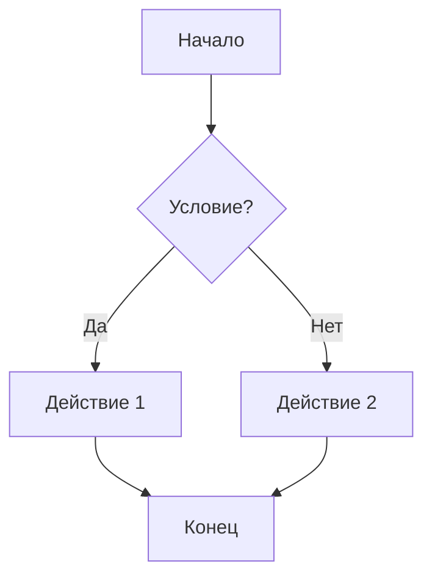

## 📚 Что вы найдете здесь

- **Основы**: Изучите синтаксис и настройте окружение
- **Типы диаграмм**: От блок-схем до диаграмм Ганта и ментальных карт
- **Продвинутые техники**: Стилизация, интерактивность и интеграция
- **Примеры**: Реальные кейсы использования в документации и архитектуре

## 🎯 Почему Mermaid?

- ✅ **Текстовый формат**: Диаграммы хранятся вместе с кодом
- ✅ **Версионность**: Легко отслеживать изменения в Git
- ✅ **Интеграция**: Работает в GitHub, GitLab, MkDocs, Obsidian и других
- ✅ **Простота**: Минимум синтаксиса для максимального результата

---

# Основы Mermaid

## Что такое Mermaid?

**Mermaid** — это JavaScript-библиотека для создания диаграмм и визуализаций с помощью простого текстового синтаксиса, похожего на Markdown.

### 🎯 Основные преимущества

| Преимущество | Описание |
|--------------|----------|
| Текстовый формат | Диаграммы хранятся в виде обычного текста |
| Версионность | Легко отслеживать изменения в Git |
| Интеграция | Работает в GitHub, GitLab, MkDocs, Obsidian |
| Простота | Минимум синтаксиса для быстрого старта |

### 🔧 Где используется

- Документация проектов
- Архитектурные схемы
- Блок-схемы алгоритмов
- Диаграммы последовательностей
- Ментальные карты

## Установка и настройка

### 📦 Установка в MkDocs

#### 1. Установка зависимостей

```bash
pip install mkdocs-material mkdocs-mermaid2-plugin
```

#### 2. Настройка `mkdocs.yml`

```yaml
markdown_extensions:
  - mermaid2

plugins:
  - search
  - mermaid2:
      version: 10.6.1
```

### 🔗 Интеграция с GitHub

GitHub автоматически рендерит Mermaid-диаграммы в Markdown-файлах.

### 🛠 Другие платформы

| Платформа | Поддержка |
|-----------|-----------|
| GitLab | ✅ Встроенная |
| Obsidian | ✅ Встроенная |
| Notion | ❌ Не поддерживается |
| Confluence | ⚠️ Через плагины |

## Базовый синтаксис

### 📐 Структура диаграммы

Любая диаграмма начинается с указания типа:


### 🔤 Основные элементы

| Элемент | Синтаксис | Пример |
|---------|-----------|--------|
| Узел | `A[Текст]` | `A[Начало]` |
| Ромб (условие) | `A{Текст}` | `A{Условие?}` |
| Круг | `A((Текст))` | `A((Конец))` |
| Стрелка | `-->` | `A --> B` |
| Стрелка с текстом | `-->|Текст|` | `A -->|Да| B` |

### 🎨 Пример сложной диаграммы


### 📏 Направления

- `TD` / `TB` — сверху вниз
- `LR` — слева направо
- `RL` — справа налево
- `BT` — снизу вверх

---

# Типы диаграмм

## Блок-схемы (Flowchart)

Блок-схемы — основной тип диаграмм для визуализации процессов и алгоритмов.

### Синтаксис узлов

```mermaid
graph TD
    A[Прямоугольник] 
    B(Ромб)
    C(Круг)
    D[Ссылка](https://example.com)
    E[/Наклонный/]
    F[\Наклонный\]
    G{{Гексагон}}
    H[(Цилиндр)]
```

### Типы связей

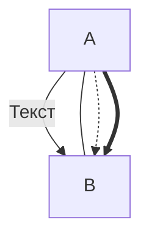

### Подграфы

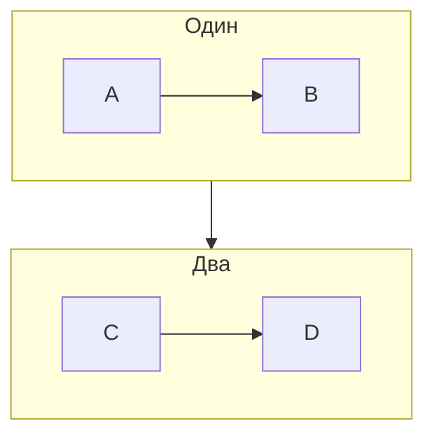

## Диаграммы последовательностей (Sequence)

Диаграммы последовательностей показывают взаимодействие между объектами во времени.

### Базовый синтаксис

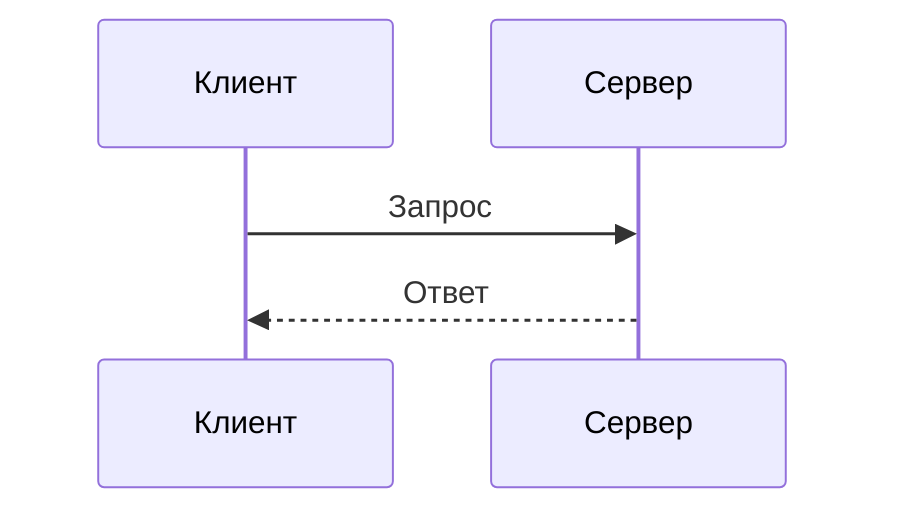

### Типы сообщений

| Тип | Синтаксис | Описание |
|-----|-----------|----------|
| Сплошная стрелка | `->>` | Синхронное сообщение |
| Пунктирная стрелка | `-->>` | Возврат ответа |
| Сплошная к себе | `->>` | Сообщение самому себе |
| Активация | `activate` / `deactivate` | Показывает активность |

### Практический пример

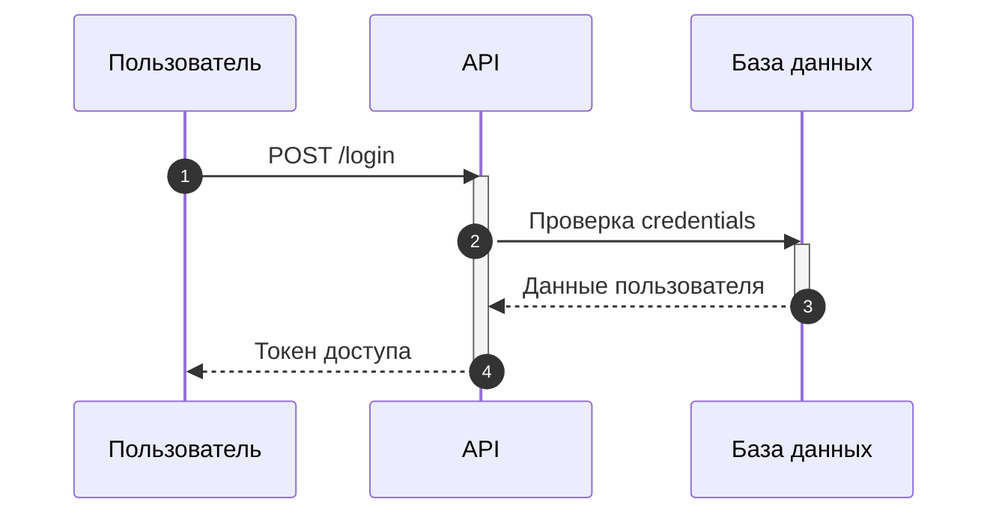

## Диаграммы классов (Class Diagram)

Диаграммы классов UML для отображения структуры системы.

### Базовый синтаксис

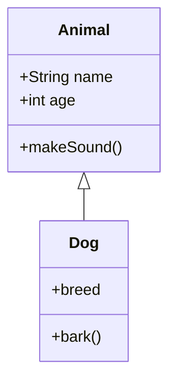

### Типы отношений

| Отношение | Синтаксис | Описание |
|-----------|-----------|----------|
| Наследование | `<|--` | "Является" |
| Реализация | `<|..` | Интерфейс |
| Ассоциация | `-->` | Связь |
| Агрегация | `o--` | "Часть целого" |
| Композиция | `*--` | Сильная связь |

### Практический пример

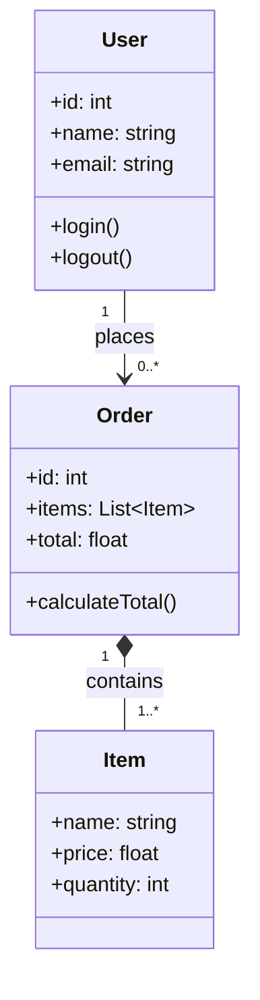

## Диаграммы состояний (State Diagram)

Показывают переходы между состояниями объекта.

### Базовый синтаксис

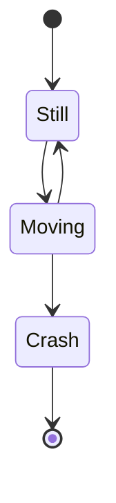

### Сложный пример

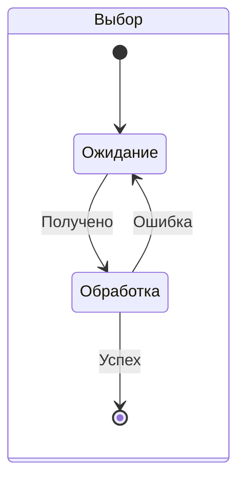

## Диаграммы Ганта (Gantt)

Диаграммы Ганта для планирования проектов.

### Пример

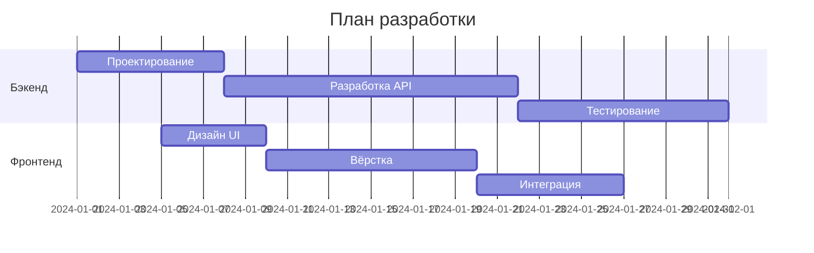

## Ментальные карты (Mindmap)

Иерархические структуры для мозгового штурма.

### Пример

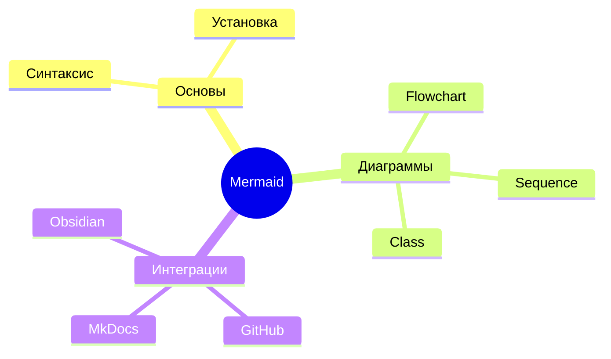

## ER-диаграммы (Entity Relationship)

ER-диаграммы для моделирования данных.

### Базовый синтаксис

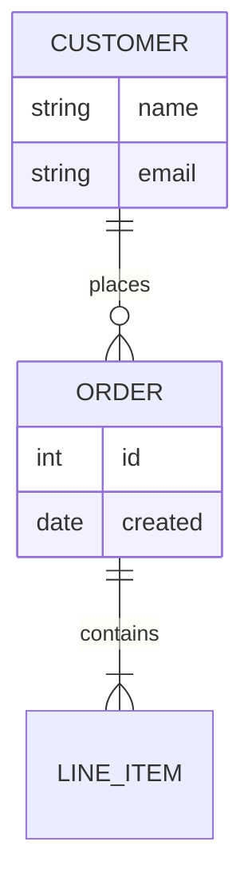

## Диаграммы требований (Requirement)

Для спецификации требований.

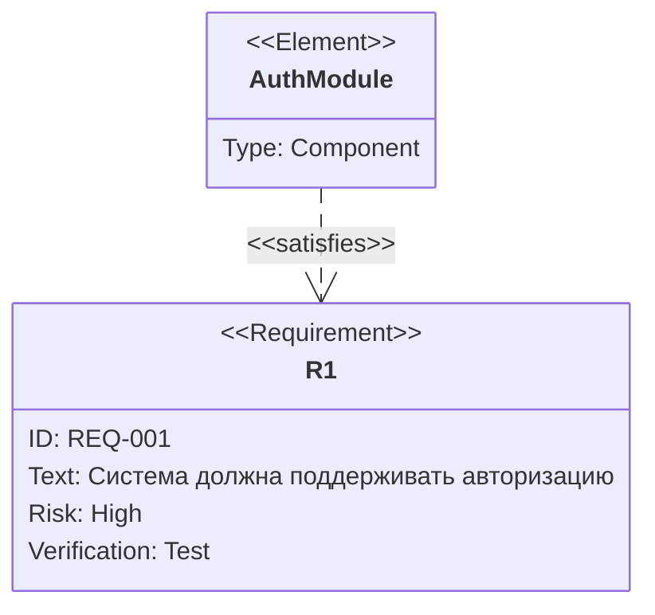

## Диаграммы пользовательских путей (User Journey)

Показывают путь пользователя через сервис.

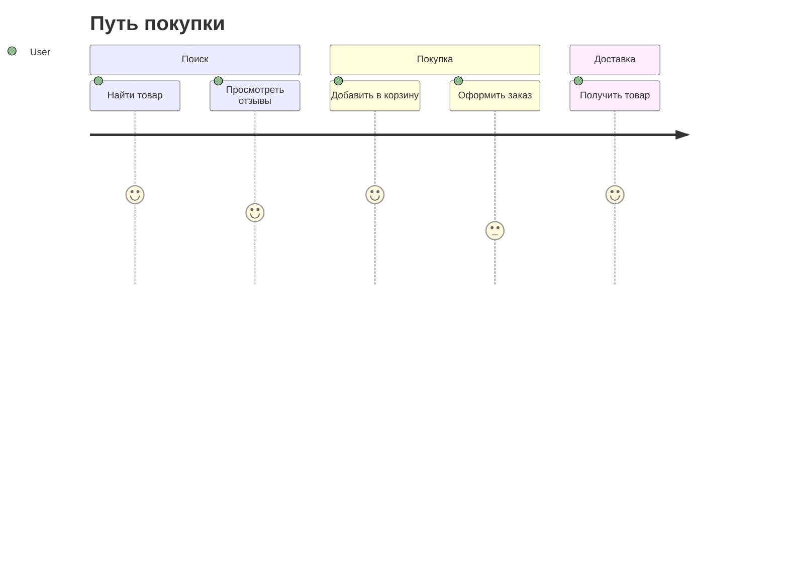

## Timeline диаграммы

Хронология событий.

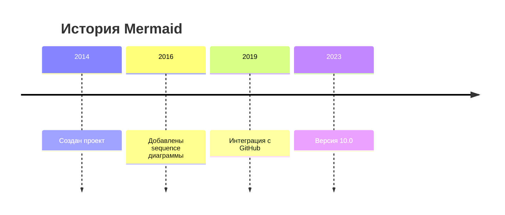

## Квадрантные диаграммы (Quadrant Chart)

Матрицы для анализа.

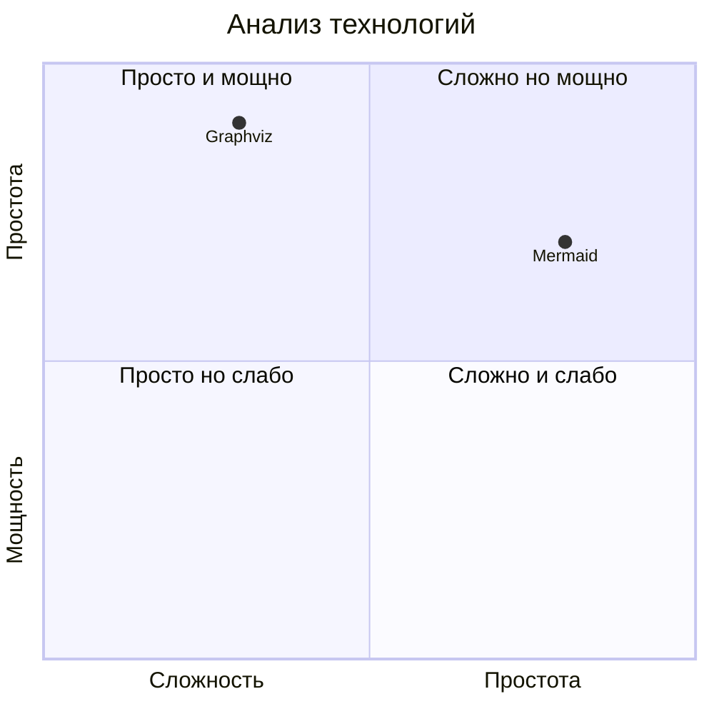

## C4 диаграммы

Модель архитектуры ПО.

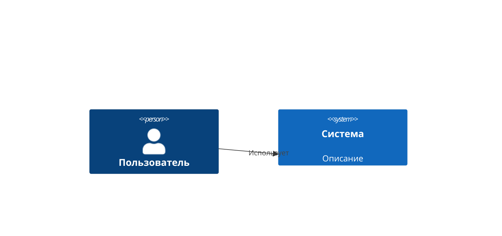

---

# Продвинутые техники

## Стилизация

### Темы

```mermaid
%%{init: {'theme': 'dark'}}%%
graph TD
    A[Тёмная тема] --> B[Красиво]
```

### Кастомные стили

```mermaid
graph TD
    A[Красный узел]:::red
    B[Синий узел]:::blue
    classDef red fill:#f96,stroke:#333;
    classDef blue fill:#69f,stroke:#333;
    A --> B
```

## Интерактивность

Добавление кликабельных элементов:

```mermaid
graph TD
    A[Кликни меня]
    click A "https://example.com" "Перейти"
```

## Интеграция с фреймворками

### React

```jsx
import Mermaid from 'react-mermaid2';

<Mermaid chart={`
  graph TD
    A[React] --> B[Mermaid]
`}/>
```

### Vue

```vue
<template>
  <mermaid :chart="chartData"/>
</template>
```

---

# Практические примеры

## Архитектура микросервисов

```mermaid
graph TB
    subgraph Frontend
        Web[Web App]
        Mobile[Mobile App]
    end
    subgraph API Gateway
        Gateway[API Gateway]
    end
    subgraph Services
        Auth[Auth Service]
        Users[User Service]
        Orders[Order Service]
    end
    subgraph Data
        DB[(Database)]
        Cache[(Cache)]
    end
    
    Web --> Gateway
    Mobile --> Gateway
    Gateway --> Auth
    Gateway --> Users
    Gateway --> Orders
    Auth --> DB
    Users --> DB
    Users --> Cache
    Orders --> DB
```

## Бизнес-процессы

```mermaid
flowchart LR
    Start([Начало]) --> Review{Требуется<br/>согласование?}
    Review -->|Да| Manager[Согласование<br/>менеджером]
    Review -->|Нет| Process[Выполнение]
    Manager --> Approved{Одобрено?}
    Approved -->|Да| Process
    Approved -->|Нет| Reject([Отклонено])
    Process --> End([Конец])
```

## Алгоритмы

```mermaid
flowchart TD
    Start([Начало]) --> Init[i = 0, sum = 0]
    Init --> Check{i < n?}
    Check -->|Да| Add[sum += arr[i]]
    Add --> Inc[i++]
    Inc --> Check
    Check -->|Нет| Result[return sum]
    Result --> End([Конец])
```

## Документация

```mermaid
flowchart TB
    Docs[Документация]
    subgraph Разделы
        Intro[Введение]
        Install[Установка]
        Usage[Использование]
        API[API Reference]
    end
    Docs --> Intro
    Docs --> Install
    Docs --> Usage
    Docs --> API
```

---

# Заключение

Mermaid — мощный инструмент для создания диаграмм прямо в Markdown. Используйте его для:

- 📋 Технической документации
- 🏗 Архитектурных схем
- 📊 Визуализации данных
- 🔄 Описания процессов

**Ресурсы:**
- [Официальная документация](https://mermaid.js.org/)
- [Редактор Mermaid Live](https://mermaid.live/)
- [GitHub Repository](https://github.com/mermaid-js/mermaid)

---

*Руководство создано [DaniilGavrin](https://github.com/DaniilGavrin)*
